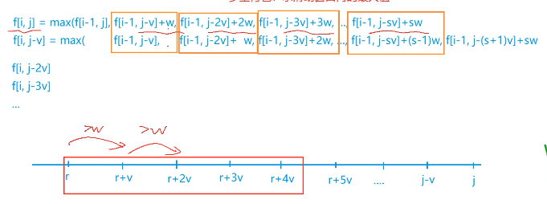

> PS: 以下是dp小萌新在学习dp的过程中的一些个人总结，若有什么不对的地方欢迎各位大佬批评指正 
> [Salute] [Salute] [Salute]
>
> 本博客是一份自用的笔记博客，所以有些我大概懂的东西可能会写得比较粗略，请见谅

# 知识点：

## 1. 基本概念：
### (1) 定义:
 动态规划算法是通过拆分问题，定义问题状态和状态之间的关系，使得问题能够以递推（或者说分治）的方式去解决。动态规划算法的基本思想与分治法类似，也是将待求解的问题分解为若干个子问题（阶段），按顺序求解子阶段，前一子问题的解，为后一子问题的求解提供了有用的信息。在求解任一子问题时，列出各种可能的局部解，通过决策保留那些有可能达到最优的局部解，丢弃其他局部解。依次解决各子问题，最后一个子问题就是初始问题的解。
 ### (2) 基本思想与策略编辑:
 由于动态规划解决的问题多数有重叠子问题这个特点，为减少重复计算，对每一个子问题只解一次，将其不同阶段的不同状态保存在一个二维数组中。

## 2.分析方法
（闫氏dp分析法）:


>A.状态表示：包括集合和属性两个元素，它的作用是用来描述当前某个特定状态的表示方式。
>
>1）集合：用于存储整个大整体（即我们平时所用的dp数组），这集合表示当前的这个状态是由什么东西（即前面一大堆的状态转移）转换到这一步的， 同时要判断当前状态需如何划分集合来得到。
>
>2）属性：当前这个dp转移方程要维护的属性，比如最大价值等等。
>
>B.状态计算：这个是所有dp的重难点，即找出当前的转移方程。

## 3.常见的概念

### (1) 三个要素：
(a)状态
(b)阶段
(c)决策

### (2) 三个基本条件：

(a)子问题重叠性
(b)无后效性
(c)最优子结构性质

## 4.动态规划问题分析时的小技巧

(1) 设计动态规划的状态转移时，我们除了从如何计算出一个状态来想问题外，还可以从当前状态可以由什么状态转移而来来分析。

(2) 在实现状态转移方程时，要注意观察决策集合的范围随着状态的变化情况。对于决策集合中的元素只增不减的情况，我们可以维护一个变量来记录决策集合的当前信息，避免重复扫描。

(3)  

# 常见题型:

## 1.背包问题

#### (1) 01背包问题

优化前：
枚举只拿前i件物品的情况
枚举前j的容量下的最佳拿法

```cpp
#include<iostream>
#include<cstring>
#include<algorithm>
using namespace std;
const int N = 1010;
int w[N], v[N], n, m, dp[N][N];
int main() {
    cin >> n >> m;
    for(int i = 1; i <= n; i++)
        cin >> v[i] >> w[i];
    //第一维度记录在拿前几件物品
    for(int i = 1; i <= n; i++)
        //第二维枚举每一个容量下的最优解
        for(int j = 1; j <= m; j++) {
            if(j < v[i]) 
                dp[i][j] = dp[i - 1][j];
            else
            dp[i][j] = max(dp[i - 1][j], dp[i - 1][j - v[i]] + w[i]);
        }
    cout << dp[n][m] << endl;
}
```
优化后:
枚举只拿前i件物品的情况
枚举前j的容量下的最佳拿法
在枚举容量时，我们从后往前遍历，这样子就可以在即利用了上次的空间的同时，不会使得更新串联

```cpp
#include<iostream>
#include<cstring>
#include<algorithm>
using namespace std;
const int N = 1010;

int dp[N], n, m, w, v;

int main() {
    scanf("%d%d", &n, &m);
    for(int i = 1; i <= n; i++) {
        scanf("%d%d", &v, &w);
        //一定从后往前，因为我们要利用之前的状态，从前往后会更新掉之前的状态
        for(int j = m; j >= v ; j--)
            dp[j] = max(dp[j], dp[j - v] + w);
    }
    printf("%d", dp[m]);
}
```

> 01背包主要解决的是拿与不拿的问题。这种题，我们判断拿第i - 1个物品时的决策基础上，再加上当前物品比较。取最优解。

#### (2) 完全背包

优化前:
暴力的话
我们先枚举前i个物品的拿法
然后枚举容量
接着枚举在当前容量下该物品应该拿多少个

```cpp
#include<cstdio>
#include<cstring>
#include<algorithm>
using namespace std;
const int N = 1010;
int w[N], v[N], n, m, dp[N][N];
int main() {
    scanf("%d%d", &n, &m);
    for(int i = 1; i <= n; i++)
        scanf("%d%d", &v[i], &w[i]);
    //枚举取前i个物品
    for(int i = 1; i <= n; i++)
        //不同容量下的取法
        for(int j = 0; j <= m; j++)
            //枚举每件物品取的次数
            for(int k = 0; k * v[i] <= j; k++)
                dp[i][j] = max(dp[i][j], dp[i - 1][j - k * v[i]] + k * w[i]);
    printf("%d\n", dp[n][m]);
}
```
优化后:
这种思路是将完全背包问题转换为了一个求前缀最大值的一个问题
我们每次转换是会发现其实我们就是在上一个状态下看看是否需要再多拿一个
因此我们可以直接从前往后更新来找到最优解
```cpp
#include<iostream>
#include<cstring>
#include<algorithm>
using namespace std;
const int N = 1010;
int w, v, n, m, dp[N];

int main() {
    scanf("%d%d", &n, &m);
    //枚举取前i个物品
    for(int i = 1; i <= n; i++) {
        scanf("%d%d", &v, &w);
        //从前往后更新，则是在之前自己去过物品的情况下讨论还是否需要继续拿
        for(int j = v; j <= m; j++) {
            dp[j] = max(dp[j], dp[j - v] + w);
        }
    }
    printf("%d\n", dp[m]);
}
```

> 完全背包就是在01背包的基础上，加上了每间物品可以取任意多个的条件。

#### (3) 多重背包

优化前:

暴力枚举
首先枚举前i件物品的最优解
其次枚举背包的容量
最后枚举每件物品的选法

```cpp
#include<cstdio>
#include<cstring>
#include<algorithm>
using namespace std;
const int N = 1010;
int w[N], v[N], s[N], n, m, dp[N][N];
int main() {
    scanf("%d%d", &n, &m);
    for(int i = 1; i <= n; i++)
        scanf("%d%d%d", &v[i], &w[i], &s[i]);
    //枚举取前i个物品
    for(int i = 1; i <= n; i++)
        //不同容量下的取法
        for(int j = 0; j <= m; j++)
            //枚举每件物品取的次数，同时这里有限制k一定不能大于多少
            for(int k = 0; k * v[i] <= j && k <= s[i]; k++)
                dp[i][j] = max(dp[i][j], dp[i - 1][j - k * v[i]] + k * w[i]);
    printf("%d\n", dp[n][m]);
}
```
优化一（二进制优化）:
这里我们用到了二进制的思想来做
我们先把所有的物品进行一次打包，然后将其转化为一个简单的01背包的问题
打包的思路是我们根据二进制的位数进行打包
【例如】：打包1（1）、10（2）、100（4）、1000（8）……
这样的打包的话假设现在最优解是拿7个某物品，我就可以从打包好的物品中找其对应的二进制
7是111（二进制），所以我们可以通过拿一个100、一个10、一个1来达到我们的目的。
但是有时我们不一定能刚好打包完，此时我们把剩下的部分打包一下即可。

```cpp
#include<iostream>
#include<cstdio>
#include<cstring>
#include<algorithm>
using namespace std;
const int N = 200010;

int n, m;
int w[N], v[N], idx;
int dp[N];

//将输入的数字进行二进制分包
void pack() {
    int k = 1, tw, tv, ts;
    scanf("%d%d%d", &tv, &tw, &ts);
    //当前剩余的数量大于当前打包的总量时
    while(k <= ts) {
        w[++idx] = k * tw;
        v[idx] = k * tv;
        ts -= k;
        k <<= 1;
    }
    //最后看看所有的当前物品是否已经打包完了，没打完，就把剩下的部分打一包
    if(ts) {
        w[++idx] = ts * tw;
        v[idx] = ts * tv;
    }
}

int main() {
    scanf("%d%d", &n, &m);
    //输入数据并进行打包
    for(int i = 0; i < n; i++) pack();
    for(int i = 1; i <= idx; i++) {
        for(int j = m; j >= v[i]; j--) {
            dp[j] = max(dp[j], dp[j - v[i]] + w[i]);
        }
    }
    printf("%d\n", dp[m]);
}
```
优化二（单调队列优化）:
单调队列的优化方法是将多重背包问题转换为一个单调队列求最值的问题
首先我们可以从将这个问题展开来看，然后就会发现他的样子如下



我们会发现他们是对应的把他们往下映射下来就会形成下图中的坐标
然后我们每次更新就相当于在某个点的前s个值中找到一个最大值拿来更新
此时抽象出来就可以用单调队列来做了

```cpp
#include<iostream>
#include<cstdio>
#include<cstring>
#include<algorithm>
using namespace std;
const int N = 200010;

int n, m;
int v[N], w[N], s[N], dp[N], g[N], q[N];

int main() {
    scanf("%d%d", &n, &m);
    for(int i = 1; i <= n; i++) scanf("%d%d%d", &v[i], &w[i], &s[i]);
    for(int i = 1; i <= n; i++) {
        //每次我们都要从一个状态来枚举因此我们不能直接本地更新
        //如果直接更新得到的结果可能会不对（拿去某个物品时，拿的个数可能超过s[i]个）
        memcpy(g, dp, sizeof dp);
        //枚举最后剩余的个数
        for(int j = 0; j < v[i]; j++) {
            int hh = 0, tt = 0;
            //套单调队列的模板
            for(int k = j; k <= m; k += v[i]) {
                //如果队头不在队列里了，那么我们把队头弹出
                if(hh < tt && q[hh] < k - s[i] * v[i]) hh++;
                //当队列不为空时更新最大值（要先更新dp再更新队列，因为我们要取的时第k项前面s项的最值）
                if(hh < tt) dp[k] = max(dp[k], g[q[hh]] + (k - q[hh]) / v[i] * w[i]);
                //更新队列
                while(hh < tt && g[q[tt - 1]] - (q[tt - 1] - j) / v[i] * w[i] <= g[k] - (k - j) / v[i] * w[i]) tt--;
                q[tt++] = k;
            }
        }
    }
    printf("%d\n", dp[m]);
}
```

>多重背包是在完全背包的的条件下，又加了一个限制条件，就是每次拿某件物品的次数限制在s次以下。

#### (4) 混合背包

混合背包就是几种背包合在一起求，其实多重背包通过二进制转换可以变成01背包，然后我们别求一次01背包的最优解，并在此基础上求一遍完全背包的最优解即可得到答案

```cpp
#include<iostream>
#include<cstdio>
#include<cstring>
#include<algorithm>
using namespace std;
const int N = 200010;

int n, m;
int w1[N], v1[N], w2[N], v2[N], idx1, idx2;
int a, b, c;
int dp[N];

//把多重背包分解为01背包
void pack(int a, int b, int c) {
    int k = 1;
    while(k <= c) {
        v1[++idx1] = k * a;
        w1[idx1] = k * b;
        c -= k;
        k <<= 1;
    }
    if(c) {
        v1[++idx1] = c * a;
        w1[idx1] = c * b;
    }
}

int main() {
    scanf("%d%d", &n, &m);
    for(int i = 1; i <= n; i++) {
        scanf("%d%d%d", &a, &b, &c);
        //01背包
        if(c == -1) {
            v1[++idx1] = a;
            w1[idx1] = b;
        //完全背包
        } else if(c == 0) {
            v2[++idx2] = a;
            w2[idx2] = b;
        //多重背包
        } else {
            pack(a, b, c);
        }
    }
    //先求一遍完全背包
    for(int i = 1; i <= idx2; i++) {
        for(int j = v2[i]; j <= m; j++) {
            dp[j] = max(dp[j], dp[j - v2[i]] + w2[i]);
        }
    }
    //再求一遍01背包
    for(int i = 1; i <= idx1; i++) {
        for(int j = m; j >= v1[i]; j--) {
            dp[j] = max(dp[j], dp[j - v1[i]] + w1[i]);
        }
    }
    printf("%d\n", dp[m]);
}
```

#### (5) 二维费用背包
二维费用背包会结合其他的背包问题一起来考，即在其他背包问题上，加多个限制（下面的代码时01 + 二维费用）
在二维费用背包中我们需要对每一种限制都进行枚举
【例如】正常来讲我们遇到的限制条件通常都是空间，此时可能还会加上其他的限制，比如重量等等
在这种情况下，我们要一次枚举每种限制然后逐步推出最优解

```cpp
#include<iostream>
#include<cstdio>
#include<cstring>
#include<algorithm>
using namespace std;
const int N = 1010;

int n, V, M;
int dp[N][N];

int main() {
    scanf("%d%d%d", &n, &V, &M);
    for(int i = 0; i < n; i++) {
        int v, m, w;
        scanf("%d%d%d", &v, &m, &w);
        //枚举第一种容量限制
        for(int j = M; j >= m; j--) {
            //枚举第二种容量限制
            for(int p = V; p >= v; p--) {
                dp[j][p] = max(dp[j][p], dp[j - m][p - v] + w);
            }
        }
    }
    printf("%d\n", dp[M][V]);
    return 0;
}
```
#### (6) 分组背包
首先枚举第几组
然后枚举容量
接着看看在当前容量下应该拿当前组中的哪件物品

```cpp
#include<iostream>
#include<cstdio>
#include<cstring>
#include<algorithm>
using namespace std;
const int N = 110;

int n, m;
int dp[N], w[N][N], v[N][N], t[N];

int main() {
    scanf("%d%d", &n, &m);
    for(int i = 1; i <= n; i++) {
        scanf("%d", &t[i]);
        for(int j = 1; j <= t[i]; j++) scanf("%d%d", &v[i][j], &w[i][j]);
    }
    //枚举第几组
    for(int i = 1; i <= n; i++) {
        //枚举容量
        for(int k = m; k >= 0; k--) {
            //枚举当前组中的最优选法
            for(int j = 1; j <= t[i]; j++) {
                if(v[i][j] <= k) dp[k] = max(dp[k], dp[k - v[i][j]] + w[i][j]);
            }
        }
    }
    printf("%d\n", dp[m]);
}
```

#### (7) 有依赖的背包问题

有依赖的背包通常会组成一个树形结构，即每个物品都可能有一个父节点，每个物品也可能被一个或多个物品依赖，那么一个物品可能会有一个或多个子节点，这恰好就构成了一个树形结构。那么我们在dp转移的时候就需要使用到树形dp的思想。往下处理，然后在回溯时注意更新当前点状态。有依赖的背包问题其实大多时候我们都会将其转换为分组背包进行处理，我们其实可以考虑以体积作为分包的依据。我们在分包时，把某个点的子节点作为一个包，然后当前子节点能拿的每一个体积作为物品，然后进行分组背包求最值的计算即可

```cpp
#include<iostream>
#include<cstdio>
#include<cstring>
#include<algorithm>
using namespace std;
const int N = 110;

int n, m;
int w[N], v[N];
int h[N], ne[N], e[N], idx;
int dp[N][N];

//把父子结点连接起来
void add(int a, int b) {
    e[idx] = b, ne[idx] = h[a], h[a] = idx++;
}

//dfs处理
void dfs(int u) {
    for(int i = h[u]; i != -1; i = ne[i]) {
        int s = e[i];
        //先往下处理
        dfs(s);
        //回溯处理当前状态，下面的都是分组背包的操作了
        //枚举物品的体积
        for(int j = m - v[u]; j >= 0; j--) {
            //枚举当前组内每一个物品
            for(int k = 0; k <= j; k++) {
                dp[u][j] = max(dp[u][j], dp[u][j - k] + dp[s][k]);
            }
        }
    }
    //因为我们想取到当前点的子节点，父节点一定要被那到，所以我们要对所有点进行处理
    //当前节点能放得进背包的前提下，把当前节点放进去
    for(int i = m; i >= v[u]; i--) dp[u][i] = dp[u][i - v[u]] + w[u];
    //当前节点能放不下背包的情况，那子节点的东西一个也拿不了，直接清0
    for(int i = 0; i < v[u]; i++) dp[u][i] = 0;
}

int main() {
    scanf("%d%d", &n, &m);
    memset(h, -1, sizeof h);
    int r, c;
    for(int i = 1; i <= n; i++) {
        scanf("%d%d%d", &v[i], &w[i], &c);
        if(c == -1) r = i;
        else add(c, i);
    }
    dfs(r);
    printf("%d\n", dp[r][m]);
}
```

#### (8) 背包问题求方案数
求方案数的大致思路是：
我们先求出我们正常某个背包是怎么转移出来
然后我们再去寻找这个路径，最后求出方案数即可，注意条件和初始化

```cpp
/*
本题求的是可使这些物品的总体积不超过背包容量，且总价值最大最优选法的方案数
我们首先思考一下这道题其实我们求的就是求背包价值最大化的条件下，求出方案数恰好等于那个最值的方案数
*/
#include<iostream>
#include<cstdio>
#include<cstring>
#include<algorithm>
#define ll long long
using namespace std;
const ll N = 1010;
const ll M = 1e9 + 7;

ll n, m;
ll v[N], w[N];
ll f[N][N], g[N][N];

int main() {
    scanf("%lld%lld", &n, &m);
    for(ll i = 1; i <= n; i++) scanf("%lld%lld", &v[i], &w[i]);
    //求（恰好）所以要初始化g[0][0]为1
    g[0][0] = 1ll;
    //先求出价值最大的物品取法
    for(ll i = 1; i <= n; i++) {
        //枚举容量
        for(ll j = 0; j <= m; j++) {
            f[i][j] = f[i - 1][j];
            if(j >= v[i]) f[i][j] = max(f[i][j], f[i - 1][j - v[i]] + w[i]);
        }
    }
    //第二次求出方案数
    for(ll i = 1; i <= n; i++) {
        for(ll j = 0; j <= m; j++) {
            ll mx = f[i - 1][j];
            if(j >= v[i]) mx = max(mx, f[i - 1][j - v[i]] + w[i]);
            if(mx == f[i - 1][j]) g[i][j] = (g[i][j] + g[i - 1][j]) % M;
            if(mx == f[i - 1][j - v[i]] + w[i]) g[i][j] = (g[i][j] + g[i - 1][j - v[i]]) % M;
        }
    }
    ll num = 0, cnt = 0;
    //求出最优的方案下总价值的值
    for(ll i = 0; i <= m; i++) num = max(num, f[n][i]);
    //找到所有与该最大值相等的状态，把他们的方案数加入答案中
    for(ll i = 0; i <= m; i++) if(f[n][i] == num) cnt = (cnt + g[n][i]) % M;
    printf("%lld\n", cnt);
}
```

#### (9) 泛化物品

考虑这样一种物品，它并没有固定的费用和价值，而是它的价值随着你分配给它的费用而变化。这就是泛化物品的概念。 

```cpp

```

#### (10) 背包问题问法的变化 
这里我们主要来总结一下题型，大多数情况下背包主要问的是怎么有限容量内取得最大的价值但是其实背包有很多变种：

(A) **求最值**:

(a) 体积小于等于m时，求总价值的最大值（不取即可得到最小值最小值）
(b) 体积等于m时，求总价值的最值
(c) 体积大于等于m时，求总价值的最小值（全选即可得到最大值）

(B) **求方案数**:

(a) 体积小于等于m时，求总价值的最大值的方案数（不取即可得到最小值最小值）
(b) 体积等于m时，求总价值的最值的方案数
(c) 体积大于等于m时，求总价值的最小值的方案数（全选即可得到最大值）

(C) **记录方案数**:

(a) 输出方案
(b) 输出字典序最小的方案数

```cpp
//当需要输出字典序最小时，倒着枚举物品
for (int i = n; i >= 1; i--) {
    //剩余的部分与正常背包差不多
    for (int j = 0; j <= m; j++) {
        f[i][j] = f[i + 1][j];
        if (j >= v[i]) f[i][j] = max(f[i][j], f[i + 1][j - v[i]] + w[i]);
    }
}
int j = m;
//从前往后枚举物品 
//当我们要列出方案数时，我们的顺序要分过来，即如果求背包时枚举的顺序是1~n，找方案时枚举的顺序就要变为n~1，反之亦然
for (int i = 1; i <= n; i++) {
    if (j >= v[i] && f[i][j] == f[i + 1][j - v[i]] + w[i]) {
        printf("%d ", i);
        j -= v[i];
    }
}
return 0;
```

#### (11) 背包的初始化问题

此处借用师兄的总结：

```cpp
求方案数初始化总结:

/*
二维情况
1、体积至多j，f[0][i] = 1, 0 <= i <= m，其余是0
2、体积恰好j，f[0][0] = 1, 其余是0
3、体积至少j，f[0][0] = 1，其余是0

一维情况
1、体积至多j，f[i] = 1, 0 <= i <= m，
2、体积恰好j，f[0] = 1, 其余是0
3、体积至少j，f[0] = 1，其余是0
*/

求最大值最小值初始化总结:
/*
二维情况
1、体积至多j，f[i,k] = 0，0 <= i <= n, 0 <= k <= m（只会求价值的最大值）
2、体积恰好j，
当求价值的最小值：f[0][0] = 0, 其余是INF
当求价值的最大值：f[0][0] = 0, 其余是-INF
3、体积至少j，f[0][0] = 0，其余是INF（只会求价值的最小值）

一维情况
1、体积至多j，f[i] = 0, 0 <= i <= m（只会求价值的最大值）
2、体积恰好j，
当求价值的最小值：f[0] = 0, 其余是INF
当求价值的最大值：f[0] = 0, 其余是-INF
3、体积至少j，f[0] = 0，其余是INF（只会求价值的最小值）
*/

作者：小呆呆
链接：https://www.acwing.com/blog/content/458/
```

## 2. 线性DP

ps：做题套路：

首先还是决定一下阶段，线性dp大多数时候都是有一个线性的数组需要处理一下
那么我此时我们依照传统惯例把数组前i个已经处理好了推第i + 1个作为阶段
那么我们就要思考一下我们的状态了
刚刚学到了新知识，才明白其实很多时候状态首先要体现出阶段
然后思考一下在当前的信息的基础上需要附加上什么信息才能使得当前状态之间可以进行推导
然后当我们附加了一堆信息以后我们要思考一下哪些信息是不必要的（即这一信息可以被别的信息表出）
我们要尽可能的减少表示的信息，这样子即减少的空间复杂度，也减少了时间复杂度
最后如果空间还是很大，我们就要考虑使用滚动数组了

#### (1) 最长上升子序列
基本模型：
基本上题目就会让你构造一个最长的上升子序列（至于题目怎么花里胡哨就很难说了）
具体构造方式见注释

```cpp
#include<iostream>
#include<cstdio>
#include<cstring>
#include<algorithm>
#define ll long long
using namespace std;
const int N = 20010;

ll n, ans;
ll dp[N], a[N];

int main() {
    scanf("%lld", &n);
    //输入序列
    for(int i = 1; i <= n; i++) scanf("%lld", &a[i]);
    //枚举以第几个数为终点的序列中最长的可能
    for(int i = 1; i <= n; i++) {
        //每次初始化一下，因为当前点最坏的情况是自己作为一个序列
        dp[i] = 1;
        //枚举i前所有的点，看看接在哪里比较合适
        for(int j = 1 ; j < i; j++) {
            if(a[i] > a[j]) dp[i] = max(dp[i], dp[j] + 1);
        }
        //获取当前序列的长度，取最值
        ans = max(ans, dp[i]);
    }
    printf("%lld\n", ans);
}

//二分 + 贪心做法
/*
该做法也可以用于求最长公共子序列
基本思路是维护长度序列，每个序列存下当前序列的最后一个值，若有多个同长度的序列则存结尾值最小的
由于这不是dp所以此处带过，若有兴趣可以搜一下其他大佬的博客来学习
*/
#include<iostream>
#include<cstdio>
#include<cstring>
#include<algorithm>
#define ll long long
using namespace std;
const int N = 200010;

ll n;
ll a[N];
ll len, e[N];

int main() {
    scanf("%lld", &n);
    //将所有的结尾值初始化为无穷大
    for(ll i = 1; i <= n; i++) scanf("%lld", &a[i]), e[i] = 1e9 + 7;
    //第一个点的初始值设为无穷小（所有的数最短也可以自己构成子序列）
    e[0] = -1e9 + 7;
    //二分出第一个小于某数的值
    for(ll i = 1; i <= n; i++) {
        ll l = 0, r = len;
        while(l < r) {
            ll mid = (l + r + 1) >> 1;
            if(e[mid] < a[i]) l = mid;
            else r = mid - 1;
        }
        //我们把a[i]添加到当前搜到的长度的序列之中
        e[l + 1] = min(e[l + 1], a[i]);
        //如果说这个序列的长度，是目前所有序列中最长的，让len++
        if(l == len) len++;
    }
    printf("%lld\n", len);
}
```

#### (2) 最长公共子序列

基本模型：
这种模型通常是给出你两个串，然后让你找到他们两个串符合某种条件，比如子序列相等，或最小编辑距离等等问题

```cpp
#include<iostream>
#include<cstdio>
#include<cstring>
#include<algorithm>
using namespace std;
const int N = 1010;

int n, m, dp[N][N];
string a, b;

int main() {
    cin >> n >> m;
    cin >> a >> b;
    a = " " + a;
    b = " " + b;
    for(int i = 1; i <= n; i++) {
        for(int j = 1; j <= m; j++) {
            //首先距离状态dp[i][j]的距离最近的状态便是dp[i - 1][j]和dp[i][j - 1]
            //所以我们在这两种状态中选择最大值
            dp[i][j] = max(dp[i - 1][j], dp[i][j - 1]);
            //当我们发现当前我们匹配当前长度下a,b串的结尾相等，此时我们考虑是否应该将这连个字符串匹配
            //所以我们在dp[i][j], dp[i - 1][j - 1] + 1中取最值，如果匹配后能使子序列加长，则我么选择匹配
            if(a[i] == b[j]) dp[i][j] = max(dp[i][j], dp[i - 1][j - 1] + 1);
        }
    }
    printf("%d\n", dp[n][m]);
}

//附上一道最短编辑距离的代码，与公共子序列很像
#include<iostream>
#include<cstdio>
#include<cstring>
#include<algorithm>
using namespace std;
const int N = 1010;

int n, m, dp[N][N];
string a, b;

int main() {
    cin >> n >> a;
    cin >> m >> b;
    a = " " + a;
    b = " " + b;
    //初始化边界条件，当枚举到某一序列为0时，只能通过不断添加使得两串相等
    for(int i = 1; i <= max(n, m); i++) dp[i][0] = dp[0][i] = i;
    for(int i = 1; i <= n; i++) {
        for(int j = 1; j <= m; j++) {
            //在删除和添加中选择编辑距离最小的一种
            dp[i][j] = min(dp[i - 1][j], dp[i][j - 1]) + 1;
            //当当前结尾相等时，我们没必要修改，于是我们看看当前（即添加或修改）是否比dp[i - 1][j - 1]要优
            if(a[i] == b[j]) dp[i][j] = min(dp[i][j], dp[i - 1][j - 1]);
            //当当前结尾不相等时，我们考虑使用修改
            else dp[i][j] = min(dp[i][j], dp[i - 1][j - 1] + 1);
        }
    }
    printf("%d\n", dp[n][m]);
}

//值得注意的是这个算法是O(n ^ 2)的，在洛谷会被卡掉一半的数据，这里提供一个nlogn的做法（当然洛谷给的是两个全排列）


```

#### (3) 数字三角形
基本模型：这一类型的题目通常都会有一张地图（或一些类似地图的东西），每个点都有一个权值或之类的东西
然后要你从某点走到某点，然后要你找到一条路径满足……的条件
这种题目通常我们就找找某个点的状态可以由那些方向的点转移过来
然后我们列出状态转移方程即可，注意一些边界问题

```cpp
#include<iostream>
#include<cstring>
#include<algorithm>
using namespace std;
const int N = 510;

int dp[N][N], n;

int main() {
    cin >> n;
    //输入数字
    for(int i = 1; i <= n; i++) {
        for(int j = 1; j <= i; j++) {
            cin >> dp[i][j];
        }
    }
    //从下往上更新
    for(int i = n - 1; i >= 1 ; i--) {
        for(int j = 1; j <= i; j++) {
            dp[i][j] += max(dp[i + 1][j], dp[i + 1][j + 1]);
        }
    }
    cout << dp[1][1] << endl;
}
```

> 这类题型通常是说有一个矩阵，要求其最优解（最值等等）。只要我们更新路径上，所有解情况即可。

## 3. 区间dp
基本模型：
区间dp通常的思路都是先考虑个体，即先初始化只有一个数（或其他东西）的情况
然后枚举长度，一点点的开始合并每个个体（或子区间的最优解），从而最后推出整个区间的最优解

```cpp
//经典例题石子合并
#include<iostream>
#include<cstdio>
#include<cstring>
#include<algorithm>
using namespace std;
const int N = 310;

int n;
int a[N], dp[N][N], sum[N];

int main() {
    scanf("%d", &n);
    memset(dp, 0x3f, sizeof dp);
    //读入每一个石子的个数，并初始化只有一个点的情况下的值
    for(int i = 1; i <= n; i++) scanf("%d", &a[i]), sum[i] = sum[i - 1] + a[i], dp[i][i] = 0;
    //枚举长度
    for(int len = 2; len <= n; len++) {
        //枚举起点
        for(int l = 1; l + len - 1 <= n; l++) {
            //找到右端点
            int r = l + len - 1;
            //枚举分隔点（一定要注意边界问题）
            for(int k = l; k < r; k++) {
                //合并区间
                dp[l][r] = min(dp[l][r], dp[l][k] + dp[k + 1][r] + sum[r] - sum[l - 1]);
            }
        }
    }
    printf("%d\n", dp[1][n]);
}
```

## 4. 计数类dp

> 还没学完……

```cpp
//整数划分
/*
这道题目的思想与松弛操作有点像（个人理解）
就是我们每次更新从某个点走到某个点，路径长度为i的走法
这里类似，我们每次更新从一个点到另一个点的走法数量
*/
#include<iostream>
#include<cstdio>
#include<cstring>
#include<algorithm>
#define ll long long
using namespace std;
const ll N = 200010;
const ll M = 1e9 + 7;

ll n, dp[N];

int main() {
    dp[0] = 1;
    scanf("%lld", &n);
    //枚举路径的长度
    for(ll i = 1; i <= n; i++) {
        //枚举点
        for(ll j = i; j <= n; j++) {
            dp[j] = (dp[j] + dp[j - i]) % M;
        }
    }
    printf("%lld\n", dp[n]);
}
```

## 5. 数位dp

数位dp通常都会有两种考法，通常情况下都会给一些限制条件要求一些……的性质，然后求[L, R]区间内的方案数（或其他）

或者可能会问你满足某些性质的第k小数是哪个数。

分析思路：

(1) 当我们当前要求的是区间[L, R]的计数值时，我们不妨求出 [0, L - 1] 和 [0, R] 的值，然后做差来得到我们所需要的解（类似于前缀和）

(2) 考虑数位dp时，我们不妨画一个树形结构对对每一位进行分析。

代码思路：

(1) 通过动态规划预处理出我们可能需要用到的值（或者说是贡献值）

(2) 我们写一下计数的函数，首先传入一个参数，然后我们把这个参数按位分割。

(3) 我们开两个变量一个用于计数，一个用于记录之前的信息

(4) 我们枚举每一位，分别处理其左子树和右子树

(5) 如果枚举到了最后一定要看看最后一个数是否符合答案

关于详细的内容，可以参考一下这位大佬的[博客](https://blog.csdn.net/weixin_46215084/article/details/114516634?spm=1001.2014.3001.5501)

```cpp
//计数问题
#include<iostream>
#include<cstdio>
#include<cstring>
#include<algorithm>
#include<vector>
using namespace std;
const int N = 10;

int a, b, p[N];

//用来获取某一段数字的值
int sub(vector<int> num, int l, int r) {
    int tmp = 0;
    for(int i = l; i >= r; i--) tmp = tmp * 10 + num[i];
    return tmp;
}

//统计前n个数中x出现的次数
int cnt(int n, int x) {
    vector<int> num;
    //先把这段数字按位切分
    while(n) num.push_back(n % 10), n /= 10;
    n = num.size();
    int ans = 0;
    //按照不同的位置进行统计
    for(int i = n - 1 - !x; i >= 0; i--) {
        //如果当前统计的不是最高位，则左边000 ~ abc - 1(假设abc这左边的部分) * 左边(000 ~ 999)（即p[i]个数都符合条件）
        if(i != n - 1) ans += sub(num, n - 1, i + 1) * p[i];
        //如果是0那左边要减去000的情况
        if(!x) ans -= p[i];
        //接着我们按照当前位进行统计
        //如果当前位的数字等于x那么后面可取到000 ~ efg(即efg + 1个数字)
        if(x == num[i]) ans += sub(num, i - 1, 0) + 1;
        //如果当前位的数字大于x那么当前位置为x，后面可以取到000 ~ 999（即p[i]个数）
        else if(x < num[i]) ans += p[i];
    }
    return ans;
}

int main() {
    p[0] = 1;
    for(int i = 1; i < 9; i++) p[i] = p[i - 1] * 10;
    while(~scanf("%d%d", &a, &b) && a && b) {
        if(a > b) swap(a, b);
        //前缀和思想求某一段内的i出现的次数
        for(int i = 0; i < 10; i++) printf("%d ", cnt(b, i) - cnt(a - 1, i));
        puts("");
    }
}

//另一种考法见后面魔鬼数那道题
```

## 6. 树形dp

首先我们要处理的状态与状态之间的关系是一个树的样子，所以我们的决策往往取绝与其子节点，树形dp一般是以节点从深到浅的顺序最为DP的阶段“阶段”。通常物品们物品们会哪第一维度来存储节点编号，其他维度用于存储其他需要附带的信息。因为树的结构常用搜索遍历，所以做树形dp时记忆化搜索是一个不错的选择

```cpp
//没有上司的舞会
#include<iostream>
#include<cstdio>
#include<cstring>
#include<algorithm>
using namespace std;
const int N = 200010;

int n;
int dp[N][2];
int h[N], ne[N], a[N], w[N], hf[N], idx;
int s, f;

//邻接表
void add(int x, int y) {
    w[idx] = y, ne[idx] = h[x], h[x] = idx++;
}

//dfs遍历树，并在回溯时逐步推出最优解
void dfs(int x) {
    //邻接情况，我选我自己
    dp[x][1] = a[x];
    for(int i = h[x]; i != -1; i= ne[i]) {
        int j = w[i];
        //先一直往下推
        dfs(j);
        //当前结点不选时，则我们的子节点可选可不选，我在这之中找到一个最大值
        dp[x][0] += max(dp[j][0], dp[j][1]);
        //当前结点选时，则我们的子结点是不可以选的，所以直接加上子节点不选的情况
        dp[x][1] += dp[j][0];
    }
}

int main() {
    scanf("%d", &n);
    for(int i = 1; i <= n; i++) scanf("%d", &a[i]), h[i] = -1;
    for(int i = 1; i < n; i++) {
        scanf("%d%d", &s, &f);
        add(f, s);
        hf[s] = 1;
    }
    int r = 1;
    //找到所有点中的根结点
    while(hf[r]) r++;
    dfs(r);
    printf("%d\n", max(dp[r][1], dp[r][0]));
}
```

## 7. 状压dp

状压dp主要有两类：

第一种棋盘式状压，通常都是有一个矩阵然后我们推出一列或者一行的所有状态的可行性，然后每次通过行与行之间的关系（或列与列）最终推出所有方案的最优解。

第二种是枚举集合，通常我们用状压表示一个集合，在这个集合中我们用二进制表示第几个物品是否已经选择了，然后每次我们都通过集合的子集中的最优解来推出当前集合的一个最优解。

```cpp
//棋盘式
//蒙德里安的梦想
#include<iostream>
#include<cstdio>
#include<cstring>
#include<algorithm>
#define ll long long
using namespace std;
const int N = 12, M = 1 << N;

ll n, m;
ll dp[N][M];
bool st[M];

/*
首先我们先想想状压压的是什么
我们状压压的其实是一列之中选择那些横向切割
而这道题我们可以这么想，某个1*2的格子，要么横着放，要么竖着放，而横着放会影响下一格的放法
所以我们枚举出可行的横放方法即可，剩下的我们都可以统一视为竖着放
*/
int main() {
    while(~scanf("%lld%lld", &n, &m) && (n || m)) {
        memset(dp, 0, sizeof dp);
        //首先我们先处理出来哪些横放的方法是合法的
        for(ll i = 0; i < (1 << n); i++) {
            st[i] = 1;
            //横放记录每两个横放之间的距离
            ll cnt = 0;
            //我们来看看每一位是否横放
            for(ll j = 0; j < n; j++) {
                //横放的情况
                if(i & (1 << j)) {
                    //横放间距离必须为偶数，否则不合法
                    if(cnt & 1) st[i] = 0;
                    //把横放距离清零
                    cnt = 0;
                }
                else cnt++;
            }
            //最后看看横放下面留下的空格是否符合条件
            if(cnt & 1) st[i] = 0;
        }
        dp[0][0] = 1;
        for(ll i = 1; i <= m; i++) {
            for(ll k = 0; k < (1 << n); k++) {
                for(ll j = 0; j < (1 << n); j++) {
                    //(j & k)表示格子与格子之间是否重叠
                    //st[j | k]表示j的格子填充了k的某些空格后，当前状态还是符合竖放的条件的
                    if(!(j & k) && st[j | k]) {
                        dp[i][k] += dp[i - 1][j];
                    }
                }
            }
        }
        //因为最后一列不能横放，所以最后我们输出最后一列不加任何横放的情况即dp[m][0]
        printf("%lld\n", dp[m][0]);
    }
}

//枚举集合
//最短Hamilton路径
#include<iostream>
#include<cstdio>
#include<cstring>
#include<algorithm>
using namespace std;
const int N = 21;

int n;
int mp[N][N];
int dp[1 << N][N];

int main() {
    scanf("%d", &n);
    for(int i = 0; i < n; i++) {
        for(int j = 0; j < n; j++) {
            scanf("%d", &mp[i][j]);
        }
    }
    //初始化所有的距离为无穷大
    memset(dp, 0x3f, sizeof dp);
    //选择第一个点时不会产生距离
    dp[1][0] = 0;
    //从头开始枚举每一种选点的状态
    for(int i = 1; i < (1 << n); i++) {
        for(int j = 0; j < n; j++) {
            //如果说当前点被选入
            if(i & (1 << j)) {
                //找到他没选时的状态，并看看这个状态是以哪个点为结尾
                for(int k = 0; k < n; k++) {
                    if(i & (1 << k)) {
                        dp[i][j] = min(dp[i][j], dp[i - (1 << j)][k] + mp[k][j]);
                    }
                }
            }
        }
    }
    printf("%d\n", dp[(1 << n) - 1][n - 1]);
}
```

# 常用技巧：

## 1. 记忆化搜索

在很多时候当我们搜索某个点是可能会出现重复搜索某个点很多次的情况，而这个点无论怎么搜它递归转移回来的信息是不会变的

在这样的情况下，如果我们把搜索后把这个点的信息存下来，当再次调用时直接O(1)询问就会大大的提高效率。

```cpp
//滑雪这道题是个经典的例子
#include<iostream>
#include<cstdio>
#include<cstring>
#include<algorithm>
using namespace std;
const int N = 310;

int n, m;
int mp[N][N], f[N][N];
int op[4][2] = {{1, 0}, {-1, 0}, {0, 1}, {0, -1}};


int dfs(int x, int y) {
    //当当前点被搜过且存有了信息
    if(f[x][y] != -1) return f[x][y];
    f[x][y] = 1;
    //枚举每个方向
    for(int i = 0; i < 4; i++) {
        int X = x + op[i][0];
        int Y = y + op[i][1];
        //找到四个方向的最大值
        if(X >= 1 && Y >= 1 && X <= n && Y <= m && mp[x][y] > mp[X][Y]) {
            f[x][y] = max(f[x][y], dfs(X, Y) + 1);
        }
    }
    return f[x][y];
}

int main() {
    scanf("%d%d", &n, &m);
    for(int i = 1; i <= n; i++) {
        for(int j = 1; j <= m; j++) {
            scanf("%d", &mp[i][j]);
        }
    }
    memset(f, -1, sizeof f);
    int ans = 0;
    //分别以每个点作为起点看看哪个点出发能划的距离最远
    for(int i = 1 ; i <= n; i++) {
        for(int j = 1; j <= m; j++) {
            ans = max(ans, dfs(i, j));
        }
    }
    printf("%d\n", ans);
}
```

## 2. 环形处理

有时有些题目它的dp转移是一个环状结构，就是我们在转移时有可能出现从最后一个点转移到第一个节点这样的情况我们常见有如下两种处理方法：

```cpp
//处理一强行选上环形转接部分
//例题：休息时间
#include<iostream>
#include<cstdio>
#include<cstring>
#include<algorithm>
using namespace std;
const int N = 4000;

int n, m;
//这道题会卡空间，所以第一维要用滚动数组
int w[N], dp[2][N][2];

int main() {
    scanf("%d%d", &n, &m);
    for(int i = 1; i <= n; i++) scanf("%d", &w[i]);
    memset(dp, -0x3f, sizeof dp);
    int ans = -0x3f3f3f3f;
    //过度部分不选择（即终点与起点的边）
    dp[1][0][0] = dp[1][1][1] = 0;
    for(int i = 2; i <= n; i++) {
        for(int j = 0; j <= m; j++) {
            //前i点的情况下，已经休息了j个小时，且当前不在休息
            dp[i & 1][j][0] = max(dp[(i - 1) & 1][j][0], dp[(i - 1) & 1][j][1]);
            //前i点的情况下，已经休息了j个小时，且当前在休息
            if(j - 1 >= 0) dp[i & 1][j][1] = max(dp[(i - 1) & 1][j - 1][0], dp[(i - 1) & 1][j - 1][1] + w[i]);
        }
    }
    //获取整段的最大值
    ans = max(dp[n & 1][m][0], dp[n & 1][m][1]);
    memset(dp, -0x3f, sizeof dp);
    //强行选上过度的一段
    dp[1][1][1] = w[1];
    for(int i = 2; i <= n; i++) {
        for(int j = 0; j <= m; j++) {
            //前i点的情况下，已经休息了j个小时，且当前不在休息
            dp[i & 1][j][0] = max(dp[(i - 1) & 1][j][0], dp[(i - 1) & 1][j][1]);
            //前i点的情况下，已经休息了j个小时，且当前在休息
            if(j - 1 >= 0) dp[i & 1][j][1] = max(dp[(i - 1) & 1][j - 1][0], dp[(i - 1) & 1][j - 1][1] + w[i]);
        }
    }
    
    ans = max(ans, dp[n & 1][m][1]);
    printf("%d", ans);
}

//倍长数组环转链
//经典例题：环路运输，环形石子合并（见后面练习） 
#include<iostream>
#include<cstdio>
#include<cstring>
#include<algorithm>
using namespace std;
const int N = 2000010;

/*
这道题的思路就是先把环转为链
然后这道题就成功转化为一道定长求最值的题目了（这不就是单调对列吗[Doge]）
所以我们就相当于求一个长度为（n / 2）的滑动窗口
至于具体维护的细节请看注解
*/

int n, ans;
int w[N], q[N];

int main() {
    scanf("%d" ,&n);
    for(int i = 1; i <= n; i++) scanf("%d", &w[i]), w[i + n] = w[i];
    int hh = 0, tt = 0;
    q[tt++] = 1;
    for(int i = 1; i <= n + n; i++) {
        if(hh < tt && q[hh] < i - n / 2) hh++;
        ans = max(ans, (i - q[hh]) + w[i] + w[q[hh]]);
        //这里做比较的时候要注意比较的值是w[i] - i而不是w[i]（我在这里翻车了qwq）
        while(hh < tt && w[q[tt - 1]] - q[tt - 1] <= w[i] - i) tt--;
        q[tt++] = i;
    }
    printf("%d\n", ans);
}
```

## 3. 后效性处理

```cpp

```

## 4. 状态机

状态自动机其实是一种思考状态的一种思路，我们可以把某个阶段抽出来，然后用一个维度来存储其状态，然后我们每次都分别维护当前阶段下的所有状态，最后在完成所有的阶段的情况下，或者满足某种条件的状态下找到最优解。拿前面没有上司的舞会为例，我们把每一个点作为阶段，同时创建一维来表示当前拿还是不拿，最后我们从根结点中取拿与不拿中的最大值

```cpp
//没有上司的舞会
#include<iostream>
#include<cstdio>
#include<cstring>
#include<algorithm>
using namespace std;
const int N = 200010;

int n;
int dp[N][2];
int h[N], ne[N], a[N], w[N], hf[N], idx;
int s, f;

//邻接表
void add(int x, int y) {
    w[idx] = y, ne[idx] = h[x], h[x] = idx++;
}

//dfs遍历树，并在回溯时逐步推出最优解
void dfs(int x) {
    //邻接情况，我选我自己
    dp[x][1] = a[x];
    for(int i = h[x]; i != -1; i= ne[i]) {
        int j = w[i];
        //先一直往下推
        dfs(j);
        //当前结点不选时，则我们的子节点可选可不选，我在这之中找到一个最大值
        dp[x][0] += max(dp[j][0], dp[j][1]);
        //当前结点选时，则我们的子结点是不可以选的，所以直接加上子节点不选的情况
        dp[x][1] += dp[j][0];
    }
}

int main() {
    scanf("%d", &n);
    for(int i = 1; i <= n; i++) scanf("%d", &a[i]), h[i] = -1;
    for(int i = 1; i < n; i++) {
        scanf("%d%d", &s, &f);
        add(f, s);
        hf[s] = 1;
    }
    int r = 1;
    //找到所有点中的根结点
    while(hf[r]) r++;
    dfs(r);
    printf("%d\n", max(dp[r][1], dp[r][0]));
}
```

## 5. 倍增优化dp

```cpp

```

## 6. 单调队列优化dp

这里我们继续拿多重背包为例，多重背包中我们明显有一个定长求最值的过程所以我们可以考虑使用单调队列来优化
其实在很多dp问题中我们都会出现这种问题
即我们会发现当前状态需要由前k个状态中取最值转移而来时，我们便可以考虑用单调队列来优化
但是单调队列优化时，我们要注意我们应该维护什么东西，这个东西需要我们多积累总结了

```cpp
#include<cstdio>
#include<cstring>
#include<algorithm>
using namespace std;
const int N = 1010;
int w[N], v[N], s[N], n, m, dp[N][N];
int main() {
    scanf("%d%d", &n, &m);
    for(int i = 1; i <= n; i++) scanf("%d%d%d", &v[i], &w[i], &s[i]);
    //枚举取前i个物品
    for(int i = 1; i <= n; i++)
        //不同容量下的取法
        for(int j = 0; j <= m; j++)
            //枚举每件物品取的次数，同时这里有限制k一定不能大于多少
            for(int k = 0; k * v[i] <= j && k <= s[i]; k++)
                dp[i][j] = max(dp[i][j], dp[i - 1][j - k * v[i]] + k * w[i]);
    printf("%d\n", dp[n][m]);
}
```

## 7. 斜率优化的dp

任务安排系列

（a）朴素做法

```cpp
//O(n ^ 2)我们枚举
#include<iostream>
#include<cstdio>
#include<cstring>
#include<algorithm>
using namespace std;
const int N = 5010;

//w表示机器启动的时间
int n, w;
//s表示的是任务完成时间的前缀和
//c表示的是任务花费的前缀和
int s[N], c[N];
int dp[N];

int main() {
    scanf("%d%d", &n, &w);
    for(int i = 1; i <= n; i++) scanf("%d%d", &s[i], &c[i]), s[i] += s[i - 1], c[i] += c[i - 1];
    memset(dp, 0x3f, sizeof dp);
    dp[0] = 0;
    for(int i = 1; i <= n; i++) {
        for(int j = 0; j < i; j++) {
            //我们把后面的等待时间计算到当前状态种，那么我们就不用在状态中记录已经分了多少组这个信息了
            dp[i] = min(dp[i], dp[j] + s[i] * (c[i] - c[j]) + w * (c[n] - c[j]));
        }
    }
    printf("%d\n", dp[n]);
}
```

接着讲讲斜率优化的做法首先我们把这个式子抽离出来进行**化简**：
dp[i] = dp[j] + s[i] * (c[i] - c[j]) + w * (c[n] - c[j])
dp[i] = dp[j] - (s[i] + w) * c[j] + s[i] * c[i] + w * c[n]
dp[j] = (s[i] + w) * c[j] + dp[i] - (s[i] * c[i] + w * c[n])
此时我们把dp[j]作为y，c[j]作为x，构造出一条直线
我们要求dp[i]的最小值，那么就相当于要让这条直线的截距的值尽可能的小
那么我们相当于要寻找一个点( c[j]  , dp[j] )然后把这个点代进去使得截距尽可能的小
有了这个大致思路后我们回想，如果我们把0~i有枚举一遍那这样和暴力有啥区别呢
所以此时我们就要想如何把有用的点提取出来，接着我们会发现果然不是所有点都是有用的
只有构成下凸包的点才是有用的因为在凸包内侧的点一定不及凸包上的某一点来得更优
所以我们每次递推时只要在凸包中找到使得截距最小的那个点，然后在把当前最优解作为一个点放进队列同时维护凸包即可
此时又产生了一个问题，这个最优点要怎么找，诚然我们可以遍历一遍，但是很明显没有必要
因为其实选点上有一个**性质**：
设某个点( p )与其上一个点构成的直线的斜率为k1
该点与其下一个点构成的直线的斜率为k3
斜率(s[i] + w)我们称为k2
如果出现k1 < k2 < k3，那么这个点( p )即为我们所需的最优点
有因为凸包的斜率是单调递增的（否则他无法构造成一个凸包）所以此时既有一个明显的单调性质
单调序列找值，我们自然会想到二分了，这便是整个斜率优化的大致思路
但是有时找点可以比这个更加优化，具体找点的方法就要看题目具体分析了
比如任务安排2就会因为一些性质使得找点工作直接降到O(1)

```cpp
//任务安排2
#include<iostream>
#include<cstdio>
#include<cstring>
#include<algorithm>
#define ll long long
using namespace std;
const int N = 300010;

/*
这道题我们会发现一个性质：
随着i的增加，斜率是单调递增的，新加入的点的横坐标也是单调递增
因此我们在查询时不用二分，我们每次查询时只要把比当前斜率小（当前点与下一个点构成的直线）的点弹出
然后依旧照常更新凸包即可
*/

ll n, w;
ll s[N], c[N];
ll q[N], hh, tt;
ll dp[N];

int main() {
    scanf("%lld%lld", &n, &w);
    for(ll i = 1; i <= n; i++) scanf("%lld%lld", &s[i], &c[i]), s[i] += s[i - 1], c[i] += c[i - 1];
    q[tt++] = 0;
    for(ll i = 1; i <= n; i++) {
        //弹出对后面答案没有贡献的点
        while(hh < (tt - 1) && (dp[q[hh + 1]] - dp[q[hh]]) <= (s[i] + w) * (c[q[hh + 1]] - c[q[hh]])) hh++;
        //更新答案
        dp[i] = dp[q[hh]] - (s[i] + w) * c[q[hh]] + s[i] * c[i] + w * c[n];
        //更新凸包
        while(hh < (tt - 1) && (__int128)(dp[q[tt - 1]] - dp[q[tt - 2]]) * (c[i] - c[q[tt - 2]]) >= (__int128)(dp[i] - dp[q[tt - 2]]) * (c[q[tt - 1]] - c[q[tt - 2]])) tt--;
        q[tt++] = i;
    }
    printf("%lld\n", dp[n]);
}
```

然后任务安排3少了那个单调条件，那此时我们只能老老实实二分了

```cpp
//任务安排3
#include<iostream>
#include<cstdio>
#include<cstring>
#include<algorithm>
#define ll long long
using namespace std;
const int N = 300010;

ll n, w;
ll s[N], c[N];
ll q[N], hh, tt;
ll dp[N];

int main() {
    scanf("%lld%lld", &n, &w);
    for(ll i = 1; i <= n; i++) scanf("%lld%lld", &s[i], &c[i]), s[i] += s[i - 1], c[i] += c[i - 1];
    q[tt++] = 0;
    for(ll i = 1; i <= n; i++) {
        //老老实实写二分
        ll l = hh, r = tt - 1;
        while(l < r) {
            ll mid = (l + r) >> 1;
            if(dp[q[mid + 1]] - dp[q[mid]] > (s[i] + w) * (c[q[mid + 1]] - c[q[mid]])) r = mid;
            else l = mid + 1;
        }
        //更新答案
        dp[i] = dp[q[l]] - (s[i] + w) * c[q[l]] + s[i] * c[i] + w * c[n];
        //更新凸包
        while(hh < (tt - 1) && (__int128)(dp[q[tt - 1]] - dp[q[tt - 2]]) * (c[i] - c[q[tt - 2]]) >= (__int128)(dp[i] - dp[q[tt - 2]]) * (c[q[tt - 1]] - c[q[tt - 2]])) tt--;
        q[tt++] = i;
    }
    printf("%lld\n", dp[n]);
}
```


# 刷题训练：

## 线性dp

### [1. 摘花生](https://www.acwing.com/problem/content/1017/)

```cpp
//数字三角形模型题
#include<iostream>
#include<cstdio>
#include<cstring>
#include<algorithm>
using namespace std;
const int N = 110;

int t, n, m;
int mp[N][N];

int main() {
    scanf("%d", &t);
    while(t--) {
        scanf("%d%d", &n, &m);
        memset(mp, 0, sizeof mp);
        //将地图的值输入
        for(int i = 1; i <= n; i++) {
            for(int j = 1; j <= m; j++) {
                scanf("%d", &mp[i][j]);
            }
        }
        //从右下角往左上角推出答案
        for(int i = n; i >= 1; i--) {
            for(int j = m; j >= 1; j--) {
                if(i == n) mp[i][j] += mp[i][j + 1];
                else if(j == m) mp[i][j] += mp[i + 1][j];
                else mp[i][j] += max(mp[i + 1][j], mp[i][j + 1]);
            }
        }
        printf("%d\n", mp[1][1]);
    }
}
```

### [2. 最低通行费](https://www.acwing.com/problem/content/1020/)

```cpp
//大致思路同上一道题，只是起点和终点变了
#include<iostream>
#include<cstdio>
#include<cstring>
#include<algorithm>
using namespace std;
const int N = 110;

int t, n, m;
int mp[N][N];

int main() {
    scanf("%d", &n);
    memset(mp, 0, sizeof mp);
    for(int i = 1; i <= n; i++) {
        for(int j = 1; j <= n; j++) {
            scanf("%d", &mp[i][j]);
        }
    }
    for(int i = 1; i <= n; i++) {
        for(int j = 1; j <= n; j++) {
            if(i == 1) mp[i][j] += mp[i][j - 1];
            else if(j == 1) mp[i][j] += mp[i - 1][j];
            else mp[i][j] += min(mp[i - 1][j], mp[i][j - 1]);
        }
    }
    printf("%d\n", mp[n][n]);
}
```

### [3. 传纸条](https://www.acwing.com/problem/content/277/)

```cpp
//这是数字三角形的升级版
#include<iostream>
#include<cstdio>
#include<cstring>
#include<algorithm>
using namespace std;
const int N = 60;

int dp[2 * N][N][N], num[N][N], m, n;

int main() {
    scanf("%d%d", &m, &n);
    for(int i = 1; i <= m; i++) {
        for(int j = 1; j <= n; j++) {
            cin >> num[i][j];
        }
    }
    //k枚举的是当前执行了到了第几步，由于往下往右一共要执行2n次，所以可以通过这种方法，从x得到y
    for(int k = 2; k <= m + n; k++) {
        //枚举第一条路径的x坐标
        for(int i1 = 1; i1 <= m; i1++) {
            //枚举第二条路径的x坐标
            for(int i2 = 1; i2 <= m; i2++) {
                //求出相应的y坐标
                int j1 = k - i1, j2 = k - i2;
                //判断y坐标是否合法
                if(j1 >= 1 && j1 <= n && j2 >= 1 && j2 <= n) {
                    //表示了第一条路径走到当前点可获取的值
                    int t = num[i1][j1];
                    //如果点重复了则路径二不能走到这里，所加的值也不可以被计入
                    if(i1 != i2) t += num[i2][j2];
                    //找到最大值
                    //A点往右走，B点往右走
                    dp[k][i1][i2] = max(dp[k][i1][i2], dp[k - 1][i1 - 1][i2 - 1] + t);
                    //A点往右走，B点往下走
                    dp[k][i1][i2] = max(dp[k][i1][i2], dp[k - 1][i1 - 1][i2] + t);
                    //A点往下走，B点往右走
                    dp[k][i1][i2] = max(dp[k][i1][i2], dp[k - 1][i1][i2 - 1] + t);
                    //A点往下走，B点往下走
                    dp[k][i1][i2] = max(dp[k][i1][i2], dp[k - 1][i1][i2] + t);
                }
            }
        }
    }
    printf("%d\n", dp[m + n][m][m]);
}
```

### [4. 方格取数](https://www.acwing.com/problem/content/1029/)

```cpp
//本题与上一题相似
#include<iostream>
#include<cstdio>
#include<cstring>
#include<algorithm>
using namespace std;
const int N = 60;

int dp[2 * N][N][N], num[N][N], m, n;
int h, l, v;

int main() {
    scanf("%d",&n);
    while(~scanf("%d%d%d", &h, &l, &v) && (h || l || v)) num[h][l] = v;
    //k枚举的是当前执行了到了第几步，由于往下往右一共要执行2n次，所以可以通过这种方法，从x得到y
    for(int k = 2; k <= n + n; k++) {
        //枚举第一条路径的x坐标
        for(int i1 = 1; i1 <= n; i1++) {
            //枚举第二条路径的x坐标
            for(int i2 = 1; i2 <= n; i2++) {
                //求出相应的y坐标
                int j1 = k - i1, j2 = k - i2;
                //判断y坐标是否合法
                if(j1 >= 1 && j1 <= n && j2 >= 1 && j2 <= n) {
                    //表示了第一条路径走到当前点可获取的值
                    int t = num[i1][j1];
                    //如果点重复了则路径二不能走到这里，所加的值也不可以被计入
                    if(i1 != i2) t += num[i2][j2];
                    //找到最大值
                    //A点往右走，B点往右走
                    dp[k][i1][i2] = max(dp[k][i1][i2], dp[k - 1][i1 - 1][i2 - 1] + t);
                    //A点往右走，B点往下走
                    dp[k][i1][i2] = max(dp[k][i1][i2], dp[k - 1][i1 - 1][i2] + t);
                    //A点往下走，B点往右走
                    dp[k][i1][i2] = max(dp[k][i1][i2], dp[k - 1][i1][i2 - 1] + t);
                    //A点往下走，B点往下走
                    dp[k][i1][i2] = max(dp[k][i1][i2], dp[k - 1][i1][i2] + t);
                }
            }
        }
    }
    printf("%d\n", dp[n + n][n][n]);
}
```

### [5. 怪盗基德的滑翔翼](https://www.acwing.com/problem/content/1019/)

```cpp
//最长上升子序列的模型，但是需要从左往右算一次，再从右往左算一次
#include<iostream>
#include<cstdio>
#include<cstring>
#include<algorithm>
using namespace std;
const int N = 200010;

int t, n, a[N], dp[N];

int main() {
    scanf("%d", &t);
    while(t--) {
        int ans = 0;
        scanf("%d", &n);
        //从左往右找最长上升子序列
        for(int i = 1; i <= n; i++) {
            scanf("%d", &a[i]);
            dp[i] = 1;
            for(int j = 1; j < i; j++) {
                if(a[i] < a[j]) dp[i] = max(dp[i], dp[j] + 1);
            }
            ans = max(ans, dp[i]);
        }
        //从右往左找最长上升子序列
        for(int i = n; i >= 1; i--) {
            dp[i] = 1;
            for(int j = n; j > i; j--) {
                if(a[i] < a[j]) dp[i] = max(dp[i], dp[j] + 1);
            }
            ans = max(ans, dp[i]);
        }
        printf("%d\n", ans);
    }
}
```

### [6. 登山 ](https://www.acwing.com/problem/content/1016/)

```cpp
//这道题与上一题相似，也是需要从两个方向求最长上升子序列，同时要枚举下山点，找到最大值
#include<iostream>
#include<cstring>
#include<cstdio>
#include<algorithm>
using namespace std;
const int N = 1010;

int ddp[N], udp[N], num[N], n;

int main() {
	scanf("%d", &n);
	for(int i = 1; i <= n; i++) scanf("%d", &num[i]);
    //从前往后求出最长上升子序列
	for(int i = 1; i <= n; i++) {
		udp[i] = 1;
		for(int j = 1; j < i; j++) {
			if(num[i] > num[j]) udp[i] = max(udp[i], udp[j] + 1);
		}
	}
    //从后往前求出最长上升子序列
	for(int i = n; i >= 1; i--) {
		ddp[i] = 1;
		for(int j = n; j > i; j--) {
			if(num[i] > num[j]) ddp[i] = max(ddp[i], ddp[j] + 1);
		}
	}
	int ans = 0;
    //枚举分隔点，找到从哪里开始往下走最合适
	for(int i = 1; i <= n; i++) ans = max(ans, udp[i] + ddp[i] - 1);
	printf("%d\n", ans);
}
```

### [7. 合唱队形](https://www.acwing.com/problem/content/484/)

```cpp
//这道题与上一题一摸一样，只要改一些输出结果即可
#include<iostream>
#include<cstring>
#include<cstdio>
#include<algorithm>
using namespace std;
const int N = 1010;

int ddp[N], udp[N], num[N], n;

int main() {
	scanf("%d", &n);
	for(int i = 1; i <= n; i++) scanf("%d", &num[i]);
    //从前往后求出最长上升子序列
	for(int i = 1; i <= n; i++) {
		udp[i] = 1;
		for(int j = 1; j < i; j++) {
			if(num[i] > num[j]) udp[i] = max(udp[i], udp[j] + 1);
		}
	}
    //从后往前求出最长上升子序列
	for(int i = n; i >= 1; i--) {
		ddp[i] = 1;
		for(int j = n; j > i; j--) {
			if(num[i] > num[j]) ddp[i] = max(ddp[i], ddp[j] + 1);
		}
	}
	int ans = 0;
    //枚举分隔点，找到从哪里开始往下走最合适
	for(int i = 1; i <= n; i++) ans = max(ans, udp[i] + ddp[i] - 1);
	printf("%d\n", n - ans);
}
```

### [8. 友好城市](https://www.acwing.com/problem/content/1014/)

```cpp
//这道题需要我们巧妙的构造出最长上升子序列模型出来
//首先我们要对两边岸中的一边进行排序，然后再找河对岸找最长公共子序列即可
#include<iostream>
#include<cstdio>
#include<cstring>
#include<algorithm>
#include<vector>
using namespace std;
const int N = 200010;

int n, dp[N], ans;
pair<int, int> p[N];

int main() {
    scanf("%d", &n);
    //先输入数据
    for(int i = 1; i <= n; i++) scanf("%d%d", &p[i].first, &p[i].second);
    //对一边排序
    sort(p + 1, p + n + 1);
    for(int i = 1; i <= n; i++) {
        dp[i] = 1;
        for(int j = 1; j < i; j++) {
            if(p[i].second > p[j].second) dp[i] = max(dp[i], dp[j] + 1);
        }
        ans = max(dp[i], ans);
    }
    printf("%d\n", ans);
}
```

### [9. 最大上升子序列和](https://www.acwing.com/problem/content/1018/)

```cpp
#include<iostream>
#include<cstdio>
#include<cstring>
#include<algorithm>
using namespace std;
const int N = 1010;

int n, ans;
int a[N], dp[N];

int main() {
    scanf("%d", &n);
    for(int i = 1; i <= n; i++) scanf("%d", &a[i]);
    for(int i = 1; i <= n; i++) {
        dp[i] = a[i];
        for(int j = 1; j < i; j++) {
            if(a[i] > a[j]) dp[i] = max(dp[i], dp[j] + a[i]);
        }
        ans = max(ans, dp[i]);
    }
    printf("%d", ans);
}
```

### [10. 拦截导弹](https://www.acwing.com/problem/content/1012/)

```cpp
//这道题可以用dp加贪心来算
#include<iostream>
#include<cstdio>
#include<cstring>
#include<algorithm>
using namespace std;
const int N = 1010;

int mis[N], dp[N], q[N], n;

int main() {
    while(~scanf("%d", &mis[n])) n++;
    int ans = 0;
    //这一部分是dp先算出最长上子序列
    for(int i = 0; i < n; i++) {
        dp[i] = 1;
        for(int j = 0; j < i; j++) {
            if(mis[i] <= mis[j]) {
                dp[i] = max(dp[i], dp[j] + 1);
            }
        }
        ans = max(dp[i], ans);
    }
    printf("%d\n", ans);
    //这部分是贪心用来求我们最多需要多少套系统
    int cnt = 0;
    for(int i = 0; i < n; i++) {
        int k = 0;
        while(k < cnt && mis[i] > q[k]) k++;
        q[k] = mis[i];
        if(k >= cnt)cnt++;
    }
    printf("%d\n", cnt);
}
```

### [11. 导弹防御系统](https://www.acwing.com/problem/content/189/)

```cpp
#include<iostream>
#include<cstdio>
#include<cstring>
#include<algorithm>
using namespace std;
const int N = 55;
/*
我们来分析一下这道题的思路：
搜先我们每次取的到底时上升序列最优还是下降序列最优我们是不知道的
所以在这方面我们只能考虑暴力枚举，但是找序列这件事情上我们还是可以用最长上升子序列的模型来做的
首先dfs要记录的参数有当前搜到第几个点，当前上升的子序列有多少个，下降的子序列有多少个
然后每次枚举时看看当前的数字能不能接在某个子序列后面，可以则接在序列后面，不需要新开一个子序列，反之则新开一个子序列
*/
int n, ans;
int h[N];
int up[N], down[N];

void dfs(int u, int su, int sd) {
    //如果当前搜到的结果超过了最优解我们就没必要继续搜索了
    if (su + sd >= ans) return;
    //当深度达到n说明我们n个导弹都已经拦截下来了
    if (u == n) {
        //取所有答案中的最小值
        ans = min(ans, su + sd);
        return;
    }
    //上升部分进行搜索
    int k = 0;
    while (k < su && up[k] >= h[u]) k++;
    //保留之前的值
    int t = up[k];
    up[k] = h[u];
    dfs(u + 1, su + (k >= su), sd);
    //回溯还原现场
    up[k] = t;
    //下降部分进行搜索
    k = 0;
    while (k < sd && down[k] <= h[u]) k++;
    t = down[k];
    down[k] = h[u];
    dfs(u + 1, su, sd + (k >= sd));
    //回溯还原现场
    down[k] = t;
}

int main() {
    while (scanf("%d", &n) && n) {
        for (int i = 0; i < n; i++) scanf("%d", &h[i]);
        //先假设最坏打算，所有的数字自成一个子序列
        ans = n;
        dfs(0, 0, 0);
        printf("%d\n", ans);
    }
}
```

### [12. 最长公共上升子序列](https://www.acwing.com/problem/content/274/)

```cpp
//暴力做法（过不了）
/*
我们来系统的分析一下这道题的三要素
首先我们想想这道dp的阶段是什么：
我们划分的阶段是a串的前i个数字组成的子串
而状态则是在当前状态下与b的前j个数字组成的子串能够组成的最长公共上升子序列的长度
我们的决策分两种情况：
首先a[i]与b[j]匹配的情况，那此时这个数字很有可能可以接在前面某个公共上升子序列后面，此时我们要在决策应该接在那个子串后面
首先a[i]与b[j]不匹配的情况，那么我们只好把上状态的结果继承过来就算了
*/
#include<iostream>
#include<cstdio>
#include<cstring>
#include<algorithm>
using namespace std;
const int N = 3010;

int n, ans;
int a[N], b[N];
int dp[N][N];

int main() {
scanf("%d", &n);
    for(int i = 1; i <= n; i++) scanf("%d", &a[i]);
    for(int i = 1; i <= n; i++) scanf("%d", &b[i]);
    //首先先按照最长公共子序列的求法来求
    for(int i = 1; i <= n; i++) {
        for(int j = 1; j <= n; j++) {
            //此处我们先把dp[i - 1][j]转移进来
            dp[i][j] = dp[i - 1][j];
            if(a[i] == b[j]) {
                int mx = 1;
                for(int k = 1; k < j; k++) if(a[i] > b[k]) mx = max(mx, dp[i][k] + 1);
                dp[i][j] = max(dp[i][j], mx);
            }
        }
    }
    for(int i = 1; i <= n; i++) ans = max(ans, dp[n][i]);
    printf("%d\n", ans);
}

//优化后的的做法
/*
这里直接搬上李煜东老师的笔记
决策候选集合S——用一个int维护
j,k的关系
j变化时

j=1 k=0~0 b[k]<a[i]
j=2 k=0~1 b[k]<a[i]
j=3 k=0~2 b[k]<a[i]
j=4 k=0~3 b[k]<a[i]
j增大1时至多有一个新的决策（就是j-1）进入候选集合，
并且之前的决策合法性不变

a[i] = 6
b = {0, 3, 2, 7, 5}

S={}
j=1 k={0}  新决策0即j-1进来了 S={0}
j=2 k={0,1} 新决策1即j-1进来了  S=S 并集 {1}={0,1}
j=3 k={0,1,2}
j=4 k={0,1,2}
j=5 k={0,1,2,4}  新决策4即j-1进来了

需要维护一个集合S
支持把一个新的决策j-1插入集合S
求集合S中下标对应的“f[i-1][k]+1”值的max
*/
#include<iostream>
#include<cstdio>
#include<cstring>
#include<algorithm>
using namespace std;
const int N = 3010;

int n;
int a[N], b[N];
int dp[N][N];

int main() {
    scanf("%d", &n);
    for(int i = 1; i <= n; i++) scanf("%d", &a[i]);
    for(int i = 1; i <= n; i++) scanf("%d", &b[i]);
    //把b[0]初始化为无穷小，表示所有数都可以单独组成一个上升子序列
    b[0] = -0x3f3f3f3f;
    for(int i = 1; i <= n; i++) {
        //相当于前面0 ~ j - 2的扫描记录
        int s = 0;
        for(int j = 1; j <= n; j++) {
            dp[i][j] = dp[i - 1][j];
            //因为我们前面枚举k其实是没什么用的，真正有可能会改变原来值的只可能是新加入的元素(即j - 1)
            int k = j - 1;
            //如果能组成上升子序列我们把新的数加入到集合中
            if(b[k] < a[i]) s = max(s, dp[i - 1][k] + 1);
            if(a[i] == b[j]) dp[i][j] = max(dp[i][j], s);
        }
    }
    int ans = 0;
    for(int i = 1; i <= n; i++) ans = max(ans, dp[n][i]);
    printf("%d\n", ans);
}
```

### [13. 杨老师的照相排列](https://www.acwing.com/activity/content/problem/content/2982/1/)

```cpp
//线性dp，我们要一个维度的递推状态计算方案数
#include<iostream>
#include<cstdio>
#include<cstring>
#include<algorithm>
#define ll long long
using namespace std;
const ll M = 10;

/*
分析一下这道题的dp如何设计
首先我们阶段感觉除了按照每一个格来分也没别的分法了
接着看看状态，由于我们已知队伍是一个类似矩阵的东西
然后每次我们计算是我们的决策都会取绝于每一行的原有排放方法
所以我们不妨用一个k元组分别表示出每一行以排队的情况
然后根据现有已排好的序列进行转移
*/

ll k;
ll n[M];

int main() {
    while(~scanf("%lld", &k) && k) {
        for(ll i = 1; i <= k; i++) scanf("%lld", &n[i]);
        while (k < 5) n[++k] = 0;
        ll dp[n[1] + 1][n[2] + 1][n[3] + 1][n[4] + 1][n[5] + 1];
        memset(dp, 0, sizeof dp);
        dp[0][0][0][0][0] = 1;
        //枚举k元组每一维的摆放情况
        for(ll x1 = 0; x1 <= n[1]; x1++) {
            for(ll x2 = 0; x2 <= n[2]; x2++) {
                for(ll x3 = 0; x3 <= n[3]; x3++) {
                    for(ll x4 = 0; x4 <= n[4]; x4++) {
                        for(ll x5 = 0; x5 <= n[5]; x5++) {
                            //判断每一维度的摆放情况是否合法（即是否可以在某一维后面继续排人）
                            if(x1 < n[1]) dp[x1 + 1][x2][x3][x4][x5] += dp[x1][x2][x3][x4][x5];
                            if(x2 < n[2] && x2 < x1) dp[x1][x2 + 1][x3][x4][x5] += dp[x1][x2][x3][x4][x5];
                            if(x3 < n[3] && x3 < x2) dp[x1][x2][x3 + 1][x4][x5] += dp[x1][x2][x3][x4][x5];
                            if(x4 < n[4] && x4 < x3) dp[x1][x2][x3][x4 + 1][x5] += dp[x1][x2][x3][x4][x5];
                            if(x5 < n[5] && x5 < x4) dp[x1][x2][x3][x4][x5 + 1] += dp[x1][x2][x3][x4][x5];
                        }
                    }
                }
            }
        }
        printf("%lld\n", dp[n[1]][n[2]][n[3]][n[4]][n[5]]);
    }
}
```

### [14. 分级](https://www.acwing.com/problem/content/275/)

```cpp
//这道题的优化思路与最长公共上升子序列和的思路非常相似
#include<iostream>
#include<cstdio>
#include<cstring>
#include<algorithm>
#define ll long long
using namespace std;
const int N = 2010;

/*
首先分析一下这道：
我们用一个二维的数组表示状态
第一维度表示前i个数字已经处理好的最优方案
第二维度我们用于存下以某个数做结尾的最优解
当选择这两个维度作为状态时，我们的状态转移就可以进行下去了
这道题其实从暴力来想，每个f[i][j]的状态都需要从f[i - 1][k](k属于0 ~ j)中找到最大值
但是我们发现我们对k的枚举其实是多余的，每次j++后唯一能改变当前决策的只有j
所以我们只要每次O(1)的处理最小值，然后更新即可
*/

ll n, ans;
ll a[N], b[N];
ll f[N][N];

//因为要处理上升和下降所以我们把操作独立出来
ll dp() {
    for(ll i = 1; i <= n; i++) {
        ll mn = 0x3f3f3f3f;
        for(ll j = 1; j <= n; j++) {
            mn = min(mn, f[i - 1][j]);
            f[i][j] = mn + abs(a[i] - b[j]);
        }
    }
    ll tmp = 0x3f3f3f3f;
    for(ll i = 1; i <= n; i++) tmp = min(tmp, f[n][i]);
    return tmp;
}

int main() {
    scanf("%lld", &n);
    for(ll i = 1; i <= n; i++) scanf("%lld", &a[i]), b[i] = a[i];
    sort(b + 1, b + n + 1);
    //正着求上升序列
    ans = dp();
    //倒过来求下降序列
    reverse(a + 1, a + n + 1);
    ans = min(ans, dp());
    printf("%lld\n", ans);
}
```

### [15. 移动服务](https://www.acwing.com/problem/content/276/)

```cpp
//这道题一定要用滚动数组，不然会超空间
#include<iostream>
#include<cstdio>
#include<cstring>
#include<algorithm>
using namespace std;
const int N = 310, M = 1010;

int n, m;
int g[N][N];
int p[M];
int dp[2][N][N];

/*
稍微分析一下这道题目：
阶段：前i项处理好后的最优解
状态：处理好前i项且三个人分别站在x,y,z位置的最优解
决策：当前方案是否比最优解要小
*/

int main() {
    scanf("%d%d", &n, &m);
    for(int i = 1; i <= n; i++) {
        for(int j = 1; j <= n; j++) {
            scanf("%d", &g[i][j]);
        }
    }
    for(int i = 1; i <= m; i++) scanf("%d", &p[i]);
    //这么写是方便衔接后面的转移方程
    p[0] = 3;
    memset(dp, 0x3f, sizeof dp);
    //没处理且一个人在位置1，一个人在位置2（第三个人在位置3，这也是我们把p[0]设为3的原因）
    dp[0][1][2] = 0;
    //枚举前i个指令
    for(int i = 1; i <= m; i++) {
        //枚举第一个人的位置
        for(int x = 1; x <= n; x++) {
            //枚举第二个人的位置
            for(int y = 1; y <= n; y++) {
                //如果没有处理过的话
                if(dp[(i - 1) & 1][x][y] != 0x3f3f3f3f) {
                    //因为上一个状态要被满足，所以第三个人的位置可由上一个人的为位置推导而来
                    int z = p[i - 1];
                    //第三个人处理下一个指令
                    if(p[i] != x && p[i] != y) 
                        dp[i & 1][x][y] = min(dp[i & 1][x][y], dp[(i - 1) & 1][x][y] + g[z][p[i]]);
                    //第一个人处理下一个指令
                    if(p[i] != z && p[i] != y) 
                        dp[i & 1][z][y] = min(dp[i & 1][z][y], dp[(i - 1) & 1][x][y] + g[x][p[i]]);
                    //第二个人处理下一个指令
                    if(p[i] != x && p[i] != z) 
                        dp[i & 1][x][z] = min(dp[i & 1][x][z], dp[(i - 1) & 1][x][y] + g[y][p[i]]);
                    dp[(i - 1) & 1][x][y] = 0x3f3f3f3f;
                }
            }
        }
    }
    //找到处理完所有指令的最优解
    int ans = 0x3f3f3f3f;
    for(int i = 1; i <= n; i++) {
        for(int j = 1; j <= n; j++) {
            ans = min(ans, dp[m & 1][i][j]);
        }
    }
    printf("%d\n", ans);
}
```

### [16. I-区域](https://www.acwing.com/problem/content/278/)

```cpp
//dp小白留下了惭愧的泪水
#include<iostream>
#include<cstdio>
#include<cstring>
#include<algorithm>
using namespace std;
const int N = 16;

/*
这道题快做哭了
首先这个状态的表示就很难想
dp的维度分别表示
i:当前枚举到第几行
j:当前已经选取多少个方格
l:当前行选取的左边界
r:当前行选取的右边界
x:当前左边界相对于上一行是递增还是递减
y:当前右边界相对于上一行是递增还是递减
(0表示递增，1表示递减)
然后就是恶心的状态转移方程了
首先我们知道有[1, 1][1, 0][0, 1][0, 0]的情况
然后针对这四种情况要进行分类讨论并转移状态
注意转移时还有边界问题，即上一个状态的选取还有限制（具体看代码）
由于要记录方案数，我们专门创建了一个结构体用于存储上个状态的相关信息
最后我们找到最佳的方案，然后倒退输出步骤即可
*/

int n, m, k;
int mp[N][N];
int f[N][N * N][N][N][2][2];

//记录状态的信息
struct State {
    int i, j, l, r, x, y;
} g[N][N * N][N][N][2][2];

int main() {
    scanf("%d%d%d", &n, &m, &k);
    //先输入每个格子的信息
    for(int i = 1; i <= n; i++) {
        for(int j = 1; j <= m; j++) {
            scanf("%d", &mp[i][j]);
        }
    }
    //枚举行数
    for(int i = 1; i <= n; i++) {
        //枚举当前选取的格子数
        for(int j = 1; j <= k; j++) {
            //枚举左边界
            for(int l = 1; l <= m; l++) {
                //枚举右边界
                for(int r = 1; r <= m; r++) {
                    //如果当前的行选取的格子数大于了当前状态下枚举的选举数，那此次枚举是不合法的
                    if(j < r - l + 1) break;
                    //左区间拓展，右区间拓展
                    {
                        auto &cf = f[i][j][l][r][1][0];
                        auto &cg = g[i][j][l][r][1][0];
                        for(int p = l; p <= r; p++) {
                            for(int q = p; q <= r; q++) {
                                int val = f[i - 1][j - (r - l + 1)][p][q][1][0];
                                if(val > cf) {
                                    cf = val;
                                    cg = {i - 1, j - (r - l + 1), p, q, 1, 0};
                                }
                            }
                        }
                        for(int u = l; u <= r; u++) cf += mp[i][u];
                    }
                    //左区间拓展，右区间收缩
                    {
                        auto &cf = f[i][j][l][r][1][1];
                        auto &cg = g[i][j][l][r][1][1];
                        for(int p = l; p <= r; p++) {
                            for(int q = r; q <= m; q++) {
                                for(int y = 0; y <= 1; y++) {
                                    int val = f[i - 1][j - (r - l + 1)][p][q][1][y];
                                    if(val > cf) {
                                        cf = val;
                                        cg = {i - 1, j - (r - l + 1), p, q, 1, y};
                                    }
                                }
                            }
                        }
                        for(int u = l; u <= r; u++) cf += mp[i][u];
                    }
                    //左区间收缩，右区间拓展
                    {
                        auto &cf = f[i][j][l][r][0][0];
                        auto &cg = g[i][j][l][r][0][0];
                        for(int p = 1; p <= l; p++) {
                            for(int q = l; q <= r; q++) {
                                for(int x = 0; x <= 1; x++) {
                                    int val = f[i - 1][j - (r - l + 1)][p][q][x][0];
                                    if(val > cf) {
                                        cf = val;
                                        cg = {i - 1, j - (r - l + 1), p, q, x, 0};
                                    }
                                }
                            }
                        }
                        for(int u = l; u <= r; u++) cf += mp[i][u];
                    }
                    //左区间收缩，右区间收缩
                    {
                        auto &cf = f[i][j][l][r][0][1];
                        auto &cg = g[i][j][l][r][0][1];
                        for(int p = 1; p <= l; p++) {
                            for(int q = r; q <= m; q++) {
                                for(int x = 0; x <= 1; x++) {
                                    for(int y = 0; y <= 1; y++) {
                                        int val = f[i - 1][j - (r - l + 1)][p][q][x][y];
                                        if(val > cf) {
                                            cf = val;
                                            cg = {i - 1, j - (r - l + 1), p, q, x, y};
                                        }
                                    }
                                }
                            }
                        }
                        for(int u = l; u <= r; u++) cf += mp[i][u];
                    }
                }
            }
        }
    }
    //在所有的状态中找到最大值
    int ans = 0;
    State st;
    for(int i = 1; i <= n ; i++) {
        for(int l = 1; l <= n; l++) {
            for(int r = l; r <= m; r++) {
                for(int x = 0; x <= 1; x++) {
                    for(int y = 0; y <= 1; y++) {
                        auto &cf = f[i][k][l][r][x][y];
                        auto &cg = g[i][k][l][r][x][y];
                        if(cf > ans) {
                            ans = cf;
                            st = {i, k, l, r, x, y};
                        }
                    }
                }
            }
        }
    }
    printf("Oil : %d\n", ans);
    while(st.j) {
        for(int i = st.l; i <= st.r; i++) printf("%d %d\n", st.i, i);
        st = g[st.i][st.j][st.l][st.r][st.x][st.y];
    }
}
```

### [17. 饼干](https://www.acwing.com/problem/content/279/)

```cpp
//这道题还是感觉有点难想的
#include<iostream>
#include<cstdio>
#include<cstring>
#include<algorithm>
#include<vector>
using namespace std;
const int N = 5010;
const int M = 35;

int n, m;
pair<int, int> g[N];
int dp[M][N];
int ans[N], s[N];

/*
首先根据排列不等式我们可以知道
元气值越大的孩子拿的饼干应该越多，因为这样子所有孩子一共产生的怨气值就会尽可能的少
接下来我们来想想由于有n个人，m个点，所以我们很容易会想到枚举前i个人分j个饼干的方案
接下来最难的地方来了，怎么转移状态（我就死在这了）
这里涉及到一个技巧，就是我们可以利用相对大小的不变性把一些集合进行缩小，然后再进行维护和转移
以这道题例，当所有
*/

int main() {
    scanf("%d%d", &n, &m);
    for(int i = 1; i <= n; i++) scanf("%d", &g[i].first), g[i].second = i;
    //先对所有的怨气值进行排序，然后这样子我们就可以缩小集合的大小方便枚举方案了
    sort(g + 1, g + n + 1, [](pair<int, int> a, pair<int, int> b){return a.first > b.first;});
    //求出前缀和，这样子可以方便后面处理，O(1)的获取区间和
    for(int i = 1; i <= n; i++) s[i] = s[i - 1] + g[i].first;
    memset(dp, 0x3f, sizeof dp);
    dp[0][0] = 0;
    //枚举前i个人
    for(int i = 1; i <= n; i++) {
        //枚举前j个饼干
        for(int j = 1; j <= m; j++) {
            if(j >= i) dp[i][j] = dp[i][j - i];
            //枚举分割点
            for(int k = 1; k <= i && k <= j; k++) {
                dp[i][j] = min(dp[i][j], dp[i - k][j - k] + (s[i] - s[i - k]) * (i - k));
            }
        }
    }
    printf("%d\n", dp[n][m]);
    //往回找到最优解
    int i = n, j = m, h = 0;
    while(i && j) {
        //检查当前高度下是否存在元素
        if(dp[i][j] == dp[i][j - i]) j -= i, h++;
        else {
            //找到当前高度为1 + h的区间值
            for(int k = 1; k <= i && k <= j; k++) {
                if(dp[i][j] == dp[i - k][j - k] + (i - k) * (s[i] - s[i - k])) {
                    for(int p = i; p >= i - k; p--) ans[g[p].second] = 1 + h;
                    i -= k, j -= k;
                    break;
                }
            }
        }
    }
    for(int i = 1; i <= n; i++) printf("%d ", ans[i]);
    puts("");
}
```

### [18. 尼克的任务](https://www.luogu.com.cn/problem/P1280#submit)

```cpp
//这道题我的思路完全错了所以没想到
#include<iostream>
#include<cstdio>
#include<cstring>
#include<algorithm>
#include<vector>
#define ll long long
using namespace std;
const int N = 20010;

/*
首先我们来分析一下状态，这道题的状态其实是应该以时刻为单位我却以任务为单位
还有这道题不同传统，某个状态并不能由前面的决定，而是由后面决定，所以应该到这推
*/

ll n, m;
ll x, y;
ll dp[N];
vector<ll> b[N];

int main() {
    scanf("%lld%lld", &n, &m);
    for(ll i = 1; i <= m; i++) scanf("%lld%lld", &x, &y), b[x].push_back(y);
    for(ll i = n; i >= 1; i--) {
        ll s = b[i].size();
        //当前时刻没有任务
        if(!s) dp[i] = dp[i + 1] + 1;
        else {
            //枚举当前时刻的所有任务
            for(ll j = 0; j < s; j++) {
                dp[i] = max(dp[i], dp[i + b[i][j]]);
            }
        }
    }
    printf("%lld\n", dp[1]);
}
```

### [19. 摆花](https://www.luogu.com.cn/problem/P1077)

```cpp
//这道题目仍是传统的线性dp
#include<iostream>
#include<cstdio>
#include<cstring>
#include<algorithm>
using namespace std;
const int N = 1010;
const int M = 1000007;

/*
首先我这道题我们不妨从搜索的角度进行思考
然后我们再从记忆化搜索的角度进行思考，看看那些状态可以被保存下来
接着针对这个状态我们再进行一个线性的枚举，然后观看状态之间的关系就可以得到线性方程的转移了
*/

int n, m;
int a[N];
int dp[N][N];

int main() {
    scanf("%d%d", &n, &m);
    dp[0][0] = 1;
    for(int i = 1 ; i <= n; i++) scanf("%d", &a[i]);
    for(int i = 1; i <= n; i++) {
        for(int j = 0; j <= m; j++) {
            for(int k = 0; k <= min(j, a[i]); k++) {
                dp[i][j] = (dp[i][j] + dp[i - 1][j - k]) % M;
            }
        }
    }
    printf("%d\n", dp[n][m]);
}
```

### [20. 木棍加工 ](https://www.luogu.com.cn/problem/P1233)

```cpp
//这道题可以说是最长上升子序列的贪心法的拓展版
#include<iostream>
#include<cstdio>
#include<cstring>
#include<algorithm>
using namespace std;
const int N = 5050;

struct Size{
    int l,w;
    bool operator < (const Size &t) {
        if(l == t.l) return w > t.w;
        else return l > t.l;
    }
}a[N];

int n, len, f[N];

/*
首先这道题小的可以放入大的中，抽象出来就是一个最长上升子序列模型
dp只能记录一条最长路径，而本题我们需要知道需要多少次操作，这就和导弹拦截有点像了
由于这个最长序列有两个比较关键字，我们先排好一个关键字，另一个作为上升依据的关键字
*/

int main(){
    scanf("%d", &n);
    for(int i = 1; i <= n; i++) scanf("%d%d", &a[i].l, &a[i].w);
    sort(a + 1, a + n + 1);
    for(int i = 1; i <= n; i++) {
        //若当前框过大所有都装不下则新开一个框
        if(f[len] < a[i].w) {
            f[++len] = a[i].w;
        //反之二分找到最小的框并放入
        } else {
            int l = 1, r = len;
            while(l < r) {
                int mid = (l + r) / 2;
                if(f[mid] >= a[i].w) r = mid;
                else l = mid + 1;
            }
            f[l] = a[i].w;
        }
    }
    printf("%d\n", len);
}
```

### [21. 花店橱窗](https://www.acwing.com/problem/content/315/)

```cpp
//
#include<iostream>
#include<cstdio>
#include<cstring>
#include<algorithm>
#include<vector>
using namespace std;
const int N = 110;

int n, m;
int v[N][N];
int dp[N][N], g[N][N];
vector<int> path;

int main() {
    scanf("%d%d", &n, &m);
    for(int i = 1; i <= n; i++) {
        for(int j = 1; j <= m; j++) {
            scanf("%d", &v[i][j]);
        }
    }
    memset(dp, -0x3f, sizeof dp);
    dp[0][0] = 0;
    for(int i = 1; i <= n; i++) {
        for(int j = 1; j <= m; j++) {
            int idx = 0;
            for(int k = 0; k < j; k++) {
                if(dp[i - 1][k] > dp[i - 1][idx]) idx = k;
            }
            dp[i][j] = dp[i - 1][idx] + v[i][j];
            g[i][j] = idx;
        }
    }
    int idx = 0;
    for(int i = n; i <= m; i++) {
        if(dp[n][i] > dp[n][idx]) idx = i;
    }
    printf("%d\n", dp[n][idx]);
    int cur = n;
    while(g[cur][idx]) path.push_back(idx), idx = g[cur--][idx];
    path.push_back(idx);
    for(int i = path.size() - 1; i >= 0; i--) {
        printf("%d ", path[i]);
    }
}
```

### [22. 乌龟棋](https://www.acwing.com/problem/content/314/)

```cpp
#include<iostream>
#include<cstdio>
#include<cstring>
#include<algorithm>
using namespace std;
const int N = 45;

int n, m;
int val[N * 10];
int s[5], x;
int dp[N][N][N][N];

int main() {
    scanf("%d%d", &n, &m);
    //输入每一格子的值
    for(int i = 1; i <= n; i++) scanf("%d", &val[i]);
    //统计每种卡片分别有多少种
    for(int i = 1; i <= m; i++) scanf("%d", &x), s[x]++;
    //枚举每种卡片的数量
    for(int a = 0; a <= s[1]; a++) {
        for(int b = 0; b <= s[2]; b++) {
            for(int c = 0; c <= s[3]; c++) {
                for(int d = 0; d <= s[4]; d++) {
                    int t = val[a + b * 2 + c * 3 + d * 4 + 1];
                    dp[a][b][c][d] = t;
                    if(a) dp[a][b][c][d] = max(dp[a][b][c][d], dp[a - 1][b][c][d] + t);
                    if(b) dp[a][b][c][d] = max(dp[a][b][c][d], dp[a][b - 1][c][d] + t);
                    if(c) dp[a][b][c][d] = max(dp[a][b][c][d], dp[a][b][c - 1][d] + t);
                    if(d) dp[a][b][c][d] = max(dp[a][b][c][d], dp[a][b][c][d - 1] + t);
                }
            }
        }
    }
    printf("%d\n", dp[s[1]][s[2]][s[3]][s[4]]);
}
```

### [23. 低买](https://www.acwing.com/problem/content/316/)

```cpp
//这道题一定要好好审题不然很容易翻车
#include<iostream>
#include<cstdio>
#include<cstring>
#include<algorithm>
#include<set>
using namespace std;
const int N = 5010;

int n;
int a[N];
int dp[N], g[N];
int ans, cnt;

/*
这道题还是值得分析一波的
首先这道是的模型是求最长下降子序列并统计最长下降子序列的方案数
这道题有一个重要条件：如果两种方案的买入日序列不同，但是价格序列相同，则认为这是相同的方案（只计算一次）
这就意味着当出现两个子序列长度相等且最末尾的元素相等时，只能算最先出现的那个
所以我们要做一部清零操作
然后我们每次寻找最长下降子序列，如果有更优解更新长度和方案数
如果出现等长的子序列，那么我们只增加方案数。
最后找到最长的下降子序列并统计答案即可得到答案
*/

int main() {
    scanf("%d", &n);
    //初始化
    memset(dp, -0x3f, sizeof dp);
    a[0] = 0x3f3f3f3f, g[0] = 1, dp[0] = 0;
    //枚举前i天
    for(int i = 1; i <= n; i++) {
        scanf("%d", &a[i]);
        //在前i天中寻找最优解
        for(int j = 0; j < i; j++) {
            //重复清零
            if (dp[i] == dp[j] && a[i]==a[j]) g[j] = 0;
            //求最上下降子序列
            if(a[j] > a[i]) {
                if(dp[i] < dp[j] + 1) dp[i] = dp[j] + 1, g[i] = g[j];
                else if(dp[i] == dp[j] + 1) g[i] += g[j];
            }
        }
    }
    //找到最优解并统计答案
    for (int i = 1; i <= n; i++) {
        if(dp[i] > ans) ans = dp[i], cnt = g[i];
        else if(dp[i] == ans) cnt += g[i];
    }
    printf("%d %d\n", ans, cnt);
}
```


## 背包问题

### [1. 采药](https://www.acwing.com/problem/content/425/)

```cpp
//裸板01背包
#include<iostream>
#include<cstdio>
#include<cstring>
#include<algorithm>
using namespace std;
const int N = 20010;

int n, m;
int dp[N], v[N], w[N];

int main() {
    scanf("%d%d", &m, &n);
    for(int i = 1; i <= n; i++) scanf("%d%d", &v[i], &w[i]);
    //枚举物品
    for(int i = 1; i <= n; i++) {
        //枚举容量
        for(int j = m; j >= v[i]; j--) {
            dp[j] = max(dp[j], dp[j - v[i]] + w[i]);
        }
    }
    printf("%d\n", dp[m]);
}
```

### [2. 装箱问题](https://www.acwing.com/problem/content/1026/)

```cpp
//把体积同时当价值的01背包
#include<iostream>
#include<cstdio>
#include<cstring>
#include<algorithm>
using namespace std;
const int N = 20010;

int n, m;
int dp[N], v[N];

int main() {
    scanf("%d%d", &m, &n);
    for(int i = 1; i <= n; i++) scanf("%d", &v[i]);
    //枚举物品
    for(int i = 1; i <= n; i++) {
        //枚举容量
        for(int j = m; j >= v[i]; j--) {
            dp[j] = max(dp[j], dp[j - v[i]] + v[i]);
        }
    }
    printf("%d\n", m - dp[m]);
}
```

### [3. 宠物小精灵之收服](https://www.acwing.com/problem/content/1024/)

```cpp
//这是一个二维费用的背包
//同时我们需要找到另外一维中的最小值
#include<iostream>
#include<cstdio>
#include<cstring>
#include<algorithm>
using namespace std;
const int N = 1010;

int n, m, k;
int dp[N][N], v[N], w[N];

int main() {
    scanf("%d%d%d", &n, &m, &k);
    for(int i = 1; i <= k; i++) scanf("%d%d", &v[i], &w[i]);
    //枚举精灵
    for(int i = 1; i <= k; i++) {
        //枚举精灵球数量
        for(int j = n; j >= v[i]; j--) {
            //枚举皮卡丘剩下的血量
            for(int k = m - 1; k >= w[i]; k--) {
                dp[j][k] = max(dp[j][k], dp[j - v[i]][k - w[i]] + 1);
            }
        }
    }
    int left = m, mx = 0;
    //枚举精灵球用完的情况下血量消耗最少的最大值
    for(int i = 1; i <= m; i++) {
        if(dp[n][i] > mx) {
            mx = dp[n][i];
            left = m - i;
        }
    }
    printf("%d %d\n", mx, left);
}
```

### [4. 数字组合](https://www.acwing.com/problem/content/280/)

```cpp
//01背包的变种，主要是决策方面会有一定的变化
#include<iostream>
#include<cstdio>
#include<cstring>
#include<algorithm>
using namespace std;
const int N = 200010;

int n, m;
int a[N], dp[N];

int main() {
    scanf("%d%d", &n, &m);
    dp[0] = 1;
    for(int i = 1; i <= n; i++) scanf("%d", &a[i]);
    //阶段分为前i个数字
    for(int i = 1; i <= n; i++) {
        //状态和为j时有多少种取法
        for(int j = m; j >= a[i]; j--) {
            dp[j] += dp[j - a[i]];
        }
    }
    printf("%d\n", dp[m]);
}
```

### [5. 买书](https://www.acwing.com/problem/content/1025/)

```cpp
//同上题相似，但此处是完全背包
#include<iostream>
#include<cstdio>
#include<cstring>
#include<algorithm>
using namespace std;
const int N = 200010;

int n;
int a[5] = {0, 10, 20, 50, 100};
int dp[N];

int main() {
    scanf("%d", &n);
    dp[0] = 1;
    for(int i = 1; i <= 4; i++) {
        for(int j = a[i]; j <= n; j++) {
            dp[j] += dp[j - a[i]];
        }
    }
    printf("%d\n", dp[n]);
}
```

### [6. 货币系统](https://www.acwing.com/problem/content/1023/)

```cpp
//这道题与上一道题相似
#include<iostream>
#include<cstdio>
#include<cstring>
#include<algorithm>
#define ll long long
using namespace std;
const int N = 200010;

ll n, m;
ll dp[N], a[N];

int main() {
    scanf("%lld%lld", &n, &m);
    dp[0] = 1;
    for(ll i = 1; i <= n; i++) scanf("%lld", &a[i]);
    for(ll i = 1; i <= n; i++) {
        for(ll j = a[i]; j <= m; j++) {
            dp[j] += dp[j - a[i]];
        }
    }
    printf("%lld\n", dp[m]);
}
```

### [7. 开心的金明](https://www.acwing.com/problem/content/428/)

```cpp
//01背包微小变动
#include<iostream>
#include<cstdio>
#include<cstring>
#include<algorithm>
using namespace std;
const int N = 200010;

int n, m;
int w, v;
int dp[N];

int main() {
    scanf("%d%d", &n, &m);
    for(int i = 1; i <= m; i++) {
        scanf("%d%d", &v, &w);
        for(int j = n; j >= v; j--) {
            dp[j] = max(dp[j], dp[j - v] + w * v);
        }
    }
    printf("%d\n", dp[n]);
}
```

### [8. 庆功宴](https://www.acwing.com/problem/content/1021/)

```cpp
//多重背包的模板题
#include<iostream>
#include<cstdio>
#include<cstring>
#include<algorithm>
using namespace std;
const int N = 200010;

int n, m;
int w[N], v[N], idx;
int dp[N];

//先把背包进行二进制打包
void pack() {
    int k = 1;
    int tw, tv, ts;
    scanf("%d%d%d", &tv, &tw, &ts);
    while(ts >= k) {
        ts -= k;
        w[++idx] = tw * k;
        v[idx] = tv * k;
        k <<= 1;
    }
    if(k) {
        w[++idx] = tw * ts;
        v[idx] = tv * ts;
    }
}

int main() {
    scanf("%d%d", &n, &m);
    for(int i = 1; i <= n; i++) pack();
    //打包后就转化为01背包了
    for(int i = 1; i <= idx; i++) {
        for(int j = m; j >= v[i]; j--) {
            dp[j] = max(dp[j], dp[j - v[i]] + w[i]);
        }
    }
    printf("%d\n", dp[m]);
}
```

### [9. 潜水员](https://www.acwing.com/problem/content/1022/)

```cpp
//这是一道二维费用背包的问题，同时求的是容量至少为n，m的价值最小值
#include<iostream>
#include<cstdio>
#include<cstring>
#include<algorithm>
using namespace std;
const int N = 1010;

int o, h, n;
int dp[N][N];

int main() {
    scanf("%d%d%d", &o, &h, &n);
    memset(dp, 0x3f, sizeof dp);
    dp[0][0] = 0;
    for(int i = 0; i < n; i++) {
        int a, b, c;
        scanf("%d%d%d", &a, &b, &c);
        for(int j = o; j >= 0; j--) {
            for(int p = h; p >= 0; p--) {
                //这个地方是个细节，当某个物品所含氧气和氮气很大但重量很小时，这是我们的可选方案
                //相当于一次性同时满足两个条件的物品
                dp[j][p] = min(dp[j][p], dp[max(j - a, 0)][max(p - b, 0)] + c);
            }
        }
    }
    printf("%d\n", dp[o][h]);
    return 0;
}
```

### [10. 背包问题求具体方案](https://www.acwing.com/problem/content/12/)

```cpp
//这道题有一个坑点，就是要输出字典序最小的方案，所以我们在枚举方案时要倒着枚举
#include<iostream>
#include<cstdio>
#include<cstring>
#include<algorithm>
#include<vector>
using namespace std;
const int N = 1010;

int n, m;
int v[N], w[N];
int f[N][N];

int main() {
    scanf("%d%d", &n, &m);
    for (int i = 1; i <= n; i++) scanf("%d%d", &v[i], &w[i]);
    //倒着枚举物品
    for (int i = n; i >= 1; i--) {
        //剩余的部分与正常背包差不多
        for (int j = 0; j <= m; j++) {
            f[i][j] = f[i + 1][j];
            if (j >= v[i]) f[i][j] = max(f[i][j], f[i + 1][j - v[i]] + w[i]);
        }
    }
    int j = m;
    //从前往后枚举物品（因为我们现在是从结果推步骤，所以要反过来）
    for (int i = 1; i <= n; i++) {
        if (j >= v[i] && f[i][j] == f[i + 1][j - v[i]] + w[i]) {
            printf("%d ", i);
            j -= v[i];
        }
    }
    return 0;
}
```

### [11. 机器分配](https://www.acwing.com/problem/content/1015/)

```cpp
//分组背包重点是要看出来如何分组
#include<iostream>
#include<cstdio>
#include<cstring>
#include<algorithm>
using namespace std;
const int N = 20;

/*
本题中，我们对公司分组，然后拿多少个物品作为同组中的每个物品
分配多少机器就是就是一种物品，然后物品的价值就是题目所给的价值，物品的体积就是我们分配的机器的数量
*/

int n, m;
int p[N], w[N][N], f[N][N];


int main() {
    scanf("%d%d", &n, &m);
    for(int i = 1; i <= n; i++) {
        for(int j = 1; j <= m; j++) {
            scanf("%d", &w[i][j]);
        }
    }
    //分组背包求得最优解
    for(int i = 1; i <= n; i++) {
        for(int j = m; j >= 0; j--) {
            for(int k = 0; k <= j; k++) {
                f[i][j] = max(f[i][j], f[i - 1][j - k] + w[i][k]);
            }
        }
    }
    //输出最优解结果
    printf("%d\n", f[n][m]);
    int k = m;
    //从后往前寻找最优解从哪条式子推导而来
    for(int i = n; i > 0; i--) {
        for(int j = 0; j <= m; j++) {
            if(k >= j && f[i][k] == f[i - 1][k - j] + w[i][j]) {
                p[i] = j;
                k -= j;
                break;
            }
        }
    }
    for (int i = 1; i <= n; i++) printf("%d %d\n", i, p[i]);
}
```

### [12. 金明的预算方案](https://www.acwing.com/problem/content/489/)

```cpp
//长得很像有依赖的背包，但是可以用分组背包来做
#include<iostream>
#include<cstdio>
#include<cstring>
#include<algorithm>
#include<vector>
#define V first
#define W second
using namespace std;
const int N = 200010;

/*
由于条件给出：
每个主件可以有0个、1个或2个附件
附件不再有从属于自己的附件
这就简化了问题，我们就可以把每一个主件当作是一个分组
然后我们分情况讨论分别分别是：
只买主件
买主件和左子件（其实两个附件没有左右之分，为了方便枚举这里分一下）
买主件和右子件（如果存在两个附件）
整套都买（如果存在两个附件）
那么现在就变成一个分组背包问题了，剩下的我们就按分组背包来做即可
*/

int n, m;
int v, p, q;
int dp[N];
pair<int, int> f[N];
vector<pair<int, int> > s[N];

int main() {
    scanf("%d%d", &m, &n);
    for(int i = 1; i <= n; i++) {
        scanf("%d%d%d", &v, &p, &q);
        //是主件
        if(!q) {
            f[i] = {v, v * p};
        //是符件
        } else {
            s[q].push_back({v, v * p});
        }
    }
    //枚举组别
    for(int i = 1; i <= n; i++) {
        //当前组有元素
        if(f[i].V) {
            int len = s[i].size();
            //枚举容量
            for(int j = m; j >= 0; j--) {
                //把主件和附件进行打包
                for(int k = 0; k < (1 << len); k++) {
                    int cv = f[i].V, cw = f[i].W;
                    //分别判断左右子件拿不拿
                    for(int t = 0; t < len; t++) {
                        if(k & (1 << t)) {
                            cv += s[i][t].V;
                            cw += s[i][t].W; 
                        }
                    }
                    if(j >= cv) dp[j] = max(dp[j], dp[j - cv] + cw);
                }
            }
        }
    }
    printf("%d\n", dp[m]);
}
```

### [13. 货币系统(升级版)](https://www.acwing.com/problem/content/description/534/)

```cpp
#include<iostream>
#include<cstdio>
#include<cstring>
#include<algorithm>
using namespace std;
const int N = 200010;

int t, n;
int a[N];
//本题的dp主要记录的是当前数字是否可以由其他数字凑出来
bool dp[N];

int main() {
    scanf("%d", &t);
    while(t--) {
        int ans = 0;
        scanf("%d", &n);
        for(int i = 1; i <= n; i++) scanf("%d", &a[i]);
        sort(a + 1, a + n + 1);
        //找到最大的数体积枚举到这即可
        int m = a[n];
        memset(dp, 0, sizeof dp);
        //这里方便转移时把自己标记为可凑
        dp[0] = 1;
        for(int i = 1; i <= n; i++) {
            //若当前数字凑不出来则答案加一，该数需要计入集合中
            if(!dp[a[i]]) {
                //筛出所有能凑的数字
                for(int j = a[i]; j <= m; j++) dp[j] |= dp[j - a[i]];
                ans++;
            }
        }
        printf("%d\n", ans);
    }
}
```

### [14. 能量石](https://www.acwing.com/problem/content/736/)

```cpp
//这道题是贪心加背包
#include<iostream>
#include<cstdio>
#include<cstring>
#include<algorithm>
using namespace std;
const int N = 200010;

//首先用微扰法对背包先进行排序
struct Node{
    int s, e, l;
    bool operator < (const Node &t) const {
        return s * t.l < t.s * l;
    }
}sn[N];

int n, t, ca;
int dp[N];

int main() {
    scanf("%d", &t);
    while(t--) {
        memset(dp, 0, sizeof dp);
        memset(sn, 0, sizeof sn);
        scanf("%d", &n);
        int m = 0;
        //总的体积枚举到假设所有石头都吃掉
        for(int i = 1; i <= n; i++) scanf("%d%d%d", &sn[i].s, &sn[i].e, &sn[i].l), m += sn[i].s;
        sort(sn + 1, sn + n + 1);
        //剩下的就是01背包的操作
        for(int i = 1; i <= n; i++) {
            for(int j = m; j >= sn[i].s; j--) {
                dp[j] = max(dp[j], dp[j - sn[i].s] + max(0, sn[i].e - sn[i].l * (j - sn[i].s)));
            }
        }
        int ans = 0;
        //在所有容积中寻找最大值
        for(int i = 0; i <= m; i++) ans = max(ans, dp[i]);
        printf("Case #%d: %d\n", ++ca, ans);
    }
}
```

### [15.  陪审团]()

```cpp
#include<iostream>
#include<cstdio>
#include<cstring>
#include<algorithm>
using namespace std;
const int L = 21, N = 210, M = 810, E = 400;

int n, m;
int d[N], p[N];
int dp[N][L][M];
int ans[N];

/*
这道题是一记录需要记录方案的背包
首先我们先求出背包的最值我们的背包如果选取的状态是d和p话复杂度太高
所以我们最终选取的状态是d与p的差值
*/

int main() {
    int T = 1;
    while(~scanf("%d%d", &n, &m) && (n || m)) {
    for(int i = 1; i <= n; i++) scanf("%d%d", &p[i], &d[i]);
    memset(dp, -0x3f, sizeof dp);
    dp[0][0][E] = 0;
    //枚举物品
    for(int i = 1; i <= n ; i++) {
        //枚举容量
        for(int j = 0; j <= m; j++) {
            //枚举差值
            for(int k = 0; k < M; k++) {
                dp[i][j][k] = dp[i - 1][j][k];
                int t = k - (p[i] - d[i]);
                if(t < 0 || t >= M) continue;
                if(j < 1) continue;
                dp[i][j][k] = max(dp[i][j][k], dp[i - 1][j - 1][t] + p[i] + d[i]);
            }
        }
    }
    int v = 0;
    //找到差值最小的解
    while(dp[n][m][E - v] < 0 && dp[n][m][E + v] < 0) v++;
    //看看哪一个的和更大
    if(dp[n][m][E - v] > dp[n][m][E + v]) v = E - v;
    else v = E + v;
    int cnt = 0;
    int i = n, j = m, k = v;
    //倒回去寻找方案
    while(j) {
        if(dp[i][j][k] == dp[i - 1][j][k]) i--;
        else {
            ans[cnt++] = i;
            k -= (p[i] - d[i]);
            i--, j--;
        }
    }
    int sp = 0, sd = 0;
    //把解加入到答案中
    for(int i = 0 ; i < cnt; i++) {
        sp += p[ans[i]];
        sd += d[ans[i]];
    }
    printf("Jury #%d\n", T++);
    printf("Best jury has value %d for prosecution and value %d for defence:\n", sp, sd);
    //这里一定要升序输出呀（这里debug一天才发现）
    for(int i = cnt - 1; i >= 0; i--) printf(" %d", ans[i]);
    puts("\n");
    }
    return 0;
}
```

### [16. 硬币](https://www.acwing.com/problem/content/description/283/)

```cpp
//这道题还是有点恐怖的，是一道在单调队列优化多重背包的情况下还要优化常数的题
#include<iostream>
#include<cstdio>
#include<cstring>
#include<algorithm>
using namespace std;
const int N = 200010;

/*
首先这道题的dp只记录当前状态是否可行，而不是最大值
然后这道如果用传统的单调队列来做的话会卡常
所以我们要在单调队列的基础上再优化
想想如果求最大值用单调队列维护的是最值，而本题只需要找是否可行
所以我们只需要记录的是定长区间内是否有可行点
对于这个问题我们可以简化一下我们的“队列”
我们不妨开一个数组由于存储距离，某个点最近的可行点距离然后每次我们利用其信息往后更新即可
具体细节见代码
*/

int n, m;
int a[N], c[N];
int f[N], g[N];

int main() {
    while(~scanf("%d%d", &n, &m) && (n | m)) {
        for(int i = 1; i <= n; i++) scanf("%d", &a[i]);
        for(int i = 1; i <= n; i++) scanf("%d", &c[i]);
        memset(f, 0, sizeof f);
        f[0] = 1;
        for(int i = 1; i <= n; i++) {
            //先初始化记录数组，即一开始假设所有点最近距离就是它本身（因为不符合条件的点不会被访问到所以那些点不用管）
            memset(g, 0, sizeof g);
            for(int j = a[i]; j <= m; j++) {
                //如果当前点不可行而可以通过加入当前硬币使其可行（当然当前硬币还要有剩余）
                if(!f[j] && f[j - a[i]] && g[j - a[i]] < c[i]) {
                    f[j] = 1;
                    //当前硬币使用量由上一状态转移而来
                    g[j] = g[j - a[i]] + 1;
                }
            }
        }
        int ans = 0;
        //随后枚举所有面值看看那些可行
        for(int i = 1; i <= m; i++) if(f[i]) ans++;
        printf("%d\n", ans);
    }
}
```

## 区间dp

### [1. 环形石子合并](https://www.acwing.com/problem/content/1070/)
```cpp
//石子合并的一个拓展
#include<iostream>
#include<cstdio>
#include<cstring>
#include<algorithm>
using namespace std;
const int N = 500;

int n; 
int s[N], sum[N];
int f[N][N], g[N][N];

int main() {
    scanf("%d", &n);
    //f用来记录区间最小值，g用来记录区间最大值
    memset(f, 0x3f, sizeof f);
    memset(g, -0x3f, sizeof g);
    //这里有一个环形问题的一个巧妙的解决办法，那就是倍长区间，然后通过逐步扫描区间
    for(int i = 1; i <= n; i++) scanf("%d", &s[i]), s[i + n] = s[i];
    for(int i = 1; i <= n + n; i++) sum[i] = sum[i - 1] + s[i], f[i][i] = g[i][i] = 0;
    //枚举长度
    for(int len = 2; len <= n; len++) {
        //枚举起点
        for(int l = 1; l + len - 1 <= n + n; l++) {
            int r = l + len - 1;
            //枚举分割点
            for(int k = 1; k < r; k++) {
                f[l][r] = min(f[l][r], f[l][k] + f[k + 1][r] + sum[r] - sum[l - 1]);
                g[l][r] = max(g[l][r], g[l][k] + g[k + 1][r] + sum[r] - sum[l - 1]);
            }
        }
    }
    int mx = -0x3f3f3f3f, mn = 0x3f3f3f3f;
    //找到最优解
    for(int i = 1; i <= n; i++) {
        mx = max(mx, g[i][i + n - 1]);
        mn = min(mn, f[i][i + n - 1]);
    }
    printf("%d\n%d\n", mn, mx);
}
```

### [2. 能量项链](https://www.acwing.com/problem/content/322/)

```cpp
//环形石子合并的一个变形
#include<iostream>
#include<cstdio>
#include<cstring>
#include<algorithm>
#define ll long long
using namespace std;
const ll N = 300;

ll n;
ll a[N], dp[N][N];

/*
首先这道题的区间长得和别的题目不大一样，所以我们要看看区间怎么分，合并怎么合（做法很多种，以下仅供参考）
首先我们可以把区间l~r视作从l到r的所有能量石
而第l块石头我们看成是a[l]（a[i]表示第i块石头的）以a[l]开头，以a[l + 1]结尾的一块石头
这个原则要坚持下去，不然后面区间合并计算消耗时很容易翻车
区间合并时，我们把a[l]视为起点，a[r + 1]视为终点（因为a[r + 1]是第r块石头的终点）
合并点就因该是选中石头的终点（即a[k + 1]）
这是核心的思路，剩下的环形石子合并差不多
*/

int main() {
    scanf("%lld", &n);
    for(ll i = 1; i <= n; i++) scanf("%lld", &a[i]), a[i + n] = a[i];
    //枚举长度
    for(ll len = 2; len <= n; len++) {
        //枚举起点
        for(ll l = 1; l + len - 1 <= n + n; l++) {
            ll r = l + len - 1;
            //枚举分隔点
            for(ll k = l; k < r; k++) {
                dp[l][r] = max(dp[l][r], dp[l][k] + dp[k + 1][r] + a[l] * a[r + 1] * a[k + 1]);
            }
        }
    }
    ll ans = 0;
    for(ll i = 1; i <= n; i++) ans = max(ans, dp[i][i + n - 1]);
    printf("%lld\n", ans);
}
```

### [3. 加分二叉树](https://www.acwing.com/problem/content/481/)

```cpp
//这是一道记录路径的一道区间合并的题目
#include<iostream>
#include<cstdio>
#include<cstring>
#include<algorithm>
using namespace std;
const int N = 50;

int n, a[N];
//f用于区间内最优解的值
//g用于记录区间最优解的分割点，在本题中即为父结点
int f[N][N], g[N][N];

//用于前序遍历输出路径
void dfs(int l, int r) {
    if(l > r) return;
    int u = g[l][r];
    printf("%d ", u);
    dfs(l, u - 1);
    dfs(u + 1, r);
}

int main() {
    scanf("%d", &n);
    for(int i = 1; i <= n; i++) scanf("%d", &a[i]), f[i][i] = a[i], g[i][i] = i;
    //枚举长度
    for(int len = 2; len <= n; len++) {
        //枚举起点
        for(int l = 1; l + len - 1 <= n; l++) {
            int r = l + len - 1;
            //枚举分割点
            for(int k = l; k <= r; k++) {
                //左右子树为空时，默认为1
                int sl = k == l ? 1 : f[l][k - 1];
                int sr = k == r ? 1 : f[k + 1][r];
                //若当前解更优，同时更新位置和值大小
                if(sl * sr + a[k] > f[l][r]) {
                    f[l][r] = sl * sr + a[k];
                    g[l][r] = k;
                }
            }
        }
    }
    printf("%d\n", f[1][n]);
    dfs(1, n);
}
```

### [4. 凸多边形的划分](https://www.acwing.com/problem/content/1071/)

```cpp
//这道题与能量项链那道题有点相似，不同之处在于这道题需要使用高精度，且这道题的枚举不需要用到环转链的技巧
#include<iostream>
#include<cstdio>
#include<cstring>
#include<algorithm>
#define ll long long
using namespace std;
const ll N = 55, M = 35, INF = 1e9;

ll n;
ll w[N], c[M];
//最后一维是高精度
ll f[N][N][M];

//加法
void add(ll a[], ll b[]) {
    memset(c, 0, sizeof c);
    for (ll i = 0, t = 0; i < M; i ++ ) {
        t += a[i] + b[i];
        c[i] = t % 10;
        t /= 10;
    }
    memcpy(a, c, sizeof c);
}

//乘法
void mul(ll a[], ll b) {
    memset(c, 0, sizeof c);
    ll t = 0;
    for (ll i = 0; i < M; i++) {
        t += a[i] * b;
        c[i] = t % 10;
        t /= 10;
    }
    memcpy(a, c, sizeof c);
}

//比较
int cmp(ll a[], ll b[]) {
    for (ll i = M - 1; i >= 0; i--)
        if (a[i] > b[i]) return 1;
        else if (a[i] < b[i]) return -1;
    return 0;
}

//输出函数
void print(ll a[]) {
    int k = M - 1;
    while (k && !a[k]) k--;
    while (k >= 0) printf("%lld", a[k--]);
    puts("");
}

int main() {
    scanf("%lld", &n);
    for (ll i = 1; i <= n; i ++ ) scanf("%lld", &w[i]);
    ll tmp[M];
    //枚举长度（至少三个点才能组成一个三角形）
    for (int len = 3; len <= n; len++) {
        //枚举起点
        for (ll l = 1; l + len - 1 <= n; l++) {
            ll r = l + len - 1;
            //这里是把这个值初始化为无穷大的意思
            f[l][r][M - 1] = 9;
            //枚举分割点，不能以起点和终点作为分隔点，不然就会切出了个寂寞
            for (ll k = l + 1; k < r; k++) {
                //以下操作等价于dp[l][r] = min(dp[l][r], dp[l][k] + dp[k][r] + w[l] * w[k] * w[r])
                memset(tmp, 0, sizeof tmp);
                tmp[0] = w[l];
                mul(tmp, w[k]);
                mul(tmp, w[r]);
                add(tmp, f[l][k]);
                add(tmp, f[k][r]);
                if (cmp(f[l][r], tmp) > 0) memcpy(f[l][r], tmp, sizeof tmp);
            }
        }
    }
    print(f[1][n]);
}
/*
这里稍微说一个问题，就是为什么这道题我们的环状结构不需要转换为链式结构呢？（这个问题我也想了很久）
们再枚举区间时有些子区间虽然没有被更新到就进入更长区间的状态转移了
有些在区间比如(6, 1, 2)这种小区间是不会被更新到的（这里假设n等于6）那么这样是否会影响转移呢？
其实不会，其实那段区间的值最终会被合并进最优解里就拿刚刚我们说的(6, 1, 2)这个三角形为例说明一下：
假设我们的最优解里因该存在这个解，但我们小区间没有枚举到怎么办，其实没有问题当枚举到dp[1][6]且k = 2时
我们就可以分割出这一个最优解，其他的一次类推，所以其实所有解最终都会包含在dp[1][n]中，因此我们不需要转环成链。
*/
```

### [5. 棋盘分割](https://www.acwing.com/problem/content/323/)

```cpp
//这道题相对比较复杂，但是依稀还是可以看到区间dp的影子的
#include<iostream>
#include<cstdio>
#include<cstring>
#include<algorithm>
#include<cmath>
using namespace std;
const int N = 15;
const double INF = 1e9;

/*
这道题目相对不大“模板”，所以我们来稍微分析一下
首先按照区间dp的套路我们以长度作为阶段，区间起点与终点作为状态，合并的分割点作为决策，然后构造状态转移方程
这道题感觉还是有点不一样的，首先它是个二维的东西，我们平时处理的都是一维的，通常都是枚举一下以哪个点作为分割点最佳
但是这道题目是二维的所以我们分割的时候，不仅需要考虑是第几个点，而且还要考虑分隔哪一维
但是这道题有个特点，那就是每次只切一个维度，所以我们可以把两个维度分开进行计算
最后我们再来看看这道题的dp三要素是什么：
首先这道题的“长度”是什么，这道由于我们一共要切n刀，所以我们可以以且到第几刀作为阶段
接着就是状态，我们在一维时使用的是左端点和右端点，所以这里我们也这么做
但是左端点和右端点是二维的所以这里我们先开四个维度用于存储当前点的左上点和右下点的坐标
由于我们在一维以长度作为阶段时，长度可以由l, r推出,即其信息已经保存在状态中了
但这题不同，这题的阶段以两个点都没关系所以我们这里要再开多一维用于存储当前是切到第几刀的结果
最后便是决策，决策即在切第k刀时我们因该切在哪里
因为我们在算总价值时要切完才知道，所以我们可以选择记忆化搜索，先切完再回溯转移求解
*/

int n;
double sum[N][N];
double dp[N][N][N][N][N];
double X;

//二维前缀和
double get(int x1, int y1, int x2, int y2) {
    double tmp = sum[x2][y2] - sum[x2][y1 - 1] - sum[x1 - 1][y2] + sum[x1 - 1][y1 - 1] - X;
    return tmp * tmp / n;
}

//递归求解
double dfs(int x1, int y1, int x2, int y2, int k) {
    double &v = dp[x1][y1][x2][y2][k];
    if(v >= 0) return v;
    if(k == 1) return v = get(x1, y1, x2, y2);
    v = INF;
    //横切
    for(int i = x1; i < x2; i++) {
        v = min(v, dfs(x1, y1, i, y2, k - 1) + get(i + 1, y1, x2, y2));
        v = min(v, dfs(i + 1, y1, x2, y2, k - 1) + get(x1, y1, i, y2));
    }
    //竖切
    for(int i = y1; i < y2; i++) {
        v = min(v, dfs(x1, i + 1, x2, y2, k - 1) + get(x1, y1 , x2, i));
        v = min(v, dfs(x1, y1, x2, i, k - 1) + get(x1, i + 1, x2, y2));
    }
    return v;
}

int main() {
    scanf("%d", &n);
    //预处理前缀和
    for(int i = 1; i <= 8; i++) {
        for(int j = 1; j <= 8; j++) {
            scanf("%lf", &sum[i][j]);
            sum[i][j] += sum[i - 1][j] + sum[i][j - 1] - sum[i - 1][j - 1];
        }
    }
    //求出均值
    X = sum[8][8] / n;
    memset(dp, -1, sizeof dp);
    double ans = dfs(1, 1, 8, 8, n);
    printf("%.3lf\n", sqrt(ans));
}
```

### [6. 多边形](https://www.acwing.com/problem/content/285/)

```cpp
//这是一道环形区间dp的题，但是有坑小心！！！
#include<iostream>
#include<cstdio>
#include<cstring>
#include<algorithm>
#include<cmath>
using namespace std;
const int N = 110;

int n;
int f[N][N], g[N][N];
int a[N];
char e[N];

/*
题目意思其实简单明了，我一开始还以为就是个环形石子合并的题目，最多输出一个没用的边而已，然后就掉坑了
这道题的乘法其实是有坑的，这道题如果是只有整数那这么做自然没什么问题，但最大的坑点是这道题是有负数的
那就意味着我们的最大值不一定由我们的两个子区间的最大值组成，还有可能由我们两个子区间的最小值组成
举个例子，我们左区间最大值为100，最小值为-1000，右区间也如此
若合并两个最大值区间我们得到10000，但我们合并最小值区间就得到1000000，显然合并最小值更优
因此本题不仅要维护最大值，还要维护最小值，具体的维护方法见代码
*/

int main() {
    scanf("%d", &n);
    memset(f, -0x3f , sizeof f);
    memset(g, 0x3f , sizeof g);
    for(int i = 1; i <= n; i++) {
        cin >> e[i] >> a[i];
        e[i + n] = e[i], a[i + n] = a[i];
        g[i][i] = g[i + n][i + n] = f[i + n][i + n] = f[i][i] = a[i];
    }
    //枚举长度
    for(int len = 2; len <= n; len++) {
        //枚举起点
        for(int l = 1; l + len - 1 <= n + n; l++) {
            int r = l + len - 1;
            //枚举分割点
            for(int k = l; k < r; k++) {
                //乘法运算
                if(e[k + 1] != 't') {
                    //维护最大值
                    f[l][r] = max(f[l][r], g[l][k] * g[k + 1][r]);
                    f[l][r] = max(f[l][r], f[l][k] * f[k + 1][r]);
                    //维护最小值
                    g[l][r] = min(g[l][r], g[l][k] * g[k + 1][r]);
                    g[l][r] = min(g[l][r], f[l][k] * f[k + 1][r]);
                    g[l][r] = min(g[l][r], g[l][k] * f[k + 1][r]);
                    g[l][r] = min(g[l][r], f[l][k] * g[k + 1][r]);
                //加法运算
                } else {
                    f[l][r] = max(f[l][r], f[l][k] + f[k + 1][r]);
                    g[l][r] = min(g[l][r], g[l][k] + g[k + 1][r]);
                }
            }
        }
    }
    int ans = -0x3f3f3f3f;
    //找到最大值
    for(int i = 1; i <= n; i++) ans = max(ans, f[i][i + n - 1]);
    printf("%d\n", ans);
    //找到符合条件的区间，并输出那条没用的边
    for(int i = 1; i <= n; i++) if(ans == f[i][i + n - 1]) printf("%d ", i);
}
```

### [7. 金字塔](https://www.acwing.com/problem/content/286/)

```cpp
#include<iostream>
#include<cstdio>
#include<cstring>
#include<algorithm>
#define ll long long
using namespace std;
const ll N = 310, M = 1e9;

string a;
ll dp[N][N];

/*
这道题感觉还是有点难想的特别是分类统计的那方面会特别难想
首先我们这道给出的是一棵树的欧拉序，在这里我还特意去了解了一下欧拉序和dfs序是什么（建议先学习一下）
然后每次我们先确定好某个子树然后再去算后面的情况
*/

ll dfs(ll l, ll r) {
    //return 0 的情况都是符合规矩的，这种情况下返回0可以直接否决掉当前构造子树的方案
    if(l > r) return 0;
    //当只有一个节点时，构成一个子节点
    if(l == r) return 1;
    //记忆化搜索
    if(dp[l][r] != -1) return dp[l][r];
    if(a[l] != a[r]) return 0;
    //初始化为0开始进行累加计算
    dp[l][r] = 0;
    //累加所有的情况
    for(ll k = l + 2; k <= r; k++) dp[l][r] = (dp[l][r] + (dfs(l + 1, k - 1) * dfs(k, r)) % M) % M;
    return dp[l][r];
}

int main() {
    cin >> a;
    ll n = a.size();
    a = " " + a;
    //初始化为-1表示当前位置没有被处理过
    memset(dp, -1, sizeof dp);
    cout << dfs(1, n) << endl;
}
```

### [8. 关路灯](https://www.luogu.com.cn/problem/P1220)

```cpp
//这道题除了传统的记录区间值以外还需要维护其最后点的信息
#include<iostream>
#include<cstdio>
#include<cstring>
#include<algorithm>
using namespace std;
const int N = 55;

int n, m;
int a[N], sum[N];
//0表示在当前点左边，1表示在当前点右边
int dp[N][N][2];

//计算除了某个区间以外所有点的功率
int cal(int l, int r) {
    return sum[n] - (sum[r] - sum[l - 1]);
}

int main() {
    scanf("%d%d", &n, &m);
    for(int i = 1 ; i <= n; i++) scanf("%d%d", &a[i], &sum[i]), sum[i] += sum[i - 1];
    memset(dp, 0x3f, sizeof dp);
    dp[m][m][1] = dp[m][m][0] = 0;
    //枚举长度
    for(int len = 2 ; len <= n; len++) {
        //枚举左端点
        for(int l  = 1; l + len - 1 <= n; l++) {
            //算出右端点
            int r = l + len - 1;
            dp[l][r][0] = min(dp[l + 1][r][0] + cal(l + 1, r) * (a[l + 1] - a[l]), dp[l + 1][r][1] + cal(l + 1, r) * (a[r] - a[l]));
            dp[l][r][1] = min(dp[l][r - 1][1] + cal(l, r - 1) * (a[r] - a[r - 1]), dp[l][r - 1][0] + cal(l, r - 1) * (a[r] - a[l]));
        }
    }
    printf("%d\n", min(dp[1][n][0], dp[1][n][1]));
}
```

### [9. 合唱队](https://www.luogu.com.cn/problem/P3205)

```cpp
//这道题与上一道题目的状态计算有点相似依旧时在区间处理时需要记录左进入还是右进入的信息
#include<iostream>
#include<cstdio>
#include<cstring>
#include<algorithm>
using namespace std;
const int N = 2010;
const int M = 19650827;

int n, m;
int a[N], sum[N];
int dp[N][N][2];

int main() {
    scanf("%d", &n);
    //这里初始化是个坑点，不能把单点的左进入和右进入同时处理为1，这样会出现计算重复
    for(int i = 1; i <= n; i++) scanf("%d", &a[i]), dp[i][i][0] = 1;
    //枚举区间长度
    for(int len = 2; len <= n; len++) {
        //枚举起点
        for(int l = 1; l + len - 1 <= n; l++) {
            int r = l + len - 1;
            if(a[l] < a[l + 1]) dp[l][r][0] = (dp[l][r][0] + dp[l + 1][r][0]) % M;
            if(a[l] < a[r]) dp[l][r][0] = (dp[l][r][0] + dp[l + 1][r][1]) % M;
            if(a[l] < a[r]) dp[l][r][1] = (dp[l][r][1] + dp[l][r - 1][0]) % M;
            if(a[r - 1] < a[r]) dp[l][r][1] = (dp[l][r][1] + dp[l][r - 1][1]) % M;
        }
    }
    printf("%d\n", (dp[1][n][1] + dp[1][n][0]) % M);
}
```

### [10. 248G](https://www.luogu.com.cn/problem/P3146)

```cpp
//这道题与石子合并很相似，但是合并的时候有所限制
#include<iostream>
#include<cstdio>
#include<cstring>
#include<algorithm>
using namespace std;
const int N = 2010;

int n, m, ans;
int dp[N][N];

int main() {
    scanf("%d", &n);
    for(int i = 1; i <= n; i++) scanf("%d", &dp[i][i]), ans = max(dp[i][i], ans);
    //枚举区间长度
    for(int len = 2; len <= n; len++) {
        //左端点
        for(int l = 1; l + len - 1 <= n; l++) {
            //算出有右端点
            int r = l + len - 1;
            //枚举分割点
            for(int k = l; k < r; k++) {
                //这两个区间有经过合并，且合并后的值相等
                if(dp[l][k] == dp[k + 1][r] && dp[l][k] && dp[k + 1][r]) {
                    dp[l][r] = max(dp[l][r], dp[l][k] + 1);
                }
            }
            ans = max(ans, dp[l][r]);
        }
    }
    printf("%d\n", ans);
}
```

### [11. 涂色](https://www.luogu.com.cn/problem/P4170) 

```cpp
//这道题算是典型的区间dp了,这道题主要是需要判断左右端点来推区间
#include<iostream>
#include<cstdio>
#include<cstring>
#include<algorithm>
#define ll long long
using namespace std;
const int N = 55;

int n;
int dp[N][N];
char s[N];

int main() {
    scanf("%s", s + 1);
    n = strlen(s + 1);
    memset(dp, 0x3f, sizeof dp);
    for(int i = 1; i <= n; i++) dp[i][i] = 1;
    for(int len = 2; len <= n; len++) {
        for(int l = 1; l + len - 1 <= n; l++) {
            int r = l + len - 1;
            //这一步一开始我想复杂了
            if(s[l] == s[r])  {
                dp[l][r] = min(dp[l + 1][r], dp[l][r - 1]);
            } else {
                //如果连个端点不能通过一次涂改得到，那么我们需要找到一个分割点使得涂改次数最少
                for(int k = l; k < r; k++) {
                    dp[l][r] = min(dp[l][r], dp[l][k] + dp[k + 1][r]);
                }
            }
        }
    }
    printf("%d\n", dp[1][n]);
}
```

### [12. Zuma](https://www.luogu.com.cn/problem/CF607B)

```cpp
//这道题和涂色那题很相似，也是通过边界推状态
#include<iostream>
#include<cstdio>
#include<cstring>
#include<algorithm>
#define ll long long
using namespace std;
const int N = 550;

int n;
int a[N];
int dp[N][N];

int main() {
    scanf("%d",&n);
    memset(dp, 0x3f, sizeof dp);
    for(int i = 1;i <= n; i++) scanf("%d",&a[i]), dp[i][i] = 1;
    //枚举长度
    for (int len = 2; len <= n; len++) {
        //枚举左端点
        for (int l = 1; l + len - 1 <= n; l++) {
            //计算右端点
            int r = l + len - 1;
            //如果左右端点是相等的，那么我们可以看看内部的值
            if (a[l] == a[r]) {
                if(l == r - 1) dp[l][r] = 1;
                else dp[l][r] = dp[l + 1][r - 1];
            }
            //我们再看看是否可以合并得到最优解
            for (int k = l; k < r; k++) dp[l][r] = min(dp[l][r], dp[l][k] + dp[k + 1][r]);
        }
    }
    printf("%d\n",dp[1][n]);
}
```

### [13. Cake](https://vjudge.net/problem/ZOJ-3537)

```cpp
#include <iostream>
#include <cstdio>
#include <cmath>
#include <cstring>
#include <algorithm>
using namespace std;
const int N = 1005;

struct Node {
	int x, y;
} nodes[N], pack[N];
int cost[N][N], dp[N][N], n, m;

//叉乘公式
int cross(Node A, Node B, Node C) {
	return (A.x - C.x) * (B.y - C.y) - (B.x - C.x) * (A.y - C.y);
}

//把所有点按字典序升序排序
bool cmp(Node A, Node B) {
	if (A.y == B.y) return A.x < B.x;
	return A.y < B.y;
}

//Graham扫描法
int Graham() {
	//先排序
	sort(nodes, nodes + n, cmp);
	//第一个点一定是凸包上的点
	pack[0] = nodes[0];
	//先放进一个点
	pack[1] = nodes[1];
	//当前凸包顶点数
	int top = 1;
	//构造凸包的下侧
	for (int i = 0; i < n; i++) {
		while (top && cross(pack[top], nodes[i], pack[top - 1]) >= 0) top--;
		pack[++top] = nodes[i];
	}
	//构造凸包上侧
	for(int i = n - 2, k = top; i >= 0; i--) {
		while (top > mid && cross(pack[top], nodes[i], pack[top - 1]) >= 0) top--;
		pack[++top] = nodes[i];
	}
	//返回凸包上有多少点
	return top;
}

//计算划分三角的权值
int cal(Node A, Node B) {
	return (abs(A.x + B.x) * abs(A.y + B.y)) % m;
}

int main() {
	while (~scanf("%d%d", &n, &m)) {
		for (int i = 0; i < n; i++)
			scanf("%d%d",&nodes[i].x, &nodes[i].y);
		//判断是否为凸包
		if (Graham() != n) printf("I can't cut.\n");
		else {
			//计算不同点构造三角形所需的权值
			memset(cost, 0, sizeof(cost));
			for (int i = 0; i < n; ++i)
				for (int j = i + 2; j < n; ++j)
					cost[i][j] = cost[j][i] = cal(pack[i], pack[j]);
			//区间dp部分
			//枚举区间长度
			for(int len = 3; len <= n; len++) {
				//枚举起点
				for(int i = 0; i < n - len + 1; i++) {
					//处使化值
					int l = i, r = i + len - 1;
					dp[l][r] = 0x3f3f3f3f;
					//枚举分隔点
					for(int j = l + 1; j < r; j++) {
						dp[l][r] = min(dp[l][r], dp[l][j] + dp[j][r] + cost[l][j] + cost[j][r]);
					}
				}
			}
			//输出答案
			printf("%d\n", dp[0][n - 1]);
		}
	}
	return 0;
}
```

### [14. Halloween Costumes](https://vjudge.net/problem/LightOJ-1422)

```cpp
#include<iostream>
#include<cstring>
#include<cstdio>
#include<algorithm>
using namespace std;
const int N = 1010;

int t, ca, n, a[N], dp[N][N];

int main() {
	scanf("%d", &t);
	while(t--) {
		scanf("%d", &n);
		//初始化
		memset(dp, 0, sizeof dp);
		memset(a, 0, sizeof a);
		for(int i = 1; i <= n; i++) {
			scanf("%d", &a[i]);
			dp[i][i] = 1;
		}
		//枚举区间长度
		for(int len = 2; len <= n; len++) {
			//枚举起点
			for(int i = 1; i <= n - len + 1; i++) {
				//处使化起点和终点
				int l = i, r = i + len - 1;
				dp[l][r] = dp[l][r - 1] + 1;
				//枚举分割点
				for(int k = l; k < r; k++) {
					if(a[k] == a[r]) {
						//通过转移方程得到最优解
						dp[l][r] = min(dp[l][r], dp[l][k] + dp[k + 1][r - 1]);
					}
				}
			}
		}
		//输出结果
		printf("Case %d: %d\n", ++ca, dp[1][n]);
	}
```

### [15. Brackets](https://vjudge.net/problem/POJ-2955)

```cpp
#include<iostream>
#include<cstring>
#include<algorithm>
using namespace std;
const int N = 110;

int dp[N][N];
string str;

int main() {
	while(cin >> str, str != "end") {
		memset(dp, 0, sizeof dp);
		int n = str.size();
		//枚举区间长度
		for(int len = 2; len <= n; len++) {
			//枚举起点
			for(int i = 0; i < n - len + 1; i++) {
				int l = i, r = i + len - 1;
				//初始化dp[l][r]的值
				if((str[l] == '(' && str[r] == ')') || (str[l] == '[' && str[r] == ']')) dp[l][r] = dp[l + 1][r - 1] + 2;
				//枚举分割点
				for(int k = l; k < r; k++) {
					dp[l][r] = max(dp[l][r], dp[l][k] + dp[k + 1][r]);
				}
			}
		}
		cout << dp[0][n - 1] << endl;
	}
}
```

### [16. Coloring Brackets](https://vjudge.net/problem/CodeForces-149D)

```cpp
#include<iostream>
#include<cstring>
#include<string>
#include<cstdio>
#include<algorithm>
#include<stack>
#define ll long long
using namespace std;
const int N = 710;
const int M = 1e9 + 7;

/*
首先我们要对这一堆括号进行匹配找出他们对应括号的位置，这一步主要是为了讨论每对匹配的括号，有且仅有一个字符被染色的情况做铺垫的。
接下来我们来讨论一下三个条件有什么用：
1.每个字符有三种情况：不染色，染成红色，染成蓝色 
针对这个条件，我们可以创建一个四维的dp数组，第一二维表示区间的左右端点的坐标，第三维用于记录左端点的涂色情况，而第四维我们可以记录右端点的涂色情况。
2.每对匹配的括号，有且仅有一个字符被染色 
由于每对括号仅有一个字符被染色因此可以分四种情况讨论：
1）左端点涂红色，右端点不涂色
2）左端点涂蓝色，右端点不涂色
3）左端点不涂色，右端点涂红色
4）左端点不涂色，右端点涂蓝色
同时针对一对匹配的括号又有两种情况
a. 匹配的括号内没有括号了，那么我们对这对括号内四种情况分别初始化为1即可。
b. 匹配的括号内还有括号，那么我们就要讨论里面括号的情况，讨论时我们还需要结合外层括号讨论（具体见条件3）
3.所有相邻的两个字符，不能染成同一种颜色
因为这个条件我们在讨论内层括号时只能算相邻括号不相同的情况（即当前左括号与其右边一个括号不能同色，当前右括号与其左边一个括号不能同色）
*/

ll dp[N][N][3][3], match[N];
stack<int> stk;
char bracket[N];

//记录下一对括号中，两个括号的相应下标
void getMatch() {
	scanf("%s", bracket + 1);
	int n = strlen(bracket + 1);
	for(int i = 1; i <= n; i++) {
		if(bracket[i] == '(') stk.push(i);
		else {
			match[i] = stk.top();
			match[stk.top()] = i;
			stk.pop();
		}
	}
}

void dfs(int l, int r) {
	//匹配到一对内层无括号的括号
	if(l + 1 == r) {
		//初始化各值
		dp[l][r][1][0] = 1;
		dp[l][r][2][0] = 1;
		dp[l][r][0][1] = 1;
		dp[l][r][0][2] = 1;
		return;
	}
	//匹配到一对内层有括号的括号
	if(match[l] == r) {
		//搜索里面的情况
		dfs(l + 1, r - 1);
		//枚举不同颜色的情况
		for(int i = 0; i < 3; i++) {
			for(int j = 0; j < 3; j++) {
				//相邻括号同色的情况不合法，所以相邻括号同色的方案不能加入
				if(i != 1) dp[l][r][1][0] = (dp[l][r][1][0] + dp[l + 1][r - 1][i][j]) % M;
				if(i != 2) dp[l][r][2][0] = (dp[l][r][2][0] + dp[l + 1][r - 1][i][j]) % M;
				if(j != 1) dp[l][r][0][1] = (dp[l][r][0][1] + dp[l + 1][r - 1][i][j]) % M;
				if(j != 2) dp[l][r][0][2] = (dp[l][r][0][2] + dp[l + 1][r - 1][i][j]) % M;
			}
		}
		//区间左右端点不是一堆匹配括号的情况
	} else {
		//找到与左端点匹配的右括号
		int k = match[l];
		//分别找两个区间
		dfs(l, k);
		dfs(k + 1, r);
		//枚举所有涂色情况
		for(int i = 0; i < 3; i++) {
			for(int j = 0; j < 3; j++) {
				for(int p = 0; p < 3; p++) {
					for(int q = 0; q < 3; q++) {
						//两区间中间的位置两个点不能涂色（都不涂色除外）
						if(p != q || q == 0) dp[l][r][i][j] = (dp[l][r][i][j] +  dp[l][k][i][p] * dp[k + 1][r][q][j]) % M;
					}
				}
			}
		}
	}
}

int main() {
	getMatch();
	int n = strlen(bracket + 1);
	dfs(1, n);
	ll ans = 0;
	//把不同涂色情况的答案加起来
	for(int i = 0; i < 3; i++) {
		for(int j = 0; j < 3; j++) {
			ans = (ans + dp[1][n][i][j]) % M;
		}
	}
	printf("%lld\n", ans);
}
```

### [17. Multiplication Puzzle](https://vjudge.net/problem/POJ-1651)

```cpp
#include<iostream>
#include<cstdio> 
#include<cstring>
#include<algorithm>
#define ll long long
using namespace std;
const int N = 110;

ll n;
ll a[N];
ll dp[N][N];

int main() {
    scanf("%lld", &n);
    //初始化
    memset(dp, 0x3f, sizeof dp);
    for(ll i = 1 ; i <= n; i++) scanf("%lld", &a[i]), dp[i][i] = 0, dp[i][i + 1] = dp[i - 1][i] = 0;
    //枚举长度(3以下不存在合并)
    for(ll len = 3; len <= n; len++) {
    	//枚举起点
        for(ll l = 1; l + len - 1 <= n; l++) {
       		//计算出右顶点
            ll r = l + len - 1;
            //枚举分割点
            for(ll k = l + 1; k < r; k++) {
                dp[l][r] = min(dp[l][r], dp[l][k] + dp[k][r] + a[l] * a[k] * a[r]);
            }
        }
    }
    printf("%lld\n", dp[1][n]);
}
```

### [18. Food Delivery](https://vjudge.net/problem/ZOJ-3469)

```cpp
//该题与关路灯很相似
#include<iostream>
#include<cstdio>
#include<cstring>
#include<algorithm>
using namespace std;
const int N = 1010;

struct Node{
    int idx, v;
    bool operator < (const Node &t) const {
        return idx < t.idx;
    }
}a[N];

int n, v, x;
//0表示在当前点左边，1表示在当前点右边
int sum[N], dp[N][N][2];

//计算除了某个区间以外所有点的不满意值
int cal(int l, int r) {
    return sum[n] - sum[r] + sum[l - 1];
}

int main() {
    while(~scanf("%d%d%d", &n, &v, &x)) {
        for(int i = 1; i <= n; i++) scanf("%d%d", &a[i].idx, &a[i].v);
        sort(a + 1, a + n + 1);
        memset(dp, 0x3f, sizeof dp);
        //维护前缀和，方便后面计算
        for(int i = 1; i <= n; i++) sum[i] = sum[i - 1] + a[i].v;
        //初始化一开始走到某点的值
        for(int i = 1; i <= n; i++) dp[i][i][0] = dp[i][i][1] = abs(a[i].idx - x) * sum[n];
        //枚举长度
        for(int len = 2; len <= n; len++) {
        	//枚举左端点
            for(int l = 1; l + len - 1 <= n; l++) {
            	//枚举右端点
                int r = l + len - 1;
                //维护两种状态下的dp值
                dp[l][r][0] = min(dp[l + 1][r][0] + abs(a[l + 1].idx - a[l].idx) * cal(l + 1, r), dp[l + 1][r][1] + abs(a[r].idx - a[l].idx) * cal(l + 1, r));
                dp[l][r][1] = min(dp[l][r - 1][0] + abs(a[r].idx - a[l].idx) * cal(l, r - 1), dp[l][r - 1][1] + abs(a[r].idx - a[r - 1].idx) * cal(l, r - 1));
            }
        }
        printf("%d\n", min(dp[1][n][0], dp[1][n][1]) * v);
    }
}
```

### [19. You Are the One](https://vjudge.net/problem/HDU-4283) 

```cpp
//这道题子问题的分割上感觉还是有点难度的qwq
#include<iostream>
#include<cstdio>
#include<cstring>
#include<algorithm>
using namespace std;
const int N = 110;

int t, n, ca;
int a[N], sum[N];
int dp[N][N];

/*
这道题的分割点的选择还是有点坑的
一开始没有理解清楚题意导致思路有点混乱(哎！)
这道题感觉最大的难点在于状态转移时区间合并的方法
从头分析一波这道题，首先我们从最底层（两个元素）开始分析起来
当只有两个元素时显然只有两种情况第一个元素先，或者第二个元素先
当有n个元素时，我们应该如何枚举分割点呢？
其实可以选取当前区间的第一个点的出场时间作为分割点
然后我们先独立计算出第一点的等待时间，然后把前半部分的dp值与后半部分相加，并加上后半区间的等待时间
最终就可以得到答案了
*/

int main() {
    scanf("%d", &t);
    while(t--) {
        scanf("%d", &n);
        memset(dp, 0, sizeof dp);
        for(int i = 1; i <= n; i++) scanf("%d", &a[i]), sum[i] = sum[i - 1] + a[i];
        //枚举长度
        for(int len = 2; len <= n; len++) {
            //枚举左端点
            for(int l = 1; l + len - 1 <= n; l++) {
                //计算出右端点
                int r = l + len - 1;
                //第一个第一个开始
                dp[l][r] = dp[l + 1][r] + sum[r] - sum[l];
                for(int k = l + 1; k <= r; k++) {
                    dp[l][r] = min(dp[l][r], a[l] * (k - l) + dp[l + 1][k] + dp[k + 1][r] + (k - l + 1) * (sum[r] - sum[k]));
                }
            }
        }
        printf("Case #%d: %d\n", ++ca, dp[1][n]);
    }
}
```

### [20. String painter](https://vjudge.net/problem/HDU-2476)

```cpp
//洛谷涂色那一题的拓展版
#include<iostream>
#include<cstdio>
#include<cstring>
#include<algorithm>
using namespace std;
const int N = 110;

int n, m;
int dp[N][N], ans[N];
char s[N], t[N];

int main() {
    while(~scanf("%s%s", s + 1, t + 1)) {
        memset(dp, 0x3f, sizeof dp);
        n = strlen(s + 1);
        //这一部分是对涂色的预处理，即假如这个区间需要由涂色处理获得，那么需要涂多少此颜色（我们假设每个字母是一种颜色）
        for(int i = 1;i <= n; i++) dp[i][i] = 1;
        //枚举区间长度
        for(int len = 2; len <= n; len++) {
            //枚举左端点
            for(int l = 1; l + len - 1 <= n; l++) {
                //计算右端点
                int r = l + len - 1;
                //左右端点颜色相等的情况
                if(t[l] == t[r]) dp[l][r] = min(dp[l + 1][r], dp[l][r - 1]);
                //反之枚举分割点找最小值
                else for(int k = l; k < r; k++) dp[l][r] = min(dp[l][r], dp[l][k] + dp[k + 1][r]);
            }
        }
        //第二次dp寻找最优解
        for(int i = 1; i <= n; i++) {
            //首先假设前i个字符都是涂出来的
            ans[i] = dp[1][i];
            //如果第i个字母都相同那么我们取前i - 1个的最优解即可
            if(s[i] == t[i]) ans[i] = ans[i - 1];
            else {
                //反之我们需要寻找一下从第i个字符开始往前涂多少个能得到最优解
                for(int k = 1; k < i; k++) ans[i] = min(ans[i], ans[k] + dp[k + 1][i]);;
            }
        }
        printf("%d\n", ans[n]);
    }
}
```


## 树形dp

### [1. 树的最长路径](https://www.acwing.com/problem/content/1074/)

```cpp
//用到树形dp思想的搜索
#include<iostream>
#include<cstdio>
#include<cstring>
#include<algorithm>
using namespace std;
const int N = 200010;

/*
其实这道题感觉有点树形但dp的影子还是比较小（可能是我太菜了体会不出来）
这道题的其实就是遍历以某个点为根结点，这里随便拿个1（毕竟你如果一不小心拿了个不存在的点就尴尬了）
然后我们dfs每次维护当前点的最大值和次大值，因为如果某条路径如果经过u点的话（u是任意一个点）
最长的路劲就应该等于当前点的子路径中的最大值和次大值的结合
*/

int n, a, b, c;
int h[N], e[N], ne[N], w[N], idx;
int ans;

void add(int a, int b, int c) {
    w[idx] = c, e[idx] = b, ne[idx] = h[a], h[a] = idx++;
}

int dfs(int u, int f) {
    //d[0]用于存储子树中的最大值，d[1]用于存储子树中的最小值
    int d[2] = {0};
    //遍历所有与当前节点相邻的点（父节点除外）
    for(int i = h[u]; i != -1; i = ne[i]) {
        int j = e[i];
        if(j != f) {
            int dis = dfs(j, u) + w[i];
            //维护最大值
            if(dis >= d[0]) d[1] = d[0], d[0] = dis;
            //维护次大值
            else if(dis > d[1]) d[1] = dis;
        }
    }
    //每次枚举后看看当前点的最大与次大值所构成的路径的值的大小如何
    ans = max(d[1] + d[0], ans);
    return d[0];
}

int main() {
    scanf("%d", &n);
    memset(h, -1, sizeof h);
    //无向边，所以要双向加边
    for(int i = 1; i < n; i++) scanf("%d%d%d", &a, &b, &c), add(a, b, c), add(b, a, c);
    dfs(1, -1);
    printf("%d\n", ans);
}
```

### [2. 树的中心](https://www.acwing.com/problem/content/1075/)

```cpp
//这道题我们dp维护两个值（准确来说是三个），然后我们通过遍历所有点到各方向（其实只有向上向下）的最大值来找最小值
#include<iostream>
#include<cstdio>
#include<cstring>
#include<algorithm>
using namespace std;
const int N = 200010;
const int INF = 0x3f3f3f3f;

int n, ans;
int h[N], e[N], w[N], ne[N], idx;
int a, b, c, d[N][2], p[N], s[N];

void add(int a, int b, int c) {
    w[idx] = c, e[idx] = b, ne[idx] = h[a], h[a] = idx++;
}

//通过递归从下往上更新，找到以某个点为父结点的最长路径和次长路径
int up(int u, int f) {
    d[u][0] = d[u][1] = -INF;
    for(int i = h[u]; i != -1; i = ne[i]) {
        int j = e[i];
        //不能走回父结点
        if(j != f) {
            int dis = up(j, u) + w[i];
            //维护最大值
            if(dis >= d[u][0]) d[u][1] = d[u][0], d[u][0] = dis, s[u] = j;
            //维护次大值
            else if(dis > d[u][1]) d[u][1] = dis;
        }
    }
    if(d[u][0] == -INF) d[u][0] = d[u][1] = 0;
    return d[u][0];
}

//从上往下找到每个节点往上找的最长路径
void down(int u, int f) {
    for(int i = h[u]; i != -1; i = ne[i]) {
        int j = e[i];
        //不能走回父结点
        if(j != f) {
            //如果从当前u节点往下走的最大值经过父结点，我们只能取到次大值，取次大值
            if(s[u] == j) p[j] = max(p[u], d[u][1]) + w[i];
            else p[j] = max(p[u], d[u][0]) + w[i];
            down(j, u);
        }
    }
}

int main() {
    scanf("%d", &n);
    memset(h, -1, sizeof h);
    for(int i = 1; i < n; i++) scanf("%d%d%d", &a, &b, &c), add(a, b, c), add(b, a, c);
    up(1, -1);
    down(1, -1);
    ans = INF;
    for(int i = 1; i <= n; i++) ans = min(ans, max(d[i][0], p[i]));
    printf("%d\n", ans);
}
```

### [3. 数字转换](https://www.acwing.com/problem/content/1077/)

```cpp
//这道题其实与树的最长路径那题还是很相似的，难点在于如何建树以及如何快速的把某个数的约数之和求出来
#include<iostream>
#include<cstdio>
#include<cstring>
#include<algorithm>
using namespace std;
const int N = 50010;

int n, ans;
int d[N][2];
int h[N], e[N], ne[N], idx;
int sum[N];
bool s[N];

void add(int a, int b) {
    e[idx] = b, ne[idx] = h[a], h[a] = idx++;
}

//这里的操作和树的最长路径相似
int dfs(int u) {
    d[u][0] = d[u][1] = 0;
    for(int i = h[u]; i != -1; i = ne[i]) {
        int j = e[i];
        int dis = dfs(j) + 1;
        //维护最大长度
        if(dis >= d[u][0]) d[u][1] = d[u][0], d[u][0] = dis;
        //维护次大长度
        else if(dis > d[u][1]) d[u][1] = dis;
    }
    //找到总路径最大长度
    ans = max(ans, d[u][1] + d[u][0]);
    return d[u][0];
}

int main() {
    scanf("%d", &n);
    memset(h, -1, sizeof h);
    //这一步是找到所有数字的约数之和
    for(int i = 1; i <= n; i++)
        for(int j = 2; j <= n / i; j++) 
            sum[i * j] += i;
    /*
    建图，同时记录那些点是子节点，这样子我们就不必要搜这些点了
    因为我们搜索它的父节点时我们就会搜到这个点所以这个点不必要单独搜
    */
    for(int i = 2; i <= n; i++) {
        if(i > sum[i]) add(sum[i], i), s[i] = 1;
    }
    for(int i = 1; i <= n; i++) {
        if(!s[i]) dfs(i);
    }
    printf("%d\n", ans);
}
```

### [4. 二叉苹果树](https://www.acwing.com/problem/content/1076/)

```cpp
//这道题目，与有依赖的背包的那道题目有点相似
#include<iostream>
#include<cstdio>
#include<cstring>
#include<algorithm>
using namespace std;
const int N = 310;

int n, m;
int dp[N][N];
int h[N], ne[N], w[N], e[N], idx;
int a, b, c;

void add(int a, int b, int c) {
    e[idx] = b, w[idx] = c, ne[idx] = h[a], h[a] = idx++;
}

void dfs(int u, int f) {
    for(int i = h[u]; i != -1; i = ne[i]) {
        int p = e[i];
        if(p != f) {
            dfs(p, u);
            //分组背包
            //枚举空间
            for(int j = m; j > 0; j--) {
                //枚举物品
                for(int t = 0; t < j; t++) {
                    dp[u][j] = max(dp[u][j], dp[u][j - t - 1] + dp[p][t] + w[i]);
                }
            }            
        }
    }
}

int main() {
    scanf("%d%d", &n, &m);
    memset(h, -1, sizeof h);
    //输入边并建树
    for(int i = 1; i < n; i++) scanf("%d%d%d", &a, &b, &c), add(a, b, c), add(b, a, c);
    dfs(1, -1);
    printf("%d\n", dp[1][m]);
}
```

### [5. 战略游戏](https://www.acwing.com/problem/content/325/)

```cpp
//这道题目与没有上司的舞会有点像，都是用dp维护每一个点选与不选的最优解，不同的是本题维护的是最小值
#include<iostream>
#include<cstdio>
#include<cstring>
#include<algorithm>
using namespace std;
const int N = 3010;

int n, m, f, s;
int h[N], e[N], ne[N], idx;
int dp[N][2];
bool is[N];

void add(int a, int b) {
    e[idx] = b, ne[idx] = h[a], h[a] = idx++;
}

void dfs(int u) {
    //初始化dp值0表示没取当前点，1表示取了当前点
    dp[u][1] = 1, dp[u][0] = 0;
    for(int i = h[u]; i != -1; i = ne[i]) {
        int j = e[i];
        dfs(j);
        //如果父节点不选，那么子节点都需要被选上
        dp[u][0] += dp[j][1];
        //如果父结点选上了，那么子节点可选可不选
        dp[u][1] += min(dp[j][1], dp[j][0]);
    }
}

int main() {
    //多组输入输出
    while(~scanf("%d", &n)) {
        memset(h, -1, sizeof h);
        memset(is, 0, sizeof is);
        idx = 0;
        for(int i = 0; i < n; i++) {
            scanf("%d:(%d)", &f, &m);
            for(int j = 0; j < m; j++) scanf("%d", &s), add(f, s), is[s] = 1;
        }
        //找到根结点
        int r = 0;
        while (is[r]) r++;
        dfs(r);
        printf("%d\n", min(dp[r][1], dp[r][0]));
    }
}
```

### [6. 皇宫看守](https://www.acwing.com/problem/content/1079/)

```cpp
/*
这道题目与上一道题目有点相似但也有点不同，上一道题是需要选中点的邻边的并集能覆盖到所有的边
但这道题是选中的点的邻点（包括自己）的并集能覆盖到所有点，这就需要我们多处理一种情况了
分类上大致分为选与不选：
选的情况下其邻点选不选都没所谓，所以我们只要在其他的点的情况中选择一个最小方案即可
不选的情况下又有两种情况：
第一种其父节点选了，那么在这种情况下当前点的子节点可选可不选
第一种其子节点选了，那么在这种情况下当前点的父节点可选可不选
由于子节点较多，所以我们只要保证有一个子节点被选择即可
*/
#include<iostream>
#include<cstdio>
#include<cstring>
#include<algorithm>
using namespace std;
const int N = 3010;

int n, m, f, s;
int h[N], e[N], ne[N], idx;
int dp[N][3], w[N];
bool is[N];

void add(int a, int b) {
    e[idx] = b, ne[idx] = h[a], h[a] = idx++;
}

void dfs(int u) {
    dp[u][2] = w[u], dp[u][0] = 0;
    int sum = 0;
    for(int i = h[u]; i != -1; i = ne[i]) {
        int j = e[i];
        dfs(j);
        //不选当前点但父节点被选的情况
        dp[u][0] += min(dp[j][1], dp[j][2]);
        //选择当前点的情况
        dp[u][2] += min(min(dp[j][1], dp[j][0]), dp[j][2]);
    }
    //不选当前点，且当前点有子节点被选择的情况
    dp[u][1] = 0x3f3f3f3f, sum = dp[u][0];
    for(int i = h[u]; i != -1; i = ne[i]) {
        int j = e[i];
        dp[u][1] = min(dp[u][1], sum - min(dp[j][1], dp[j][2]) + dp[j][2]);
    }
}

int main() {
    scanf("%d", &n);
    memset(h, -1, sizeof h);
    for(int i = 0; i < n; i++) {
        scanf("%d", &f);
        scanf("%d%d", &w[f], &m);
        for(int j = 0; j < m; j++) scanf("%d", &s), add(f, s), is[s] = 1;
    }
    //找到根结点
    int r = 1;
    while (is[r]) r++;
    dfs(r);
    printf("%d\n", min(dp[r][1], dp[r][2]));
}
```

### [7. 选课](https://www.acwing.com/problem/content/288/)

```cpp
//这道题目与前面二叉苹果树差不多，甚至可以说思路是一样的
#include<iostream>
#include<cstdio>
#include<cstring>
#include<algorithm>
using namespace std;
const int N = 500;

int n, m, f;
int h[N], e[N], ne[N], idx;
int w[N], dp[N][N];

void add(int a, int b) {
    e[idx] = b, ne[idx] = h[a], h[a] = idx++;
}

void dfs(int u) {
    for(int i = h[u]; i != -1; i = ne[i]) {
        int p = e[i];
        dfs(p);
        //分组背包
        //枚举容量
        for(int j = m; j > 0; j--) {
            //枚举物品
            for(int k = 0; k < j; k++) {
                dp[u][j] = max(dp[u][j], dp[u][j - k - 1] + dp[p][k] + w[p]);
            }
        }
    }
}

int main() {
    scanf("%d%d", &n, &m);
    memset(h, -1, sizeof h);
    for(int i = 1; i <= n; i++) scanf("%d%d", &f, &w[i]), add(f, i);
    dfs(0);
    printf("%d\n", dp[0][m]);
}
```

### [8. 积蓄程度](https://www.acwing.com/problem/content/289/)

```cpp
//朴素做法
#include<iostream>
#include<cstdio>
#include<cstring>
#include<algorithm>
using namespace std;
const int N = 200010;

int n, t;
int x, y, z;
int w[N], e[N], ne[N], h[N], idx;
int dp[N], d[N];

void add(int a, int b, int c) {
    e[idx] = b, w[idx] = c, ne[idx] = h[a], h[a] = idx++;
}

void dfs(int u, int f) {
    dp[u] = 0;
    for(int i = h[u]; i != -1; i = ne[i]) {
        int j = e[i];
        if(j != f) {
            dfs(j, u);
            if(d[j] == 1) dp[u] += w[i];
            else dp[u] += min(dp[j], w[i]);
        }
    }
}

int main() {
    scanf("%d", &t);
    while(t--) {
        idx = 0;
        memset(h, -1, sizeof h);
        memset(d, 0, sizeof d);
        scanf("%d", &n);
        for(int i = 1; i < n; i++) scanf("%d%d%d", &x, &y, &z), add(x, y, z), add(y, x, z), d[x]++, d[y]++;
        int ans = 0;
        for(int i = 1; i <= n; i++) dfs(i, -1), ans = max(ans, dp[i]);
        printf("%d\n", ans);
    }
}
//二次扫描 + 换根
#include<iostream>
#include<cstdio>
#include<cstring>
#include<algorithm>
using namespace std;
const int N = 200010;

/*
首先很难受的事情是我又被卡memset了qwq
不得不说两次扫描换根是真的舒服
首先我们为什么这么做，因为暴力过不了呗[Doge]
我们如果一个个点来找最大值的话复杂度很大，因此我们可以想想，在动态规划中，我们保留下来的信息是否能被用来求其他点
很幸运的是这里是可以的，当我们换了一个点作为根时，其实有些支流的信息可以继续使用
而有些不能用的信息我们只需要经过换根处理也可以继续用下去了
*/

int n, t;
int x, y, z;
int w[2 * N], e[2 * N], ne[2 * N], h[N], idx;
int f[N], d[N], g[N];

void add(int a, int b, int c) {
    e[idx] = b, w[idx] = c, ne[idx] = h[a], h[a] = idx++;
}

//第一次先处理出一个确定根的每个支流
void dfs(int u, int fa) {
    f[u] = 0;
    for(int i = h[u]; i != -1; i = ne[i]) {
        int j = e[i];
        if(j != fa) {
            dfs(j, u);
            if(d[j] == 1) f[u] += w[i];
            else f[u] += min(f[j], w[i]);
        }
    }
}

//换根法每次换一次根，然后把其他信息保留，把需要换方向的边换个方向即可得到答案
void dp(int u, int fa) {
    for(int i = h[u]; i != -1; i = ne[i]) {
        int j = e[i];
        if(j != fa) {
            g[j] = f[j];
            if(d[u] > 1 && d[j] > 1) g[j] += min(g[u] - min(f[j], w[i]), w[i]);
            else if(d[u] > 1 && d[j] == 1) g[j] += min(g[u] - w[i], w[i]);
            else if(d[u] == 1) g[j] += w[i];
            dp(j, u);
        }
    }
}

int main() {
    scanf("%d", &t);
    while(t--) {
        idx = 0;
        scanf("%d", &n);
        for(int i = 0; i <= n; i++) d[i] = 0, h[i] = -1;
        for(int i = 1; i < n; i++) scanf("%d%d%d", &x, &y, &z), add(x, y, z), add(y, x, z), d[x]++, d[y]++;
        dfs(1, -1);
        g[1] = f[1];
        dp(1, -1);
        int ans = 0;
        for (int i = 1; i <= n; i++) ans = max(ans, g[i]);
        printf("%d\n", ans);
    }
}
```

### [9. 小G有一个大树](https://ac.nowcoder.com/acm/problem/15033)

```cpp
//这道题主要是找到一个分割点然后让所有的子树中的节点数量的最大值尽可能的小
#include<iostream>
#include<cstdio>
#include<cstring>
#include<algorithm>
#include<cmath>
using namespace std;
const int N = 1010;

int n;
int dp[N];
int h[N], ne[N], e[N], idx;
int a, b, bla, mn;

void add(int a, int b) {
    e[idx] = b, ne[idx] = h[a], h[a] = idx++;
}

int dfs(int u, int f) {
    //记忆化搜索
    if(dp[u] != -1) return dp[u];
    //先把自己加入点中
    dp[u] = 1;
    int tmp = 0;
    for(int i = h[u]; i != -1; i = ne[i]) {
        int j = e[i];
        if(j != f) dp[u] += dfs(j, u), tmp = max(tmp, dfs(j, u));
    }
    if(mn > max(tmp, n - dp[u])) {
        bla = u;
        mn = max(tmp, n - dp[u]);
    }
    else if(mn == max(tmp, n - dp[u]) && bla > u) {
        bla = u;
        mn = max(tmp, n - dp[u]);
    }
    return dp[u];
}

int main() {
    scanf("%d", &n);
    memset(h, -1, sizeof h);
    memset(dp, -1, sizeof dp);
    mn = 0x3f3f3f3f;
    for(int i = 1; i < n; i++) scanf("%d%d", &a, &b), add(a, b), add(b, a);
    dfs(1, -1);
    printf("%d %d\n", bla, mn);
}
```

###  [10. 最大子树和](https://www.luogu.com.cn/problem/P1122)

```cpp
//这道题是简单的树形dp题，每个点只要取所有和大于0的子树即可
#include<iostream>
#include<cstdio>
#include<cstring>
#include<algorithm>
#define ll long long
using namespace std;
const int N = 200010;

int n, m;
int x, y, ans, a[N];
int h[N], ne[N], e[N], idx;
int dp[N];

void add(int a, int b) {
    e[idx] = b, ne[idx] = h[a], h[a] = idx++;
}

void dfs(int u, int f) {
    dp[u] = a[u];
    for(int i = h[u]; i != -1; i = ne[i]) {
        int j = e[i];
        if(f == j) continue;
        dfs(j, u);
        dp[u] += max(0, dp[j]);
    }
    ans = max(ans, dp[u]);
}

int main() {
    scanf("%d", &n);
    for(int i = 1; i <= n; i++) scanf("%d", &a[i]);
    memset(h, -1, sizeof h);
    for(int i = 1; i < n; i++) scanf("%d%d", &x, &y), add(x, y), add(y, x);
    dfs(1, -1);
    printf("%d\n", ans);
}
```

### [11. 三色二叉树](https://www.luogu.com.cn/problem/P2585)

```cpp
//这道题其实状态转移还是很好想的，烦就烦在其dfs过程应该如何递归
#include<iostream>
#include<cstdio>
#include<cstring>
#include<algorithm>
using namespace std;
const int N = 500010;

//这里用0, 1, 2分别表示绿 /红 /蓝三种染色情况，这就和状态机很相似了
int f[N][3], g[N][3], idx;
char s[N];

void dfs(int u) {
    //当前点位叶子结点时，直接令该点染绿初始化为1
    if(s[u] == '0') {
        f[u][0] = g[u][0] = 1;
        return;
    }
    //往下找结点
    dfs(++idx);
    //找完一个分支后回溯，如果当前点是单分支，则更新此点继续回溯
    if(s[u] == '1') {
        g[u][0] = max(g[u + 1][1], g[u + 1][2]) + 1;
        g[u][1] = max(g[u + 1][0], g[u + 1][2]);
        g[u][2] = max(g[u + 1][0], g[u + 1][1]);
        f[u][0] = min(f[u + 1][1], f[u + 1][2]) + 1;
        f[u][1] = min(f[u + 1][0], f[u + 1][2]);
        f[u][2] = min(f[u + 1][0], f[u + 1][1]);
    //否则我们搜另一个子节点
    } else {
        int k = ++idx;
        dfs(k);
        g[u][0] = max(g[u + 1][1] + g[k][2], g[u + 1][2] + g[k][1]) + 1;
        g[u][1] = max(g[u + 1][0] + g[k][2], g[u + 1][2] + g[k][0]);
        g[u][2] = max(g[u + 1][0] + g[k][1], g[u + 1][1] + g[k][0]);
        f[u][0] = min(f[u + 1][1] + f[k][2], f[u + 1][2] + f[k][1]) + 1;
        f[u][1] = min(f[u + 1][0] + f[k][2], f[u + 1][2] + f[k][0]);
        f[u][2] = min(f[u + 1][0] + f[k][1], f[u + 1][1] + f[k][0]);
    }
}

int main() { 
    scanf("%s", s + 1);
    dfs(++idx);
    printf("%d %d\n", max(g[1][0], max(g[1][1], g[1][2])), min(f[1][0], min(f[1][1], f[1][2])));
	return 0;
}
```

###  [12. 有线电视网](https://www.luogu.com.cn/problem/P1273)

```cpp
//首先这道题是一道变种的依赖背包问题，这个思路我想了很久才转过弯来
#include<iostream>
#include<cstdio>
#include<cstring>
#include<algorithm>
using namespace std;
const int N = 200010;
const int M = 3010;

int n, m;
int am, a, c, v[N];
int h[N], ne[N], e[N], w[N], idx;
int dp[M][M];

/*
这道题其实本质上还是有依赖的背包问题
但是在枚举容量，以及获取答案这些细节上稍稍做出了一些改变
首先我们枚举的容量由当前子树的叶子结点的总数来决定
其次我们获取答案时，要找dp值大于等于0的最大下标
*/

void add(int a, int b, int c) {
	w[idx] = c, e[idx] = b, ne[idx] = h[a], h[a] = idx++;
}

int dfs(int u) {
	if(u > n - m) {
		dp[u][1] = v[u];
		return 1;
	}
   //用于向上一层返回当前结点为根的子树的叶子结点数量
	int sum = 0, t;
	for(int i = h[u]; i != -1; i = ne[i]) {
		int j = e[i], p = w[i];
		t = dfs(j), sum += t;
      //枚举容量
		for(int x = sum; x > 0; x--) {
        //枚举物品
			for(int y = 1; y <= t; y++) {
				if(x - y >= 0) dp[u][x] = max(dp[u][x], dp[u][x - y] + dp[j][y] - p);
			}
		}
	}
	return sum;
}

int main() {
	scanf("%d%d", &n, &m);
	memset(h, -1, sizeof h);
	memset(dp, -0x3f, sizeof dp);
	for(int i = 1; i <= n - m; i++) {
		scanf("%d", &am);
		for(int j = 1; j <= am; j++) scanf("%d%d", &a, &c), add(i, a, c);
	}
	for(int i = n - m + 1; i <= n; i++) scanf("%d", &v[i]);
	for(int i = 1; i <= n; i++) dp[i][0] = 0;
	dfs(1);
	idx = m;
	while(idx >= 1 && dp[1][idx] < 0) idx--;
	printf("%d\n", idx);
}
```


## 状压dp

### [1. 小国王](https://www.acwing.com/problem/content/1066/)

```cpp
//这是一道棋盘型的状压dp
#include<iostream>
#include<cstdio>
#include<cstring>
#include<algorithm>
#include<vector>
#define ll long long
using namespace std;
const int N = 12, M = 1 << 10, K = 110;

/*
首先分析一下
棋盘式dp通常是由上列推导到下一列这样的形式
所以通常我们要开一维来存取当前列的状态
然后我们还要考虑当前列的选取方法，而选取方法则可以采用二进制枚举的方法
由于这道题还有选取的数量限制所以我们还要存多一维用于记录当前的选取个数
*/

ll n, m;
vector<ll> st;
vector<ll> to[M];
ll cnt[M];
ll dp[N][M][K];

//判断当前选择是否合法
bool judge(ll x) {
    return (x >> 1) & x;
}

//统计当前选法中有多少个1（即多少个标记被选）
ll count(ll x) {
    int tmp = 0;
    for(ll i = 0; i <= n; i++) if(x & (1 << i)) tmp++;
    return tmp;
}

int main() {
    scanf("%lld%lld", &n, &m);
    for(ll i = 0; i < (1 << n); i++) {
        //符合条件的序列我们存起来，避免不必要的枚举
        if(!judge(i)) st.push_back(i), cnt[i] = count(i);;
    }
    //这里依然也是预处理出合理方案，即两列之间有多少种合法方案，避免不必要的枚举
    for(ll i = 0; i < st.size(); i++) {
        for(ll j = 0; j < st.size(); j++) {
            ll x = st[i], y = st[j];
            if(!(x & y) && !judge(x | y)) to[i].push_back(j);
        }
    }
    //dp[0][0][0] = 1表示从什么都没有的情况下可以随便放一个棋子
    dp[0][0][0] = 1;
    //枚举列
    for(ll i = 1; i <= n + 1; i++) {
        //枚举容量
        for(ll j = 0; j <= m; j++) {
            //枚举上一列的状态
            for(ll a = 0; a < st.size(); a++) {
                //枚举当前列的状态
                for(auto b : to[a]) {
                    ll c = cnt[st[a]];
                    if(j >= c) dp[i][a][j] += dp[i - 1][b][j - c];
                }
            }
        }
    }
    //表示n + 1列种什么都不拿容量为m的取法，即我们想要的答案
    printf("%lld\n", dp[n + 1][0][m]);
}
```

### [2. 玉米田](https://www.acwing.com/problem/content/submission/329/)

```cpp
//这道题和上一道差不多，但是多了一个判断条件，同时两行之间的判断条件有所不同
#include<iostream>
#include<cstdio>
#include<cstring>
#include<algorithm>
#include<vector>
#define ll long long
using namespace std;
const int N = 14;
const ll M = 1e8;

ll n, m, w[N];;
vector<ll> st;
vector<ll> to[1 << N];
ll dp[N][1 << N], vis[N][N];

//判断当前种法是否合理
bool judge(ll x) {
    return !((x >> 1) & x);
}

int main() {
    scanf("%lld%lld", &n, &m);
    for(int i = 1; i <= n; i++) {
        for(ll j = 1; j <= m; j++) {
            //把每一行的状态转换为一个二进制数
            scanf("%lld", &vis[i][j]);
            w[i] += !vis[i][j] * (1 << (j - 1));
        }
    }
    //预处理出所有的一行中符合条件的摆法
    for(ll i = 0; i < (1 << m); i++) {
        if(judge(i)) st.push_back(i);
    }
    //枚举出两行之间合法的放置方法
    for(ll i = 0; i < st.size(); i++) {
        for(ll j = 0; j < st.size(); j++) {
            ll a = st[i], b = st[j];
            if (!(a & b)) to[i].push_back(j);
        }
    }
    //初始化
    dp[0][0] = 1;
    //枚举行数
    for(ll i = 1; i <= n + 1; i++) {
        //枚举当前行的种法
        for(ll j = 0; j < st.size(); j++) {
            //判断当前种法是否种到了不能种的地方
            if(!(st[j] & w[i])) {
                //枚举所有合法情况
                for(ll k : to[j]) {
                    dp[i][j] = (dp[i][j] + dp[i - 1][k]) % M;
                }
            }
        }
    }
    printf("%lld\n", dp[n + 1][0]);
}
```

### [3. 炮兵阵地](https://www.acwing.com/problem/content/294/)

```cpp
//这道题目是上一道题目的拓展，在上一道题目的基础上，我们再枚举多一维
#include<iostream>
#include<cstdio>
#include<cstring>
#include<algorithm>
#include<vector>
using namespace std;
const int N = 10;
const int M = 1 << 10;

int n, m;
int w[M], cnt[M];
int dp[2][M][M];
vector<int> st;
char t;

/*
其实这道题i 和 i - 1的枚举反过来也是可以的
整体思路是说就是先确定前两行，然后再确定倒数第三行
*/

//判断当前放置方法合不合法
int judge(int x) {
    return !((x & (x >> 1)) || (x & (x >> 2)));
}

//统计当前方法的放置个数
int count(int x) {
    int tmp = 0;
    for(int i = 0; i < m; i++) if(x & (1 << i)) tmp++;
    return tmp;
}

int main() {
    scanf("%d%d", &n, &m);
    for(int i = 1; i<= n; i++) {
        for(int j = 0; j < m; j++) {
            cin >> t;
            w[i] += (t == 'H') << j;
        }
    }
    //预处理合理情况
    for(int i = 0; i < (1 << m); i++) {
        if(judge(i)) cnt[i] = count(i), st.push_back(i);
    }
    //枚举行
    for(int i = 1; i <= n + 2; i++) {
        //枚举第i - 1行的放置方法
        for(int j = 0; j < st.size(); j++) {
            //枚举第i行的防止方法
            for(int k = 0; k < st.size(); k++) {
                //枚举第i - 2行的防止方法
                for(int p = 0; p < st.size(); p++) {
                    int a = st[j], b = st[k], c = st[p];
                    //不符合条件的情况直接跳过
                    if((a & b) || (b & c) || (a & c)) continue;
                    if((a & w[i - 1]) || (b & w[i])) continue;
                    dp[i & 1][j][k] = max(dp[i & 1][j][k], dp[(i - 1) & 1][p][j] + cnt[b]);
                }
            }
        }
    }
    printf("%d\n", dp[(n + 2) & 1][0][0]);
}
```

### [4. 愤怒的小鸟](https://www.acwing.com/problem/content/526/)

```cpp
//这道题是枚举集合的状压dp
#include<iostream>
#include<cstdio>
#include<cstring>
#include<algorithm>
#include<cmath>
#define X first
#define Y second
using namespace std;
const int N = 20, M = 1 << N;
const double E = 1e-8;

/*
首先这道题我们要先预处理出所有的抛物线，并记录下每一个抛物线对应的处理结果
然后每次从集合中找到没被覆盖到的点然后更新所有对应集合处理的最大值
*/

int t, n, m;
pair<double, double> nd[N];
int to[N][N];
int dp[1 << N];

int cmp(double a, double b) {
    if(abs(a - b) < E) return 0;
    else if(a < b) return -1;
    else return 1;
}

int main() {
    scanf("%d", &t);
    while(t--) {
        scanf("%d%d", &n, &m);
        //先枚举所有抛物线能处理哪些小猪
        memset(to, 0, sizeof to);
        for(int i = 0; i < n; i++) scanf("%lf%lf", &nd[i].X, &nd[i].Y);
        //枚举第一个点
        for(int i = 0; i < n; i++) {
            //一个抛物线至少能打一只小猪
            to[i][i] = 1 << i;
            //枚举第二个点
            for(int j = i; j < n; j++) {
                double x1 = nd[i].X, y1 = nd[i].Y, x2 = nd[j].X, y2 = nd[j].Y;
                //如果两个点在同一列则当前抛物线只能解决一只小猪
                if (!cmp(x1, x2)) continue;
                //算出抛物线的系数a，b
                double a = (y1 / x1 - y2 / x2) / (x1 - x2);
                double b = y1 / x1 - a * x1;
                //如果抛物线是向上的，那没事了（因为小鸟不能往上飞）
                if (cmp(a, 0) >= 0) continue;
                int st = 0;
                //判断当前抛物线能处理哪些小猪，并用10进制数存起来
                for (int k = 0; k < n; k ++ ) {
                    double x = nd[k].X, y = nd[k].Y;
                    if (!cmp(a * x * x + b * x, y)) st += 1 << k;
                }
                //保存当前抛物线能处理那些小猪
                to[j][i] = to[i][j] = st;
            }
        }
        memset(dp, 0x3f, sizeof dp);
        dp[0] = 0;
        for(int i = 0; i < (1 << n) - 1; i++) {
            //找到当前集合中第一个没被选到小猪
            int x = 0;
            while(x < n && i >> x & 1) x++;
            //枚举所有能覆盖到当前小猪的抛物线，取最优解
            for(int j = 0; j < n; j++) dp[i | to[x][j]] = min(dp[i | to[x][j]], dp[i] + 1);
        }
        printf("%d\n", dp[(1 << n) - 1]);
    }
}
```

### [5. 宝藏](https://www.acwing.com/problem/content/531/)

```cpp
//这道题有点难（我太菜了qwq）依然是枚举集合的状压dp
#include <iostream>
#include <cstdio>
#include <cstring>
#include <algorithm>
using namespace std;
const int N = 12, M = 1 << 12, INF = 0x3f3f3f3f;

int n, m;
int d[N][N];
int f[M][N], g[M];
int a, b, c;

int main() {
    scanf("%d%d", &n, &m);
    memset(d, 0x3f, sizeof d);
    //初始化邻接矩阵
    for (int i = 0; i < n; i++) d[i][i] = 0;
    while (m--) scanf("%d%d%d", &a, &b, &c), d[a][b] = d[b][a] = min(d[--a][--b], c);
    //预处理出某个集合可以拓展到的点
    for (int i = 1; i < 1 << n; i++) {
        for (int j = 0; j < n; j++) {
            if (i >> j & 1) {
                for (int k = 0; k < n; k++) {
                    if (d[j][k] != INF) g[i] |= 1 << k;
                }
            }
        }
    }
    //初始化dp的初值
    memset(f, 0x3f, sizeof f);
    //一开始第一个点是免费打通的
    for (int i = 0; i < n; i++) f[1 << i][0] = 0;
    for (int i = 1; i < 1 << n; i++) {
        //此处枚举的是第i种集合的子集（这里很巧妙真的想不出来）
        for (int j = (i - 1); j; j = (j - 1) & i) {
            //这里说明j是i的子集，同时i可以由j经过添加路径而成
            if ((g[j] & i) == i) {
                //找到需要添加那些点
                int add = i ^ j;
                //记录当前转移的开销
                int cost = 0;
                //检测添加了哪几个点
                for (int k = 0; k < n; k++) {
                    //如果当前点是需要加入的话
                    if (add & (1 << k)) {
                        int t = INF;
                        //我们找找应该从原有的哪个点走到这个点上的花销最小
                        for (int u = 0; u < n; u++) {
                            if (j >> u & 1) t = min(t, d[k][u]);
                        }
                        //把花销加入总花销中
                        cost += t;
                    }
                }
                //更新不同深度下的最值
                for (int k = 1; k < n; k++) f[i][k] = min(f[i][k], f[j][k - 1] + cost * k);
            }
        }
    }
    int ans = INF;
    //在所有的深度不同选完所有点的集合中找到最小值
    for (int i = 0; i < n; i++) ans = min(ans, f[(1 << n) - 1][i]);
    printf("%d\n", ans);
    return 0;
}
```

### [6. 德玛西亚万岁](https://ac.nowcoder.com/acm/problem/15034)

```cpp
//这道题和玉米田完全一样，但是多了个多组输入数据
#include<iostream>
#include<cstdio>
#include<cstring>
#include<algorithm>
#include<vector>
#define ll long long
using namespace std;
const int N = 14;
const ll M = 100000000;

ll n, m, w[N];;
ll dp[N][1 << N], x;

//判断当前种法是否合理
bool judge(ll x) {
    return !((x >> 1) & x);
}

int main() {
    while(~scanf("%lld%lld", &n, &m)) {
        vector<ll> st;
        vector<ll> to[1 << N];
        memset(w, 0, sizeof w);
        memset(dp, 0, sizeof dp);
        for(int i = 1; i <= n; i++) {
            for(ll j = 1; j <= m; j++) {
                //把每一行的状态转换为一个二进制数
                scanf("%lld", &x);
                w[i] += !x * (1 << (j - 1));
            }
        }
        //预处理出所有的一行中符合条件的摆法
        for(ll i = 0; i < (1 << m); i++) {
            if(judge(i)) st.push_back(i);
        }
        //枚举出两行之间合法的放置方法
        for(ll i = 0; i < st.size(); i++) {
            for(ll j = 0; j < st.size(); j++) {
                ll a = st[i], b = st[j];
                if (!(a & b)) to[i].push_back(j);
            }
        }
        //初始化
        dp[0][0] = 1;
        //枚举行数
        for(ll i = 1; i <= n + 1; i++) {
            //枚举当前行的放法
            for(ll j = 0; j < st.size(); j++) {
                //判断当前种法是否种到了不能放的地方
                if(!(st[j] & w[i])) {
                    //枚举所有合法情况
                    for(ll k : to[j]) {
                        dp[i][j] = (dp[i][j] + dp[i - 1][k]) % M;
                    }
                }
            }
        }
        printf("%lld\n", dp[n + 1][0]);
    }
}
```

## 数位dp

### [1. 度的数量](https://www.acwing.com/problem/content/1083/)

```cpp
#include<iostream>
#include<cstdio>
#include<cstring>
#include<algorithm>
#include<vector>
using namespace std;
const int N = 35;

int l, r, k, b;
int C[N][N];

//先初始化组合数
void init() {
    for(int i = 0; i < N; i++) {
        for(int j = 0; j <= i; j++) {
            if(!j) C[i][j] = 1;
            else C[i][j] = C[i - 1][j - 1] + C[i - 1][j];
        }
    }
}

/*
先按照y总的思路分析一波
*/

int cnt(int x) {
    if(!x) return 0;
    vector<int> a;
    //按位分割
    while(x) a.push_back(x % b), x /= b;
    int ans = 0, sel = 0;
    //枚举每一位进行处理
    for(int i = a.size() - 1; i >= 0; i--) {
        int cur = a[i];
        //当前位置只要不是0就有左子树
        if(cur) {
            //左子树选择0时
            ans += C[i][k - sel];
            //如果当前数不是1则左子树还能选1
            if(cur > 1) {
                if(k - sel - 1 >= 0) ans += C[i][k - sel - 1];
                break;
            //当前左子树不能选1，只能进入右子树继续判断
            } else {
                sel++;
                //前面的位数的1的个数大于k时，后面的数也没必要再枚举了
                if(sel > k) break;
            }
        }
        //如果选到最后一位且选择的个数恰好为k那么我们把这个答案补充上去
        if(!i && k == sel) ans++;
    }
    return ans;
}

int main() {
    scanf("%d%d%d%d", &l, &r, &k, &b);
    init();
    printf("%d\n", cnt(r) - cnt(l - 1));
}
```

### [2. 数字游戏](https://www.acwing.com/problem/content/1084/)

```cpp
#include<iostream>
#include<cstdio>
#include<cstring>
#include<algorithm>
#include<vector>
using namespace std;
const int N = 15;

int a, b;
int f[N][N];

//先利用的dp求出以j为最高位的i位数有多少种组成方案
void init() {
    for(int i = 0; i <= 9; i++) f[1][i] = 1;
    for(int i = 2; i < N ; i++) {
        for(int j = 0; j <= 9; j++) {
            for(int k = j; k <= 9; k++) {
                f[i][j] += f[i - 1][k];
            }
        }
    }
}

int cnt(int x) {
    if(!x) return 1;
    vector<int> a;
    //按位分割
    while(x) a.push_back(x % 10), x /= 10;
    int ans = 0, la = 0;
    //枚举每一位
    for(int i = a.size() - 1; i >= 0; i--) {
        int cur = a[i];
        //处理左子树
        for(int j = la; j < cur; j++) ans += f[i + 1][j];
        //出现这种情况下后面的数都不能继续枚举了，所以可以直接跳过了
        if(cur < la) break;
        la = cur;
        if (!i) ans++;
    }
    return ans;
}

int main() {
    init();
    while(~scanf("%d%d", &a, &b)) printf("%d\n", cnt(b) - cnt(a - 1));
}
```

### [3. Windy数](https://www.acwing.com/problem/content/1085/)

```cpp
//这道题与上一道题很相似，但是有些细节需要好好处理一下
#include<iostream>
#include<cstdio>
#include<cstring>
#include<algorithm>
#include<vector>
#define ll long long
using namespace std;
const int N = 15;

ll l, r;
ll f[N][N];

//首先dp计算出以j为最高位的i位数的组成方案数
void init() {
    for(ll i = 0; i < N; i++) f[1][i] = 1;
    for(ll i = 2; i < N; i++) {
        for(ll j = 0; j <= 9; j++) {
            for(ll k = 0; k <= 9; k++) {
                if(abs(j - k) >= 2) f[i][j] += f[i - 1][k];
            }
        }
    }
}

ll cnt(ll n) {
    if(!n) return 0;
    vector<ll> a;
    //分割数字
    while(n) a.push_back(n % 10), n /= 10;
    ll ans = 0, la = 20;
    for(ll i = a.size() - 1; i >= 0; i--) {
        ll cur = a[i];
        //这里因为不能有前导0所以这里需要特殊处理一下
        for(ll j = (i == a.size() - 1); j < cur; j++) {
            if(abs(j - la) >= 2) ans += f[i + 1][j];
        }
        if(abs(cur - la) >= 2) la = cur;
        else break;
        if (!i) ans++;
    }
    //把前导0的那些数处理掉
    for (int i = 1; i < a.size(); i ++ )
        for (int j = 1; j <= 9; j ++ )
            ans += f[i][j];
    return ans;
}

int main() {
    init();
    scanf("%d%d", &l, &r);
    printf("%d\n", cnt(r) - cnt(l - 1));
}
```

### [4. 数字游戏 II](https://www.acwing.com/problem/content/1086/)

```cpp
#include<iostream>
#include<cstdio>
#include<cstring>
#include<algorithm>
#include<vector>
using namespace std;
const int N = 15, M = 110;

int l, r, m;
int f[N][N][M];

int mod(int x, int y) {
    return (x % y + y) % y;
}

/*
其实这道题还是一道经典的数位dp
这道题最大的难点就是预处理，预处理这里我们需要怎么处理出我们所需的贡献值呢
因为我们需要还是可以按照i位数以j作为最高位来表示状态，但是显然这两个维度来表示状态是很不够
所以我们再加一个维度表示当前各位之和求余的结果是多少的方案数
*/

void init() {
    //多组数据一定要记得初始化
    memset(f, 0, sizeof f);
    for (int i = 0; i <= 9; i++) f[1][i][i % m]++;
    for (int i = 2; i < N; i++) {
        for (int j = 0; j <= 9; j++) {
            //枚举余数
            for (int k = 0; k < m; k++) {
                //枚举最高位
                for (int x = 0; x <= 9; x++) {
                    f[i][j][k] += f[i - 1][x][mod(k - j, m)];
                }
            }
        }
    }
}

int cnt(int n) {
    if(!n) return 1;
    vector<int> a;
    while(n) a.push_back(n % 10), n /= 10;
    int ans = 0, la = 0;
    for(int i = a.size() - 1;  i >= 0; i--) {
        int cur = a[i];
        for(int j = 0; j < cur; j++) ans += f[i + 1][j][mod(-la, m)];
        //记录前面所有位的和
        la += cur;
        if(!i && la % m == 0) ans++;
    }
    return ans;
}

int main() {
    while(~scanf("%d%d%d", &l, &r, &m)) {
        init();
        printf("%d\n", cnt(r) - cnt(l - 1));
    }
}
```

### [5. 不要62](https://www.acwing.com/problem/content/1087/)

```cpp
#include<iostream>
#include<cstdio>
#include<cstring>
#include<algorithm>
#include<vector>
using namespace std;
const int N = 35;

int l, r;
int f[N][N];

//首先我们先预处理出所有i位数以j为最高位的构造方案
void init() {
    for(int i = 0; i <= 9; i++) f[1][i] = i != 4;
    for(int i = 2; i < N; i++) {
        for(int j = 0; j <= 9; j++) {
            if(j != 4) {
                for(int k = 0; k <= 9; k++) {
                    if(k != 4 && !(j == 6 && k == 2)) f[i][j] += f[i - 1][k];
                }
            }
        }
    }
}

int cnt(int n) {
    if(!n) return 1;
    vector<int> a;
    //分割数字
    while(n) a.push_back(n % 10), n /= 10;
    int ans = 0, la = 0;
    //按位处理
    for(int i = a.size() - 1; i >= 0; i--) {
        int cur = a[i];
        for(int j = 0; j < cur; j++) {
            //不合法情况直接跳过
            if (j == 4 || la == 6 && j == 2) continue;
            ans += f[i + 1][j];
        }
        //遇到右子树出现4或者连着的62就可以直接放弃
        if(cur == 4 ||(la == 6 && cur == 2)) break;
        else la = cur;
        if(!i && cur != 4 && !(la == 6 && cur == 2)) ans++;
    }
    return ans;
}

int main() {
    init();
    while(~scanf("%d%d", &l, &r) && (l || r)) printf("%d\n", cnt(r) - cnt(l - 1));
}
```

### [6. 启示录](https://www.acwing.com/problem/content/312/)

```cpp
//这道题还是有点不同的这种属于寻找第k小数问题
#include<iostream>
#include<cstdio>
#include<cstring>
#include<algorithm>
using namespace std;
const int N = 25;

int n, x, t;
int f[N][4];

//首先我们先用dp求出长度为i的数中有多少个魔鬼数
void init() {
    f[0][0] = 1;
    for(int i = 1; i < N; i++) {
        f[i][0] = 9 * (f[i - 1][0] + f[i - 1][1] + f[i - 1][2]);
        f[i][1] = f[i - 1][0];
        f[i][2] = f[i - 1][1];
        f[i][3] = f[i - 1][2] + 10 * f[i - 1][3];
    }
}

int main() {
    init();
    scanf("%d", &t);
    while(t--) {
        scanf("%d", &x);
        n = 1;
        //找到第x小的魔鬼数的数的位数长度
        while(f[n][3] < x) n++;
        //前几个数中已经有几个连续的6
        int cnt = 0;
        //从最高位开始确定每一位的数字
        for(int i = n - 1; i >= 0; i--) {
            for(int j = 0; j <= 9; j++) {
                //目前后面需要多少个连续的6与之拼接
                int s = 3;
                //如果前面已经有3个连续的6了，那么后面就可以随便选了
                if(cnt == 3) {
                    s = 0;
                //如果当前数选择6，那么我们后面所需的6就变为前面6的数量 + 1（当前位）+ 后面6的数量
                } else if(j == 6) {
                    s = 3 - 1 - cnt;
                }
                //用于记录取当前位置的总方案数
                int sum = 0;
                for(int k = s; k <= 3; k++) sum += f[i][k];
                //若当前方案数够大了
                if(sum >= x) {
                    //输出当前位继续往后找
                    printf("%d", j);
                    if(cnt < 3) {
                        if(j == 6) cnt++;
                        else cnt = 0;
                    }
                    break;
                } else {
                    x -= sum;
                }
            }
        }
        puts("");
    }
}
```

### [7. 月之谜](https://www.acwing.com/problem/content/313/)

```cpp
//这道题是求方案数的题目
#include<iostream>
#include<cstdio>
#include<cstring>
#include<algorithm>
#include<vector>
using namespace std;
//最大的情况下1999999999 = 82
const int N = 83;
const int M = 11;

int l, r;
//这道dp我们开四维分别表示i位数总和为j最终方案总和为k，且总和求余k为s的方案数
int f[M][N][N][N];
//这是一个预处理表示10的n次方模上k
int pt[M][N];

int mod(int x, int p) {
    return (x % p + p) % p;
}

//dp预处理所有的方案数
void init() {
    //首先我们确定最后各位数之和会是多少，因此我们不妨一个个枚举（反正不多）
    for(int k = 1; k < N; k++) {
        //预处理10的n次方模上k的取值
        pt[0][k] = 1 % k;
        for(int i = 1; i < M; i++) pt[i][k] = pt[i - 1][k] * 10 % k;
        //预处理各位之和为k的方案数
        f[0][0][k][0] = 1;
        //枚举长度
        for(int i = 1; i < M; i++) {
            //枚举总和
            for(int j = 0; j < N; j++) {
                //枚举总和求余后的值（因为求余k，所以k以上都没必要看了）
                for(int s = 0; s < k; s++) {
                    //枚举前当前位的数字
                    for(int p = 0; p <= 9; p++) {
                        if (j - p < 0) break;
                        f[i][j][k][s] += f[i - 1][j - p][k][mod(s - p * pt[i - 1][k], k)];
                    }
                }
            }
        }
    }
}

int cnt(int n) {
    vector<int> a;
    while(n) a.push_back(n % 10), n /= 10;
    int ans = 0;
    for(int k = 1; k < N; k++) {
        //s用于记录前几位的各位之和
        //q用于记录前几位的数字求余k的结果
        int s = 0, q = 0;
        for(int i = a.size() - 1; i >= 0; i--) {
            int cur = a[i];
            for(int j = 0; j < cur; j++) {
                //不合法情况直接跳出不用再往后枚举了
                if(k - j - s < 0) break;
                ans += f[i][k - j - s][k][mod(0 - q - j * pt[i][k], k)];
            }
            s += cur;
            q = (q + cur * pt[i][k]) % k;
        }
        if(q == 0 && s == k) ans++;
    }
    return ans;
}

int main() {
    init();
    scanf("%d%d", &l, &r);
    printf("%d\n", cnt(r) - cnt(l - 1));
}
```

### [8. 恨7不成妻](https://www.acwing.com/problem/content/1088/)

```cpp
//这道题实属恶心
#include<iostream>
#include<cstdio>
#include<cstring>
#include<algorithm>
#include<vector>
#define ll long long
using namespace std;
const ll N = 20, M = 1e9 + 7;

/*
之所以说这道题恶心主要是因为这道题不仅性质特多，而且要求的东西也很恶心
首先说说状态，这题总共3个性质：
1.每个位置不为7，这在列举的时候注意一下即可
2.总和不为7的倍数，那我们要开一维用于记录当前各位置的和
3.整个数不为7的倍数，拿我们要再开一维用于记录当前数字求余7的结果
接着我们要求平方和，因此我们就要想想平方和需要怎么转移
显然只
*/

ll t, l, r;
ll pwr7[N], pwr10[N];

//用一个结构体同时记录3种信息
struct F {
    ll t, s, f;
} g[N][N][7][7];

ll mod(ll a, ll b) {
    return (a % b + b) % b;
}

void init() {
    //pwr7代表10的n次方模7
    //pwr10代表10的n次方模M
    pwr7[0] = pwr10[0] = 1;
    for(ll i = 1; i < N; i++) pwr10[i] = pwr10[i - 1] * 10ll % M, pwr7[i] = pwr7[i - 1] * 10ll % 7;
    for(ll i = 0; i <= 9; i++) {
        if(i != 7) {
            F &v = g[1][i][i % 7][i % 7];
            v.t = 1, v.s = i, v.f = i * i;
        }
    }
    //枚举位数
    for(ll i = 2; i < N; i++) {
        //枚举第i位的取值
        for(ll j = 0; j <= 9; j++) {
            //取7不合法
            if(j != 7) {
                //枚举整个数模a的情况
                for(ll a = 0; a < 7; a++) {
                    //枚举每位数之和模a的情况
                    for(ll b = 0; b < 7; b++) {
                        //枚举上一位的取值
                        for(ll k = 0; k <= 9; k++) {
                            //取7不合法
                            if(k != 7) {
                                F &v1 = g[i][j][a][b];
                                F &v2 = g[i - 1][k][mod(a - (j * pwr7[i - 1]) % 7, 7)][mod(b - j, 7)];
                                //转移数量
                                v1.t = mod(v1.t + v2.t, M);
                                //转移和
                                v1.s = mod(v1.s + v2.s + (j * pwr10[i - 1] % M) * v2.t % M, M);
                                //转移平方和
                                v1.f = (v1.f + 
                                ((j * pwr10[i - 1] % M) * (j * pwr10[i - 1] % M)) % M  * v2.t % M + 
                                2 * (j * pwr10[i - 1] % M) % M * v2.s % M +
                                v2.f) % M;
                            }
                        }
                    }
                }
            }
        }
    }
}

//用于计算某个状态下的符合和条件2、3的数
F get(ll i, ll j, ll a, ll b) {
    ll tt = 0, ss = 0, ff = 0;
    for (ll x = 0; x < 7; x++) {
        for (ll y = 0; y < 7; y++) {
            if (x != a && y != b) {
                F &v = g[i][j][x][y];
                tt = (tt + v.t) % M;
                ss = (ss + v.s) % M;
                ff = (ff + v.f) % M;
            }
        }
    }
    return {tt, ss, ff};
}

ll cnt(ll n) {
    //预先存下n
    ll m = n % M;
    if(!n) return 0;
    vector<ll> a;
    while(n) a.push_back(n % 10), n /= 10;
    ll ans = 0;
    ll ss = 0, ff = 0;
    for(ll i = a.size() - 1; i >= 0; i--) {
        ll cur = a[i];
        for(ll j = 0 ; j < cur; j++) {
            if(j != 7) {
                //算出当前数字取多少模7会为0
                ll a = mod(-ff * pwr7[i + 1], 7);
                //算出当前各位数之和取多少模7会为0
                ll b = mod(-ss, 7);
                F v = get(i + 1, j, a, b);
                //把平方和加入答案
                ans = mod(ans + 
                ((ff * pwr10[i + 1] % M) * (ff * pwr10[i + 1] % M)) % M  * v.t % M + 
                2 * (ff * pwr10[i + 1] % M) % M * v.s % M +
                v.f, M);
            }
        }
        if (cur == 7) break;
        ss += cur;
        ff = ff * 10 + cur;
        if(!i && ss % 7 && ff % 7) ans = (ans + m * m) % M;
    }
    return ans;
}

int main() {
    init();
    scanf("%lld", &t);
    while(t--) {
        scanf("%lld%lld", &l, &r);
        printf("%lld\n", mod(cnt(r) - cnt(l - 1), M));
    }
}
```

### [9. 圆形数字](https://www.acwing.com/problem/content/341/)

```cpp
//这道题与windy数一题有点相似
#include<iostream>
#include<cstdio>
#include<cstring>
#include<algorithm>
#include<vector>
using namespace std;
const int N = 40;

int l, r;
int f[N][N];

//处理组合数
void init() {
    for(int i = 0; i < N; i++) {
        f[i][0] = 1;
        for(int j = 1; j <= i; j++) f[i][j] = f[i - 1][j] + f[i - 1][j - 1];
    }
}

int cnt(int n) {
    if(!n) return 0;
    vector<int> a;
    while(n) a.push_back(n % 2), n /= 2;
    //cnt代表我们需要多少个1才能是这个数构成圆形数字
    int cnt = (a.size() + 1) / 2;
    //因为没有前导0所以我们先假设最高位取1，la记录前面1的个数
    int ans = 0, la = 1;
    for(int i = a.size() - 2; i >= 0; i--) {
        int cur = a[i];
        if(cur == 1) {
            for(int j = max(cnt - la, 0); j <= i; j++) ans += f[i][j];
        } else {
            la++;
        }
        if(!i && la >= cnt) ans++;
    }
    //因为不能有前导0，所以这里我们特别处理一下
    for(int i = 1; i < a.size(); i++) {
    	cnt = (i + 1) / 2;
    	for (int j = cnt; j < i; j++) ans += f[i - 1][j];
    }
   return ans;
}

int main() {
    init();
    scanf("%d%d", &l, &r);
    printf("%d\n", cnt(r) - cnt(l - 1));
}
```

## 单调队列优化dp

### [1. 最大子序和](https://www.acwing.com/problem/content/137/)

```cpp
//单调队列的一个引入
#include<iostream>
#include<cstdio>
#include<cstring>
#include<algorithm>
using namespace std;
const int N = 300010;

int n, m, ans = -0x3f3f3f3f;
int a[N], s[N];
int q[N], hh, tt;

int main() {
    scanf("%d%d", &n, &m);
    for(int i = 1; i <= n; i++) scanf("%d", &a[i]), s[i] = s[i - 1] + a[i];
    q[tt++] = 0;
    for(int i = 1; i <= n; i++) {
        if(hh < tt && q[hh] < i - m) hh++;
        ans = max(ans, s[i] - s[q[hh]]);
        //维护一个前缀和的最小值
        while(hh < tt && s[q[tt - 1]] >= s[i]) tt--;
        q[tt++] = i;
    }
    printf("%d\n", ans);
}
```

### [2. 旅行问题](https://www.acwing.com/problem/content/description/1090/)

```cpp
//这道题主要考察的是把dp环转链以及单调队列
#include<iostream>
#include<cstdio>
#include<cstring>
#include<algorithm>
#define ll long long
using namespace std;
const int N = 200010;

ll n;
ll p[N], d[N];
ll s[N], q[N];
bool avi[N];

/*
这道题主要是先把环转链
然后正序倒序枚举一遍找到所有满足条件的点
这道题依然是用到了前缀和，我们要想让所有点都可以到达，只需满足前缀和最小的情况下最小值不小于0即可
所以这道题我们用单调队列维护最小值
这道题一定要注意的点是前缀和的问题，即区间[L, R]的值由s[R] - s[L - 1]而得来
所以在计算时，边界问题一定要搞清楚
*/

int main() {
    scanf("%lld", &n);
    for(ll i = 1; i <= n; i++) scanf("%lld%lld", &p[i], &d[i]), s[i] = s[i + n] = p[i] - d[i];
    //顺时针找点
    for(ll i = 1; i <= n * 2; i++) s[i] += s[i - 1];
    ll hh = 0, tt = 0;
    q[tt++] = 2 * n + 1;
    for(ll i = n * 2; i >= 0; i--) {
        if(q[hh] > i + n) hh++;
        if(i < n) {
            // s[q[hh]] - s[i] >= 0证明区间[i + n, i + 1]可行
            if(s[i] <= s[q[hh]]) avi[i + 1] = 1;
        }
        while(hh < tt && s[q[tt - 1]] >= s[i]) tt--;
        q[tt++] = i;
    }
    //逆时针找点
    d[0] = d[n];
    for(ll i = 1; i <= n; i++) s[i] = s[i + n] = p[i] - d[i - 1];
    for(ll i = 1; i <= n * 2; i++) s[i] += s[i - 1];
    hh = 0, tt = 0;
    q[tt++] = 0;
    for(ll i = 1; i <= 2 * n; i++) {
        if(q[hh] < i - n) hh++;
        if(i > n) {
            if(s[i] >= s[q[hh]]) avi[i - n] = 1;
        }
        while(hh < tt && s[q[tt - 1]] <= s[i]) tt--;
        q[tt++] = i;
    }
    for (ll i = 1; i <= n; i++) puts(avi[i] ? "TAK" : "NIE");
}
```

### [3. 烽火传递](https://www.acwing.com/problem/content/1091/)

```cpp
//这道题是一个线性dp用单调队列
#include<iostream>
#include<cstdio>
#include<cstring>
#include<algorithm>
using namespace std;
const int N = 200010;

int n, m;
int a[N],q[N];
int dp[N];
int hh, tt;

/*
这道题首先想想线性怎么做首先我们考虑前i个数字中，选了第i个数字
选了这种选法后，我们前m - 1项的烽火都可选可不选，因此我们只要从所有的烽火找到一个最小的
然后从那个状态转移过来即可，如果暴力枚举的话我们的复杂度会提高
这种定长找最值的情况使用单调队列再合适不过了
*/

int main() {
    scanf("%d%d", &n, &m);
    for(int i = 1; i <= n; i++) scanf("%d", &a[i]);
    q[tt++] = 0;
    for(int i = 1 ; i<= n; i++) {
        if(q[hh] < i - m) hh++;
        dp[i] = dp[q[hh]] + a[i];
        //维护前面状态下的最小值
        while(hh < tt && dp[q[tt - 1]] >= dp[i]) tt--;
        q[tt++] = i;
    }
    int ans = 0x3f3f3f3f;
    for(int i = n - m + 1; i <= n; i++) {
        ans = min(dp[i], ans);
    }
    printf("%d\n", ans);
}
```

### [4. 绿色通道](https://www.acwing.com/problem/content/1092/)

```cpp
//这道题其实和烽火传递差不多但是由于其区间长度是不定的，因此我们需要额外二分
#include<iostream>
#include<cstdio>
#include<cstring>
#include<algorithm>
using namespace std;
const int N = 200010;

int n, m;
int q[N], a[N];
int dp[N];

//在这里执行与上一题烽火传递类似的操作，然后我们看看得到的最小值是否符合条件
bool judge(int s) {
    dp[0] = 0;
    int hh = 0, tt = 0;
    q[tt++] = 0;
    for(int i = 1; i <= n; i++) {
        if(hh < tt && q[hh] < i - s - 1) hh++;
        dp[i] = dp[q[hh]] + a[i];
        while(hh < tt && dp[q[tt - 1]] >= dp[i]) tt--;
        q[tt++] = i;
    }
    int ans = 1e9;
    for(int i = n - s; i <= n; i++) ans = min(ans, dp[i]);
    return ans <= m;
}

int main() {
    scanf("%d%d", &n, &m);
    for(int i = 1; i <= n; i++) scanf("%d", &a[i]);
    int l = 0, r = n;
    //二分寻找最佳长度
    while(l < r) {
        int mid = (l + r) >> 1;
        if(judge(mid)) r = mid;
        else l = mid + 1;
    }
    printf("%d\n", r);
}
```

### [5. 修剪草坪](https://www.acwing.com/problem/content/1089/)

```cpp
//这道题和烽火传递很相似，但是单调队列维护的值稍微有点变化
#include<iostream>
#include<cstdio>
#include<cstring>
#include<algorithm>
#define ll long long
using namespace std;
const int N = 200010;

ll n, m;
ll a[N], s[N], q[N];
ll dp[N];

/*
dp[i] = max(s[i] - s[i - k] + dp[i - k - 1])
所以我们因该维护一个(dp[i - k -1] - s[i - k])的一个最值
*/
ll g(ll i) {
    return dp[i - 1] - s[i];
}

int main() {
    scanf("%lld%lld", &n, &m);
    for(int i = 1; i <= n; i++) scanf("%lld", &a[i]), s[i] = s[i - 1] + a[i];
    ll hh = 0, tt = 0;
    q[tt++] = 0;
    for(int i = 1 ; i<= n; i++) {
        if(q[hh] < i - m) hh++;
        dp[i] = max(dp[i - 1], g(q[hh]) + s[i]);
        while(hh < tt && g(q[tt - 1]) <= g(i)) tt--;
        q[tt++] = i;
    }
    printf("%lld\n", dp[n]);
}
```

### [6. 理想的正方形](https://www.acwing.com/problem/content/1093/)

```cpp
//这是一个二维的单调队列的题目
#include<iostream>
#include<cstdio>
#include<cstring>
#include<algorithm>
#define ll long long
using namespace std;
const int N = 1010;

ll n, m, k;
ll rmx[N][N], rmn[N][N];
ll w[N][N], q[N];

//获取定长区间内的最大值
void Mx(ll a[], ll b[], ll len) {
    ll hh = 0, tt = 0;
    for(ll i = 1; i <= len; i++) {
        if(hh < tt && q[hh] <= i - k) hh++;
        while(hh < tt && a[q[tt - 1]] <= a[i]) tt--;
        q[tt++] = i;
        b[i] = a[q[hh]];
    }
}

//获取定长区间内的最大值
void Mn(ll a[], ll b[], ll len) {
    ll hh = 0, tt = 0;
    for(ll i = 1; i <= len; i++) {
        if(hh < tt && q[hh] <= i - k) hh++;
        while(hh < tt && a[q[tt - 1]] >= a[i]) tt--;
        q[tt++] = i;
        b[i] = a[q[hh]];
    }
}

int main() {
    scanf("%lld%lld%lld", &n, &m, &k);
    for(ll i = 1 ; i <= n; i++) {
        for(ll j = 1; j <= m; j++) {
            scanf("%lld", &w[i][j]);
        }
    }
    //首先横向扫描
    for(ll i = 1; i <= n; i++) {
        Mx(w[i], rmx[i], m);
        Mn(w[i], rmn[i], m);
    }
    ll ans = 1e9;
    ll a[N], b[N], c[N], d[N];
    //纵向扫描得到最优解
    for(ll i = k;  i <= m; i++) {
        for(ll j = 1; j <= n; j++) a[j] = rmx[j][i], b[j] = rmn[j][i];
        Mx(a, c, n);
        Mn(b, d, n);
        for(ll j = k; j <= n; j++) ans = min(ans, c[j] - d[j]);
    }
    printf("%lld\n", ans);
}
```

###  [7. Golden Sword](https://www.luogu.com.cn/problem/P5858)

```cpp
//这是
#include<iostream>
#include<cstdio>
#include<cstring>
#include<algorithm>
#define ll long long
using namespace std;
const ll N = 5500;

ll n, m, s;
ll a[N], dp[N][N];
ll q[N], pos[N];

int main(){
    scanf("%lld%lld%lld",&n, &m, &s);
    for(ll i = 1; i <= n; i++) scanf("%lld",&a[i]);
    memset(dp, -0x3f, sizeof dp);
    dp[0][0] = 0;
    for(ll i = 1; i <= n; i++) {
        ll hh = 0, tt = 0;
        q[tt++] = m;
        for(ll j = m; j > 0; j--) {
            while(hh < tt && q[hh] > j + s - 1) hh++;
            while(hh < tt && dp[i - 1][q[tt - 1]] < dp[i - 1][j - 1]) tt--;
            q[tt++] = j - 1;
            dp[i][j] = dp[i - 1][q[hh]] + j * a[i];
        }
    }
    ll ans = -0x3f3f3f3f;
    for(ll i = 0; i <= m; i++) ans = max(ans, dp[n][i]);
    printf("%lld\n",ans);
}
```


## 状态机

### [1. 大盗阿福](https://www.acwing.com/problem/content/1051/)

```cpp
//这道题是状态机的入门
#include<iostream>
#include<cstdio>
#include<cstring>
#include<algorithm>
using namespace std;
const int N = 200010;

int n, t;
int a[N], dp[N][2];

/*
总共两个状态
当前的店铺偷与不偷
偷的状态由不偷转移而来因为不能连续偷
而不偷的状态由则从继续不透和前面偷了中取最大值
*/

int main() {
    scanf("%d", &t);
    while(t--) {
        scanf("%d", &n);
        for(int i = 1; i <= n; i++) scanf("%d", &a[i]);
        dp[0][0] = 0, dp[0][1] = -0x3f3f3f3f;
        for(int i = 1; i <= n; i++) {
            dp[i][1] = dp[i - 1][0] + a[i];
            dp[i][0] = max(dp[i - 1][0], dp[i - 1][1]);
        }
        printf("%d\n", max(dp[n][0], dp[n][1]));
    }
}
```

### [2. 股票买卖 IV](https://www.acwing.com/problem/content/1059/)

```cpp
//这道题前一题相似
#include<iostream>
#include<cstdio>
#include<cstring>
#include<algorithm>
using namespace std;
const int N = 200010;

int n, m;
//第一维表示现在进行第几轮交易
//第二维表示是否持有股票
int a[N], dp[N][2];

int main() {
    scanf("%d%d", &n, &m);
    memset(dp, -0x3f, sizeof dp);
    dp[0][0] = 0;
    for(int i = 1; i <= n; i++) {
        scanf("%d", &a[i]);
        for(int j = m; j >= 1; j--) {
            dp[j][0] = max(dp[j][0], dp[j][1] + a[i]);
            dp[j][1] = max(dp[j][1], dp[j - 1][0] - a[i]);
        }
    }
    int ans = 0;
    for(int i = 0; i <= m; i++) ans = max(ans, max(dp[i][0], dp[i][1]));
    printf("%d\n", ans);
}
```

### [3. 股票买卖 V](https://www.acwing.com/problem/content/1060/)

```cpp
//这道题在上一道的基础上又加了一个状态
#include<iostream>
#include<cstdio>
#include<cstring>
#include<algorithm>
using namespace std;
const int N = 200010;

int n, x;
//这里直接使用滚动数组了（我也是闲着没事干）
int dp[2][3];

int main() {
    scanf("%d", &n);
    memset(dp, -0x3f, sizeof dp);
    dp[0][0] = 0;
    for(int i = 1; i <= n; i++) {
        scanf("%d", &x);
        //不持有股票且不在冷冻期（后面我称这为正常期）可由上一个状态的正常期和冷冻期转移而来
        dp[i & 1][0] = max(dp[i - 1 & 1][0], dp[i - 1 & 1][2]);
        //冷冻期可由上一个状态的持有状态和冷冻期转移而来
        dp[i & 1][2] = max(dp[i - 1 & 1][2], dp[i - 1 & 1][1] + x);
        //持有状态可由上一个状态的持有状态和正常期转移而来
        dp[i & 1][1] = max(dp[i - 1 & 1][1], dp[i - 1 & 1][0] - x);
    }
    printf("%d\n", max(dp[n & 1][2], max(dp[n & 1][0], dp[n & 1][1])));
}
```

### [4. 设计密码](https://www.acwing.com/problem/content/1054/)

```cpp
//这是一道kmp+状态机的题目
#include<iostream>
#include<cstdio>
#include<cstring>
#include<algorithm>
using namespace std;
const int N = 100;
const int M = 1e9 + 7;

int n, m;
char s[N];
int ne[N];
int dp[N][N];

//获取当前子串的next数组
void get() {
    for(int i = 2, j = 0; i <= m; i++) {
        while(j && s[j + 1] != s[i]) j = ne[j];
        if(s[j + 1] == s[i]) j++;
        ne[i] = j;
    }
}

int main() {
    scanf("%d", &n);
    scanf("%s", s + 1);
    m = strlen(s + 1);
    get();
    //初始化，用于边界转移
    dp[0][0] = 1;
    //枚举当前枚举到第几位数
    for(int i = 1; i <= n; i++) {
        //枚举当前数与子串匹配到第几位
        for(int j = 0; j < m; j++) {
            //枚举下一字符的取值
            for(char c = 'a'; c <= 'z'; c++) {
                //kmp匹配的过程
                int u = j;
                while(u && s[u + 1] != c) u = ne[u];
                if(s[u + 1] == c) u++;
                //如果当前主串与子串没有匹配成功，我们加入答案
                if(u < m) dp[i][u] = (dp[i][u] + dp[i - 1][j]) % M;
            }
        }
    }
    int ans = 0;
    //找到计算完所有长度为n
    for (int i = 0; i < m; i++) ans = (ans + dp[n][i]) % M;
    printf("%d\n", ans);
    return 0;
}
```

### [5. 修复DNA](https://www.acwing.com/problem/content/1055/)

```cpp
//这道题是上一道题目的一个拓展，我们依旧需要借助ne数组，但这道题由于有多个模式串所以我们需要用到ac自动机的ne
#include<iostream>
#include<cstdio>
#include<cstring>
#include<algorithm>
#include<cmath>
using namespace std;
const int N = 1010;

int n, ca;
int tr[N][4], cnt[N], ne[N], idx;
int q[N], tt, hh;
int dp[N][N];
char s[N];

//由于只有4种字母我们直接处理就可以少开点空间了
int get(char c) {
    if(c == 'A') return 0;
    else if(c == 'G') return 1;
    else if(c == 'C') return 2;
    else return 3;
}

//创建trie树
void insert() {
    int p = 0;
    for(int i = 0; s[i]; i++) {
        int cur = get(s[i]);
        if(!tr[p][cur]) tr[p][cur] = ++idx;
        p = tr[p][cur];
    }
    cnt[p] = 1;
}

//创建每个节点的ne
void build() {
    hh = tt = 0;
    for(int i = 0; i < 4; i++) {
        if(tr[0][i]) q[tt++] =tr[0][i] ; 
    }
    while(hh < tt) {
        int cur = q[hh++];
        for(int i = 0; i < 4; i++) {
            int p = tr[cur][i];
            //trie图优化
            if(!p) tr[cur][i] = tr[ne[cur]][i];
            else {
                ne[p] = tr[ne[cur]][i];
                q[tt++] = p;
                //这里特别注意一下如果某条链的前缀是非法状态那么对应位置的后缀也是非法的
                cnt[p] |= cnt[ne[p]];
            }
        }
    }
}

int main() {
    while(~scanf("%d", &n) && n) {
        memset(dp, 0x3f, sizeof dp);
        memset(tr, 0, sizeof tr);
        memset(cnt, 0, sizeof cnt);
        memset(ne, 0, sizeof ne);
        idx = 0;
        for(int i = 1 ; i<= n; i++) {
            scanf("%s", s);
            insert();
        }
        build();
        scanf("%s", s + 1);
        n = strlen(s + 1);
        dp[0][0] = 0;
        //枚举第几个位置
        for(int i = 1; i <= n; i++) {
            //枚举当前字母处于哪一个状态（我们这里把每个点作为一个状态）
            for(int j = 0; j <= idx; j++) {
                //枚举当前位置应该选择哪个数
                for(int k = 0; k < 4; k++) {
                    int p = tr[j][k];
                    //如果当前匹配合法，那么更新这个状态下的最优解（如果字母不变则不许要再加一）
                    if (!cnt[p]) dp[i][p] = min(dp[i][p], dp[i - 1][j] + (get(s[i]) != k));
                }
            }
        }
        //找到最小值
        int ans = 0x3f3f3f3f;
        for(int i = 0; i <= idx; i++) ans = min(ans, dp[n][i]);
        printf("Case %d: ", ++ca);
        //最小值还是无穷大则说明无解
        if(ans == 0x3f3f3f3f) puts("-1");
        else printf("%d\n", ans);
    }
    return 0;
}
```

## 斜率优化dp

### [1. 运输小猫](https://www.acwing.com/problem/content/305/)

这道题的推导我是跪着看完的（数学渣表示很痛苦qwq）
题目一看起来感觉特别乱感觉无从下手，我们整理一下其实就和安排任务有点像了
首先我们可以把距离和游戏时间做差值得到某个饲养员要什么时候出发（相对时间）才能带走
我们把这个相对时间进行排序，接着我们发现我们每次只要指定饲养员一个出发时间，比出发时间小的相对出发时间的小猫都可以被带上，也就是说我们可以选择一段连续小猫然后带上，这就和任务安排很相似了
接着我们来看看如何使用斜率优化：
首先状态转移方程为：dp\[j][i] = dp\[j - 1][k] - a[i] * k + a[i] * i + s[k] - s[i];
化简得：dp\[j - 1][k] + s[k] = a[i] * k + dp\[j - 1][k] - a[i] * i + s[i];
我们把dp\[j - 1][k] + s[k]作为y，k作为x
剩下的按照传统的斜率优化处理即可

```cpp
#include<iostream>
#include<cstdio>
#include<cstring>
#include<algorithm>
#define ll long long
using namespace std;
const ll N = 100010, M = 110;

ll n, m, p;
ll d[N], a[N], s[N], h, t;
ll q[N];
ll dp[M][N];

//获取y的值
ll get(ll j, ll k) {
    return dp[j - 1][k] + s[k];
}

int main() {
    scanf("%lld%lld%lld", &n, &m, &p);
    //处理前缀和
    for (ll i = 2; i <= n; i++) scanf("%lld", &d[i]), d[i] += d[i - 1];
    for (ll i = 1; i <= m; i++) scanf("%lld%lld", &h, &t), a[i] = t - d[h];
    sort(a + 1, a + m + 1);
    for (ll i = 1; i <= m; i++) s[i] = s[i - 1] + a[i];
    //一开始要初始化为无穷大以便于后面更新
    memset(dp, 0x3f, sizeof dp);
    //没选的点要初始化为0
    for (ll i = 0; i <= p; i++) dp[i][0] = 0;
    for (ll j = 1; j <= p; j++) {
        ll hh = 0, tt = 0;
        q[tt++] = 0;
        //每一轮都是使用斜率优化进行一次转移
        for(ll i = 1; i <= m; i++) {
            while(hh < (tt - 1) && (get(j, q[hh + 1]) - get(j, q[hh])) <= a[i] * (q[hh + 1] - q[hh])) hh++;
            ll k = q[hh];
            dp[j][i] = dp[j - 1][k] - a[i] * k + a[i] * i + s[k] - s[i];
            while(hh < (tt - 1) && (get(j, i) - get(j, q[tt - 1])) * (q[tt - 1] - q[tt - 2]) <= 
            (get(j, q[tt - 1]) - get(j, q[tt - 2])) * (i - q[tt - 1])) tt--;
            q[tt++] = i;
        }
    }
    printf("%lld\n", dp[p][m]);
}
```

还有计数类dp，倍增优化等内容日后继续补……

作者学自：

[Acwing](https://www.acwing.com/about/)

算法竞赛进阶指南(蓝书)

[dd大牛的背包九讲](https://www.cnblogs.com/jbelial/articles/2116074.html)

